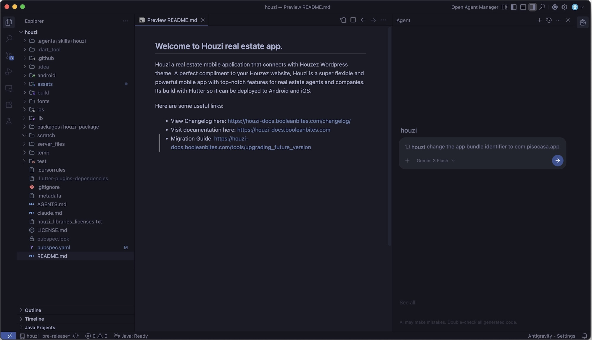

> ### ⚡ The Future of No-Code & Low-Code Customization is Here
> Configuring and customizing Houzi has never been easier. By using an AI coding assistant powered by our **Houzi AI Agent Skill**, you don't need to manually do the configurations. 
> 
> Simply tell your AI assistant (like Antigravity, Cursor, Claude Code, or GitHub Copilot) what you want to do in plain English. It's like having a senior Houzi engineer pair-programming with you 24/7.

---

## 🚀 See It In Action: Example Prompts

Here are some real-world prompts you can give your AI agent right now to perform common setup tasks and complex architectural customizations. 

### 🎨 Common Setup & Configuration
*   *"/houzi Change the primary app color to a deep purple."*
*   *"/houzi Add a dynamic banner to the home screen."*
*   *"/houzi Change the app name to 'My Business Name'."*
*   *"/houzi Use the attached icon file to generate and set the app launch icons."*
*   *"/houzi Add a new custom page to the bottom navigation bar."*
*   *"/houzi Add a custom drawer item that navigates directly to my website."*

### 🛠️ Advanced Customizations & Integrations
*   *"/houzi Add feature taxonomy terms as tabs in Home Air and also add its icons. Use wordpress api to fetch taxonomy from my website."*
*   *"/houzi Replace the Watch Video option in property details page with an inplace youtube thumb and when clicked on it, open in app browser to launch the video inside the app."*
*   *"/houzi Create a new custom property item card design that is highly compact, and inject it via the property item design hook."*
*   *"/houzi Intercept the home page's building list to inject a custom 'Recent Searches' section slider, and implement its UI using a separate hook-registered custom widget."*

---

## How to use the Skill

The skill is stored in the project at:
`[project-root]/.agents/skills/houzi/`

While the examples below demonstrate how to use **Antigravity** to execute customizations step-by-step, the Houzi Skill system is fully universal and works out-of-the-box with any modern AI coding assistant (like Cursor, Claude Code, or GitHub Copilot).

> **💡 Pro Tip: Direct Skill Invocation**
> Since the Houzi configurations and hooks guidance is registered as a custom workspace skill, you can directly activate it by prefixing your prompt with `/houzi` in your AI chat panel:
> 
> `/houzi change the app bundle identifier to com.pisocasa.app`

### Step-by-Step Guide: Customizing Houzi with Antigravity

#### Step 1: Install & Set Up Antigravity
Download and install the **Antigravity** IDE or command-line agent. Antigravity is a agentic AI coding companion by Google. Download from [https://antigravity.ai/](https://antigravity.ai/).

#### Step 2: Open Your Houzi Project
Launch Antigravity and open your Houzi Flutter project folder. 

#### Step 3: Automatic Skill Detection
Once opened, Antigravity will automatically detect the `.agents/skills/houzi/` skill. You don't need to configure anything—the AI immediately becomes an "expert Houzi developer".

#### Step 4: Ask & Automate
Now, simply open the AI chat panel and start instructing the agent. Here are step-by-step examples of how to run your commands:

##### Example A: Customizing App Name, Bundle ID, & Launcher Icons
1. Ask Antigravity:
   > *"/houzi Update my app's name to 'PisoCasa', change the iOS and Android bundle identifiers to 'com.pisocasa.app', and use assets/icons/logo.png to generate all launcher icons."*
2. **What Antigravity does**:
   - Updates the app name across native Android and iOS configurations.
   - Replaces bundle identifiers in `build.gradle` and Xcode project settings.
   - Safely updates dependencies, configures `flutter_launcher_icons.yaml`, and runs the generator command to rebuild all launcher resolutions.

##### Example B: Updating Theme Colors & Fonts
1. Ask Antigravity:
   > *"/houzi Change the app theme's primary color to a premium Indigo (#3F51B5), background to off-white, and switch the font family to 'Outfit'."*
2. **What Antigravity does**:
   - Safely updates hex values in the configurations.
   - Inspects `configurations.json` structure, increments the `api_config_version` to trigger an Over-The-Air (OTA) update so your users get the new design instantly.
   - Generates the necessary fonts configuration and localizations.

##### Example C: Advanced Layout Tweaks
1. Ask Antigravity:
   > *"/houzi Add feature taxonomy terms as tabs in Home Air and also add its icons. Use wordpress api to fetch taxonomy from my website."*
2. **What Antigravity does**:
   - Inspects your backend connection config.
   - Rewrites your Home Air section layout inside `configurations.json` with the newly dynamic taxonomy terms tabs.
   - Adds custom icons mappings safely matching your WordPress REST API taxonomy terms metadata.

---

## Why use AI Agents with Houzi?

Houzi is a highly configurable, white-label real estate application. It follows a clean architecture governed by two primary customization vectors: an **OTA-enabled Configuration Engine** (`configurations.json`) and a **Dart-level Hooks Customization System** (`hooks_v2.dart`).

Using an AI agent with the Houzi Skill allows you to leverage these systems seamlessly to:

-   **Enforce Architectural Boundaries**: The agent understands the clean segregation between the core package and the custom app wrapper, ensuring customization happens exclusively in configuration and hook files.
-   **Master Hook-Based Injection**: The agent can instantly write complex custom widget wrappers, dynamic data-formatting hooks, and platform-specific feature toggles without you needing to memorize the hook registry or signatures.
-   **Accurately Navigate the Dynamic Layout Engine**: The configuration JSON spans thousands of lines and controls all app sections. The agent knows exactly where and how to modify search filters, home screen blocks, navigation structures, and details page modules.
-   **Enable Risk-Free OTA Updates**: The agent automatically adheres to configuration schema compliance and OTA versioning protocols, ensuring seamless runtime integration.

---