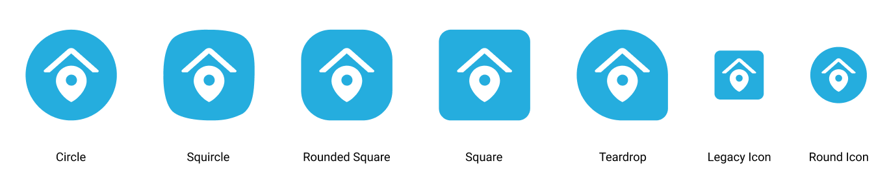
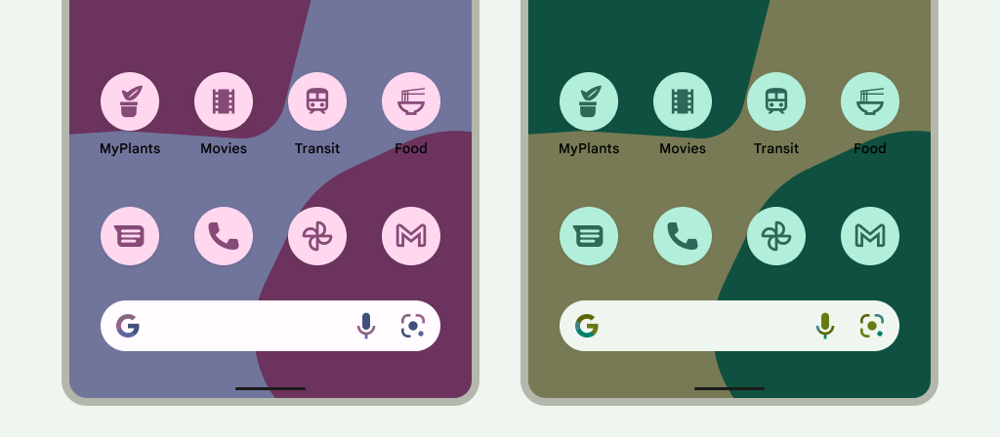

<br/>
<iframe width="560" height="315" src="https://www.youtube.com/embed/1aBe9ircyGE" frameborder="0" allow="accelerometer; autoplay; clipboard-write; encrypted-media; gyroscope; picture-in-picture" allowfullscreen></iframe>

<br/>
<br/>

Since this is a Flutter app, and it generates both Android and iOS projects. You'll need to change icons in each platform project.

#### Automatic Way

**Flutter Launcher Icons** has been designed to help quickly generate launcher icons for both Android and iOS: 
1. [Flutter Launcher Icon](https://pub.dartlang.org/packages/flutter_launcher_icons).

2. Add the package to your `pubspec.yaml` file (within your Flutter project) to use it.
```yaml
dev_dependencies:
  flutter_launcher_icons: "0.9.2"
```
3. Within the `pubspec.yaml` file specify the path of the icon you wish to use for the app and then choose whether you want to use the icon for the iOS app, Android app or both.
```yaml
flutter_icons:
  android: true
  ios: true
  image_path: "assets/icon/icon.png"
```

4. After setting up the configuration, all that is left to do is run the package.
```yaml
flutter pub get
flutter pub run flutter_launcher_icons:main
```

The default launcher icons have now been replaced with your custom icon.

#### Manual method
You can manually replace icons in Android and iOS projects at following places:

- Android: `Project_HOME > android > app > src > main > res > drawable`
- iOS: `Project_HOME > ios > Runner > Assets.xcassets`

Keep in mind, in a manual method, you’ll have to generate icons in different resolutions. There’s plenty of tools available that can take your high-res icon and convert them to platform supported resolutions.


#### Adaptive Icons (Android)

Starting from Android OS 8 api 26, Android has provided adaptive icons option. An adaptive icon, or `AdaptiveIconDrawable`, can display differently depending on individual device capabilities and user theming.



We also have included a sample adaptive icon in android project. Either you can provide your own adaptive icon or remove those icons.


###### If you want to add your own adaptive icons:

1. replace these files with your own:

    ```
    res / drawable / icon_background.xml
    res / drawable / icon_foreground.xml
    ```
2. rename the `res / mipmap-anydpi-v26 / ic_launcher_rename_if_required.xml` to `ic_launcher.xml`

To provide your own icon as adaptive, you'll need to design your icon as an svg and then export both the background and foreground layers in separate svg files. Later either convert them to Android vector or import them using android import tool from Android Studio. [Importing an SVG or PSD file](https://developer.android.com/studio/write/vector-asset-studio#svg)

If you keep the file name same as above, then nothing more need to be done. Otherwise you'll need to reference these newly imported files in `res / mipmap-anydpi-v26 / ic_launcher.xml` as foreground and background of your vector.

###### If you want to remove adaptive icon
For 1.3.0 and above, nothing needed.

For 1.2.0 and below, remove following files:

```
res / drawable / icon_background.xml
res / drawable / icon_foreground.xml
res / mipmap-anydpi-v26 / ic_launcher.xml 
```


#### Themed Icons (Android API 33 and Above)

Starting from **Android 13 (API level 33)**, Android introduced a feature for **Themed Icons**. Themed icons dynamically adjust their color based on the user's chosen wallpaper and system-wide theme, giving your app a modern and personalized look. When a user applies a new wallpaper, the icon color will adapt to complement the overall theme of the device, ensuring visual harmony.

<br/>
To add support for themed icons in your app, follow these steps:

1. **Create a Monochrome Icon**:
   Your themed icon needs to be a monochrome version of your primary icon. This will be used for theming purposes.
   
   - Design a single-color SVG or PNG icon.
   - Ensure that it’s suitable for all background and theme colors.
   - You can also use the icon_foreground.xml for themed icon if it is suitable.

2. **Add to Android Project**:
   Add the monochrome icon file in the Android project and update the launcher configuration.

   - Place the icon in `res/drawable/monochrome_icon.xml` if it is a new icon
   - Reference the monochrome icon in the `res/mipmap-anydpi-v26/ic_launcher.xml` file like so:
   
   ```xml
   <adaptive-icon xmlns:android="http://schemas.android.com/apk/res/android">
       <background android:drawable="@drawable/icon_background"/>
       <foreground android:drawable="@drawable/icon_foreground"/>
       <monochrome android:drawable="@drawable/monochrome_icon"/>   <!-- this can be icon_foreground or a separate monocrhome icon>
   </adaptive-icon>


If you want to know more about adaptive icons, read more here: [Adaptive Icons](https://developer.android.com/develop/ui/views/launch/icon_design_adaptive)