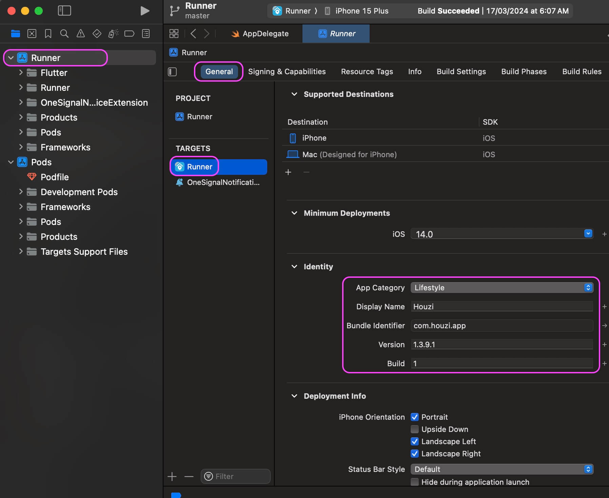
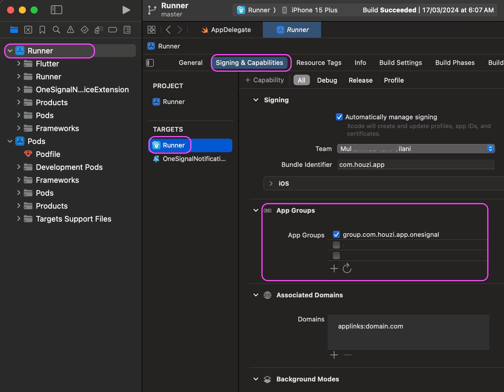
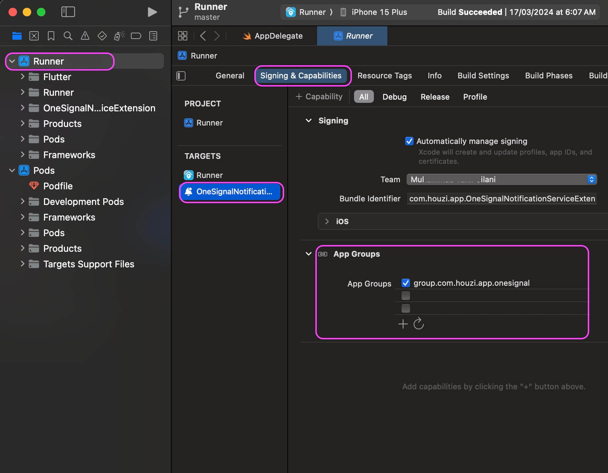

<br/>
<iframe width="560" height="315" src="https://www.youtube.com/embed/tL7JDxXxfJQ" frameborder="0" allow="accelerometer; autoplay; clipboard-write; encrypted-media; gyroscope; picture-in-picture" allowfullscreen></iframe>

<br/>
<br/>

> **Mandatory** App bundle identifiers are unique identifiers for your apps, they’re globally unique. Most of the time, you can reverse your website domain to create an identifier for your app. For example: `com.domain.app_name`

This guide consists of following sections:

- [Android:](#android)
    - [Change applicationId in build.gradle:](#change-applicationid-in-buildgradle)
    - [Change package in AndroidManifest.xml:](#change-package-in-androidmanifestxml)
    - [OneSignal Push Configurations for Android](#onesignal-push-configurations-for-android)
- [iOS:](#ios)
    - [Change App Bundle Identifier](#change-app-bundle-identifier)
    - [OneSignal Push Configurations for iOS](#onesignal-push-configurations-for-ios)

Once you’ve decided the unique identifiers, you need to replace existing with your own package identifier.

> **Important** Once you have changed the bundle identifier, you will be required to setup your own firebase projects. App will not compile if you just change your package identifier and not setup your own firebase.

# Android:

You’ve to change package info in two places. build.gradle and AndroidManifest.xml

### Change applicationId in build.gradle:

To change the package in build.gradle, follow these steps:
- Open following file:`Project_HOME > android > app > build.gradle`
- Look for `applicationId` and replace the value with your own.
- Look for `versionCode` and replace the value with your own. `versionCode` is for developers to keep track of builds.
- Look for `versionName` and replace the value with your own. `versionName` is for the public.
- Look for `namespace` in the **android** block and replace the value with your own.


### Change package in AndroidManifest.xml:
To change the package in AndroidManifest.xml, follow these steps:

- Go to `houzi > android > app > src > main >  AndroidManifest.xml`
- Find and replace the second attribute in the very first tag `package="com.houzi.app"` with your own package name like `package="your.package.name"`.
- After changing this package declaration, change the folder structure of the kotlin classes as well, like below

`android > app > src > main > kotlin > your > package > name > all_kotlin_files`

> **Suggestion** We suggest renaming the folders manually using Finder or Windows Explorer. Then change the package declaration in kotlin files as well, for example in all kotlin files change this line:
```
package com.houzi.app
```
To your own package like this:
```
package your.package.name
```

### OneSignal Push Configurations for Android
If you want to support push notification, you have to do following steps:
- Open `houzi > android > app > src > main >  AndroidManifest.xml`
- Find following meta tag and change its value to your own package that you changed in the above steps:
  ```xml
  <meta-data android:name="com.onesignal.NotificationServiceExtension"
            android:value="com.houzi.app.NotificationServiceExtension" />
  ```
  It should become something like this:
  ```xml
  <meta-data android:name="com.onesignal.NotificationServiceExtension"
            android:value="your.package.name.NotificationServiceExtension" />
  ```  
----
# iOS:
To change the package name or bundle id, you have to open the project in Xcode.

### Change App Bundle Identifier
For iOS, open Xcode, and click on the project name (Runner) on the top left side and click on General tab, you should see the Bundle Identifier option, change its value with your own.



```
open: Project_HOME > ios > Runner > General > Bundle Identifier
```
- **Display Name** - app’s display name on phone.
- **Bundle Identifier** - app’s unique identifier.
- **Version** - app’s public version.
- **Build** - app’s build code for developers to keep track.

### OneSignal Push Configurations for iOS
If you want to enable OneSignal Push Notification, then you also need to update the App Group bundle identifier in two places.

1. Target Runner:
    <br/>
    
    ```
    open: Project_HOME > ios > Runner > Signing & Capabilities > App Groups
    ```
    Set the App Groups in signing to be group.YOUR_BUNDLE_IDENTIFIER.onesignal where YOUR_BUNDLE_IDENTIFIER is the same as your Main Application "Bundle Identifier".
2. Target OneSignalNotificationServiceExtension
    <br/>
    
    ```
    open: Project_HOME > ios > OneSignalNotificationServiceExtension > Signing & Capabilities > App Groups
    ```
    Set the App Groups in signing to be group.YOUR_BUNDLE_IDENTIFIER.onesignal where YOUR_BUNDLE_IDENTIFIER is the same as your Main Application "Bundle Identifier".
    Make sure it is the same as you have in your Main Runner Target App Group.