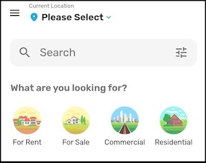

Each Property Type, Property Status and Property Label are called Term in the Houzez (wordpress) taxonomies. When you add a new property type, you actually add new term in Property Type taxonomy in your wordpress.

When you open app, the app loads Property Type, Property Status and other taxonomies on homepage. For each term (for-sale, for-rent, house, office) we show an icon against its slug. See below screenshot


Each Term has title, slug and other meta-data. So lets say you’ve a term Shop, and its slug is shop, you can set its icon with hooks. If you want to show term icon for your translated Term, you need to open following file:

`Project_HOME  > lib > hooks_v2.dart`

Look for the `getElegantHomeTermsIconMap()` method. Then look for _iconMap, and edit existing or add new entry for your desired term, add the slug-name of your term.

#### Use Google Material Icon

You can return Google Material Icon library icon as term for a slug, as below:

```dart
Map<String, dynamic> _iconMap = {
    "for-rent": Icons.vpn_key_outlined,
    "residential": Icons.apartment_outlined,

    "shop": Icons.store_outlined,
    "متجر": Icons.store_outlined,     //<-- translated slug of term for shop
    ...
};
```


The Icons.xxxxx are coded from Google Material icons here: https://fonts.google.com/icons

#### Use custom icon or image

You can also provide your own colored icon or image for a term. This will allow you to provide more customized and brand aligned icons for your app.



The process is as below:

1. Start by adding the desired icon to your assets folder.
2. Add references to your project pubspect.yaml file as follow:

`Project_HOME  > pubspec.yaml`

and the newly added icons 
