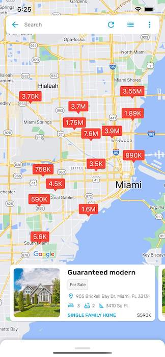

 If you want to show custom map pin with custom data like price on MapView instead of default Google Maps Pin, you can enable this using this hook. 

Then go to `Project_HOME  > lib > hooks_v2.dart`. Look for the `getCustomMarkerHook()` method.

```
  CustomMarkerHook getCustomMarkerHook() {
    
    CustomMarkerHook markerIconHook = (BuildContext context, Article article) {
      /// If you want to set the default Pin Point marker return null
      /// else return the title, background, title-color and an optional text style
      ///
      MapMarkerData markerData = MapMarkerData(
          text: article.getCompactPriceForMap(),
          backgroundColor: Colors.red,
          textColor: Colors.white
      );
      return markerData;
    };

    return markerIconHook;
  }
```

`MapMarkerData` is a class that takes `text`, `backgroundColor`, `textColor` and `textStyle`. You can provide the text that you want to show on Map pin. `textColor` and `textStyle` are optional. But they're there for you to provide any customization.

You can return `null` if you don't want to use custom map pin.




