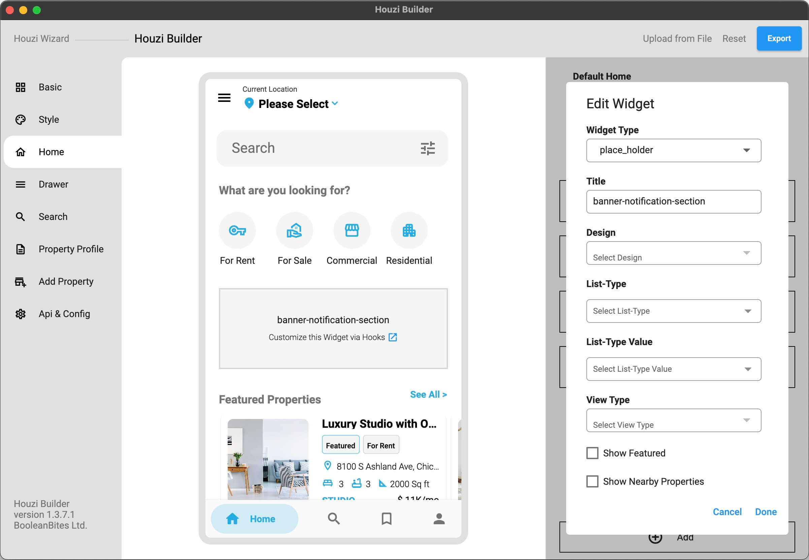

You can show custom widgets to your home pages easily via hooks.



If you want to show a 'custom widget' in Home page, you need to do following things:

- Add a custom widget section in your Home page via Houzi Builder.
- Name it something unique like `'banner-notification-section'`. You'll use this name in hooks section in code.
- Export your configuration and save to the app source code. (increase version number if required.)
- Open file `Project_HOME  > lib > hooks_v2.dart` and look for the `getHomeWidgetsHook()` method. 
- You are provided with `hookName` and `isRefreshed` parameters. In the `if_statement()` comparison, replace the `HOOK_NAME` with your specific hookName (which you have already defined in the HouziBuilder Desktop Application.) and replace your Custom widget with `WIDGET`.
- Note that, whenever the home is refreshed, `isRefreshed` will return true, if you want to perform anything when the home **refreshes**, you can use the `isRefreshed`.  

For Example: If you have a custom widget named as `'banner-notification-section'`. Just replace the `HOOK_NAME` with `'banner-notification-section'` and return your widget as follows:

```dart
  HomeWidgetsHook homeWidgetsHook = (
        BuildContext context,
        String? hookName,
        bool isRefreshed) {

//      This is sample code:
//      if (hookName == 'HOOK_NAME') {
//        return WIDGET;
//      }

        if (hookName == 'banner-notification-section') {
          return Conatiner(
            height: 120,
            child: Text("I'm custom widget"),
          );
        }

      return null;
    };
  
```

    
    
    
> **Note**: You can **re-arrange** the position of your `'banner-notification-section'` & you can **re-name** your `'banner-notification-section'` from the **HouziBuilder** Desktop App. 

*Added in version 1.3.0*

