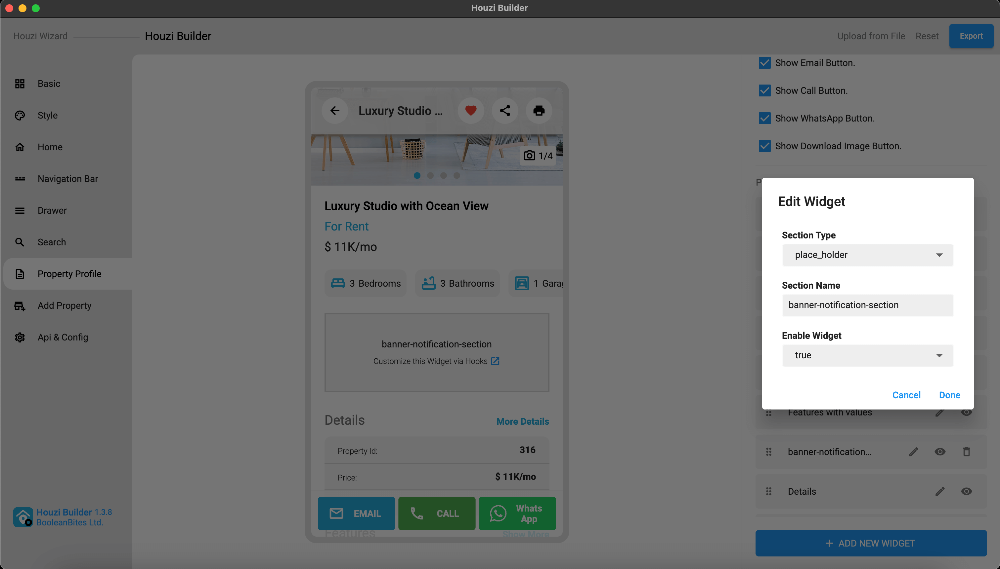

You can show custom widgets to your property details pages easily via hooks.



If you want to show a 'custom widget' in property details page, you need to do following things:

- Add a custom widget section to your property details page via Houzi Builder.
- Name it something unique like `'banner-notification-section'`. You'll use this name in hooks section in code.
- Export your configuration and save to the app source code. (increase version number if required.)
- Open file: `Project_HOME  > lib > hooks_v2.dart` and look for the `getWidgetHook()` method.
- You are provided with `hook` and `article` parameters. In the `if_statement()` comparison, replace the `HOOK_NAME` with your specific hook name (which you have already defined in the HouziBuilder Desktop Application.) and replace your Custom widget with `WIDGET`.  

You are provided with the Property Article Information as the object 'article'. You and get your desired information from the 'article' and display in your Custom Widget.

For Example: If you have a custom widget named as `'banner-notification-section'`, just replace the 'HOOK_NAME' with `'banner-notification-section'` and return your widget as follows:

```dart
  PropertyPageWidgetsHook detailsHook = (
      BuildContext context,
      Article article,
      String hook,
    ) {
      
      /// This is sample code:
      /// if (hook == 'HOOK_NAME') {
      ///   return WIDGET;
      /// }

      if (hook == 'banner-notification-section') {
          return Container(
            height: 120,
            child: Text("I'm custom widget"),
          );
        }

      return null;
    };
  
```

    
    
    
> **Note**: You can **re-arrange** the position of your `banner-notification-section` & you can **re-name** your `banner-notification-section` from the **HouziBuilder** Desktop App. 

*Added in version 1.3.0*

