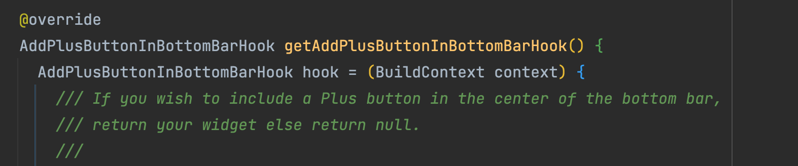
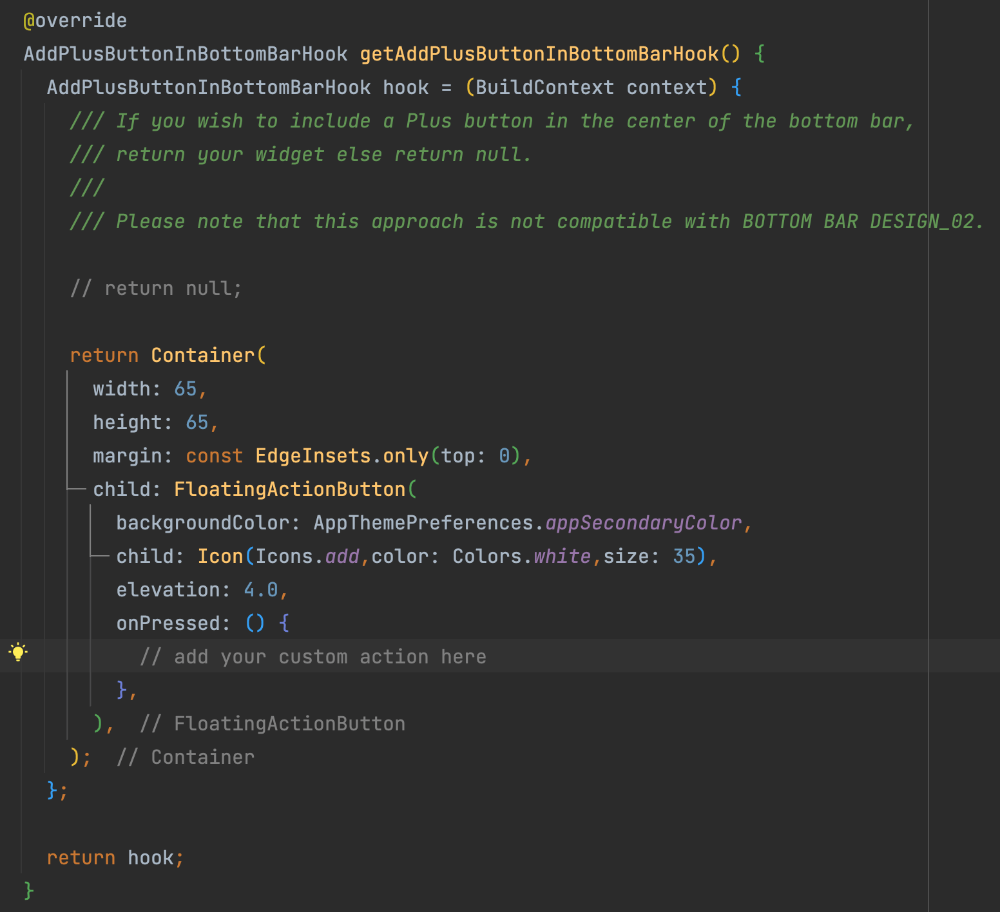

If you want to add a custom action on Add Floating Action Button on the Navigation Bar, you need to open following file:

`Project_HOME  > lib > hooks_v2.dart`

Look for the `getAddPlusButtonInBottomBarHook()` method.




You will be provided with some code in this method. Just comment or remove the `return null;` statement and un-comment the commented below code, after performing the changes, your code will be as follows:



Now define your custom *Action* ,that you want to perform when the Add Floating Button will be pressed, in the **onPressed** method.

## Code Preview:

```dart
 @override
  AddPlusButtonInBottomBarHook getAddPlusButtonInBottomBarHook() {
    AddPlusButtonInBottomBarHook hook = (BuildContext context) {
      /// If you wish to include a Plus button in the center of the bottom bar,
      /// return your widget else return null.
      ///
      /// Please note that this approach is not compatible with BOTTOM BAR DESIGN_02.

      // return null;

      return Container(
        width: 65,
        height: 65,
        margin: const EdgeInsets.only(top: 0),
        child: FloatingActionButton(
          backgroundColor: AppThemePreferences.appSecondaryColor,
          child: Icon(Icons.add,color: Colors.white,size: 35),
          elevation: 4.0,
          onPressed: () {
            // add your custom action here
          },
        ),
      );
    };

    return hook;
  }
```

> **Note**: Add Floating Action Button is **not availble** for *Navigation Bar Design 02*. 

*Added in version 1.3.8*

