> **Important**: You are required to install the Houzi Rest Api Plugin on your Houzez wordpress. To install the Plug-in, click on [Houzi Rest Api Plugin Link](https://github.com/booleanbites/houzi-rest-api).

> A **Mobile App View** is provided in the center of screen, so you can see how the modifications will look on real device.  

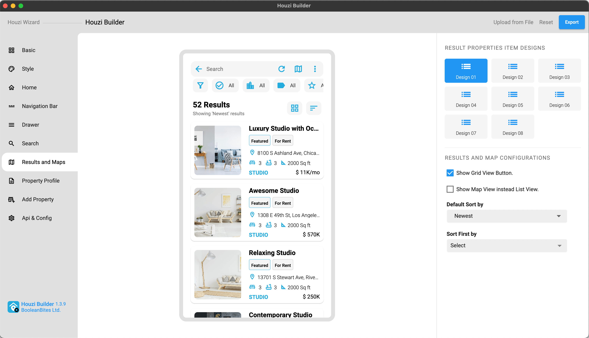  

This guide consists of following sections:

[Result Properties Item Designs](#result-properties-item-designs)  
[Results and Maps Configurations](#results-and-maps-configurations)  
[Sort Menu Configurations](#sort-menu-configurations)

Let's dive into the details of each section.  

---  

# Result Properties Item Designs

Houzi provides you wide range of *Result Properties Item Designs*. On the top right side of Results and Maps section, Result Properties Item Designs are provided. Click on any design, and you will be able to see, how it will look on real device in the *Mobile App View*. (By default, selected design is *Design 01*, one of most popular designs.)

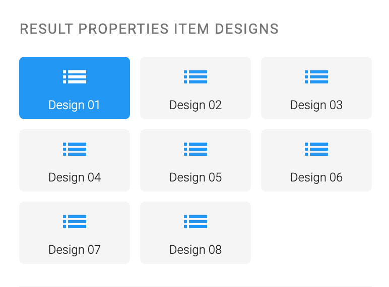   

---  

# Results and Maps Configurations

- By default, when you open the **Search Results Screen**, you see property listings in **List view**. If you want that when you search something and Search Results Screen should show property listings in **Map view** instead of *List view*, check mark the **Show Map View instead List View on Search Results Page** checkbox field.

  

- You can *enable* or *disable* **Grid View Button** on *Search Results Screen*, just by check marking or check unmarking the **Show Grid View Button on Search Results Page** checkbox field.

  

---

# Sort Menu Configurations

This guide consists of following sections:

[Default Sort By Configuration](#default-sort-by-configuration)  
[Sort First By Configuration](#sort-first-by-configuration)  

Let's dive into the details of each section.  

### Default Sort By Configuration

You are provided with the dropdown list of the self-explanatory **Sort** options. You can configure the default sorting order just by choosing an option from the list. 

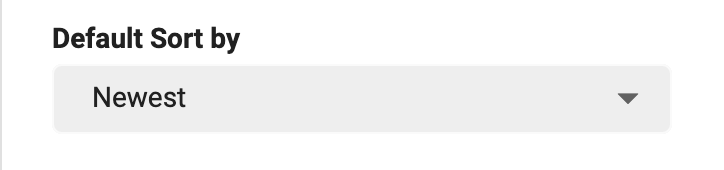

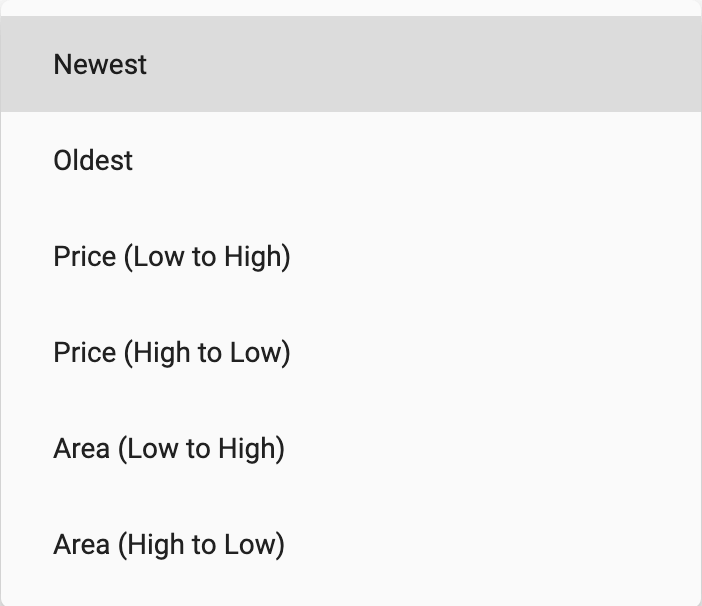

### Sort First By Configuration

You can configure the *Sort First By* menu by clicking on the 'Sort First by' dropdown field. 

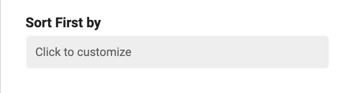

A dialog along with the sort menu view on the Mobile App View will be opened.

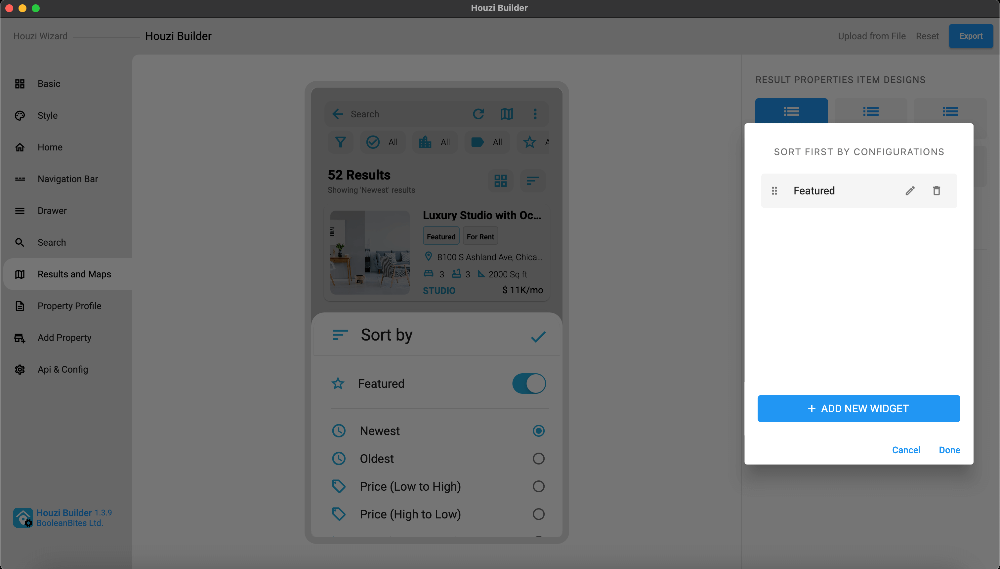  

You can configure the sort first by menu section by performing following actions:

[Add New Section](#add-new-section)  
[Edit a Section](#edit-a-section)  
[Delete a Section](#delete-a-section)  
[Re-arrange a Section](#re-arrange-a-section) 

Let's dive into the details of each action. 

### Add New Section

For adding new section, follow these steps:

- There is a **Add** button at the bottom of the dialog, press this button and an other dialog box will open.

  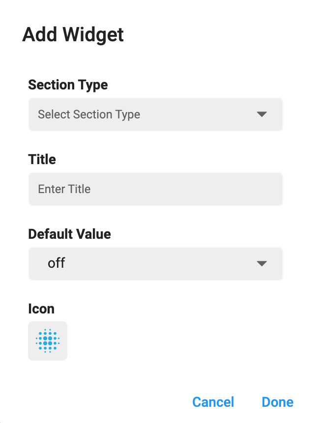  

- First of all, you have to define the **Section Type** of the section. The description of section types is as follows:
  - **featured:** If you want to show *Featured* properties at the top of the listings.
  - **Term:** If you want to show properties with some specific attributes like properties having label *Hot Offer* or *Gold Offer* at the top of the listings.

    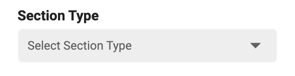

    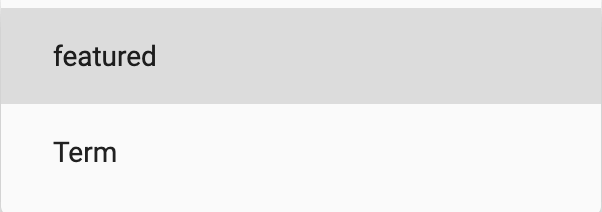

- Second, you have to define the **Title** of the section.

  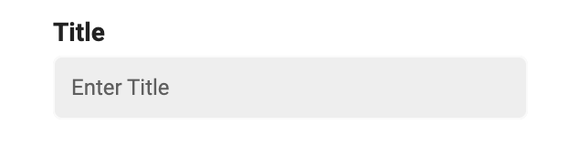

- Third, you have to define **Default Value** of the section. The default value determines that the specific type of filter will be taken into consideration while the sorting is performed. User can also modify the value of Sort First filter by switching on or off the required sort first menu item.

  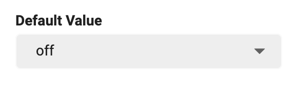

  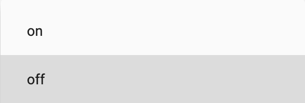

- Forth, you have to define the icon. Click on the icon button, an icon picker dialog will open. You can either choose from **Material Icons** or **Cupertino Icons**. Just search and click the required icon, it will be displayed and previous icon will be replaced.

  

- If you have selected the **Term** widget type, *Term* and *Sub-Term* additional fields will be visible to you.

  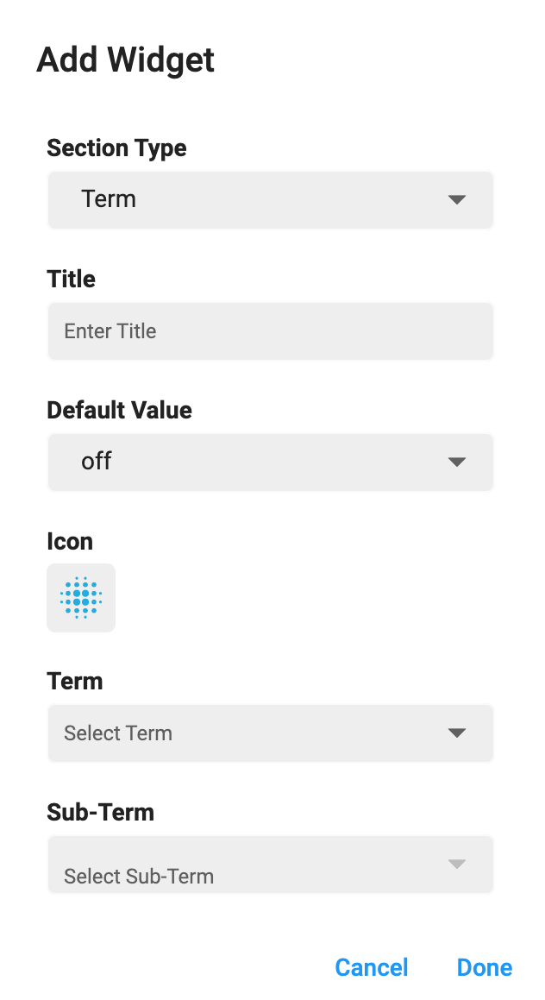

- Select the *Term Type* from the **Term Type** dropdown menu.

  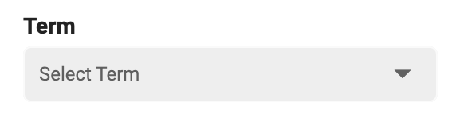

  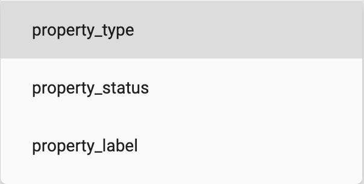

- Select the *Sub-Term Type* from the **Sub-Term Type** dropdown menu.

  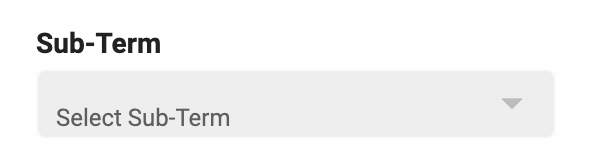

  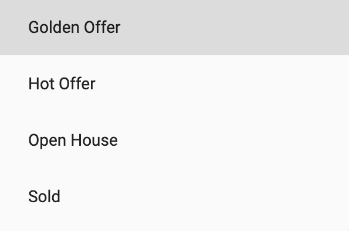

> Term Type and Term Type Value are only section type "Term" related fields.

### Edit a Section

You can **Edit** any sections just by clicking on *edit icon* of respective section.   

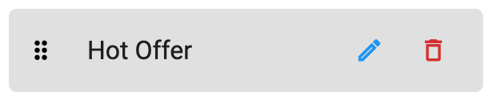  

 

You can perform following opertions while **Editing** a section:
- You can change the **Section Type** of any section.
- You can **Rename** any section.
- You can change the **Default Value** of any section.
-  You can change the **Icon** of any section.
-  You can change the **Term** of any section.
-  You can change the **Sub-Term** of any section.

> Term Type and Term Type Value are only section type "Term" related fields.

### Delete a Section

You can **Delete** any section just by clicking on *delete icon* of respective section. A delete confirmation dialog will open. 

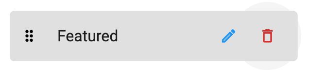    

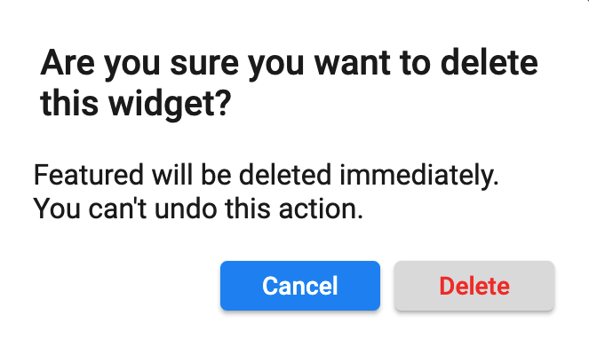  
    
> Click **Delete** if you want to *delete* the section.  
  Click **Cancel** if you want to *discard* the action.

### Re-arrange a Section

You can **Re-arrange** the sections with ease. Hold the section that you want to re-arrange and move it vertically (*upwards* or *downwards*). Place it on desire position in sections list.

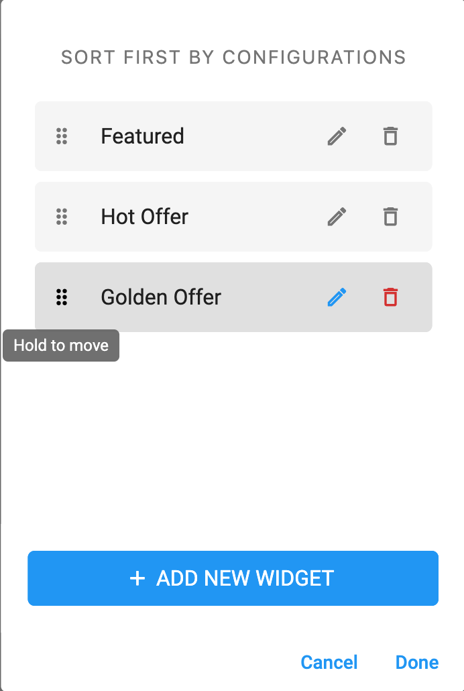  

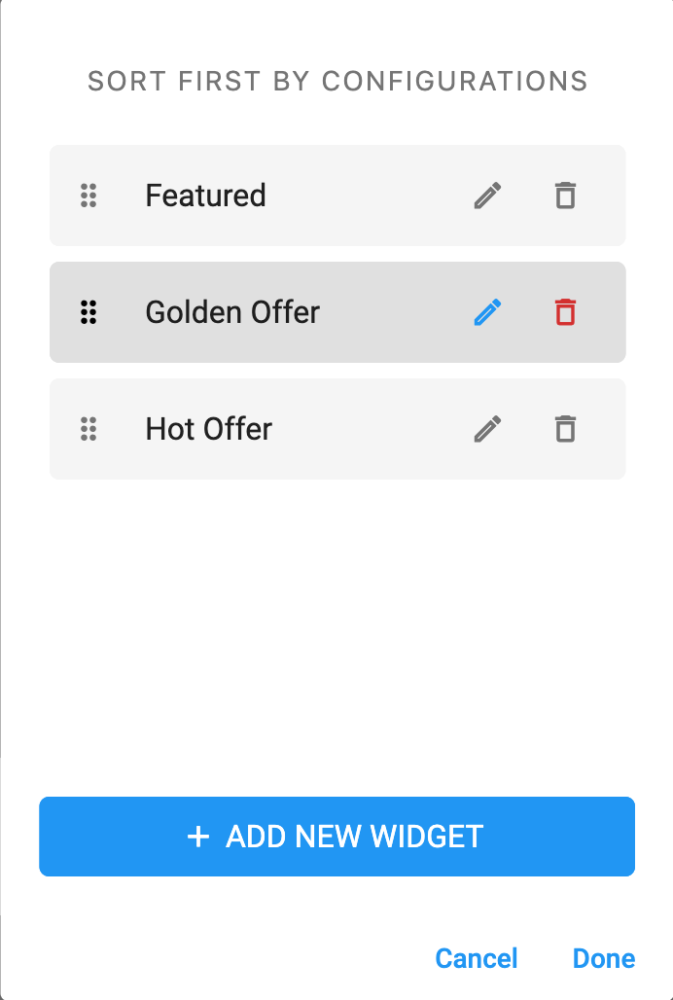