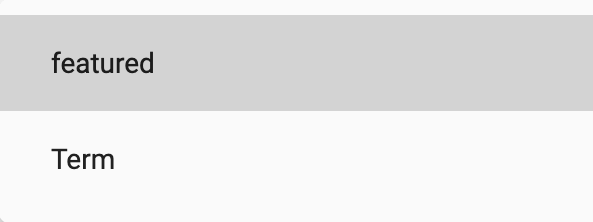

> **Important**: You are required to install the Houzi Rest Api Plugin on your Houzez wordpress. To install the Plug-in, click on [Houzi Rest Api Plugin Link](https://github.com/booleanbites/houzi-rest-api).

> A **Mobile App View** is provided in the center of screen, so you can see how the modifications will look on real device.  

  

This guide consists of following sections:

[Listing Item Designs](#listing-item-designs)  
[Display Configurations](#display-configurations)  
[Sorting Configurations](#sorting-configurations)   

Let's dive into the details of each section.  

---  

# Listing Item Designs

Houzi provides you wide range of listing items designs. On the top right side of Results and Maps section, Listing Items designs are provided. Click on any *design*, and you will be able to see, how it will look on real device in the *Mobile App View*. (By default, selected design is *Design 01*, one of most popular designs.)

 

---

# Display Configurations

- Houzi provide you with two views for the resulted listing items i.e. *List View* and *Grid View*. The default view is List view. User can switch between views by tapping on "Show Grid View" Button. If you want to restrict the user to only List view, you can hide the "Show Grid View" button from the screen. You can **show** or **hide** this button on results screen just by *Check Marking or Un-Marking* the **Show Grid View Button** checkbox field.  

     

- By default, Houzi provide a List View for the searched items on the Results screen. User can see the results on Google Maps by tapping on the Maps icon on the top search bar. If you want to display the search results on the Google Maps, by default, you can simply *Check Mark* the **Show Map View instead List View** checkbox field.  

   
---

# Sorting Configurations

Houzi provides you with following two sorting configuration:  

[Default Sort By](#default-sort-by)  
[Sort First By](#sort-first-by)

Let's dive into the details of each configuration.

###  Default Sort By

When you search something, the corresponding search results can be sorted w.r.t. one of the following orders:
- Newest (newest items on the top of List).
- Oldest (oldest items on the top of List).
- Price (Low to High).
- Price (High to Low).
- Area (Low to High).
- Area (High to Low).

The default Houzi sort by order is "**Newest**". You can select the desired sort by order from the **Default Sort By** dropdown. 

   

   

  ---

  ### Sort First By

  When you search something, the corresponding search results are sort by the default sort by order. If you want to further sort these results on the basis of some specific attributes e.g. if you want to sort results w.r.t. "**Featured**" results (meaning show featured results on top) or if you want to sort results w.r.t. "**Term**", you can configure some settings in the "Sort First By" configurations. 

  To configure the *Sort First By* settings, Click on the **Sort First By** dropdown menu.

  

  Following dialog will open:

   

You can perform following opertions while configuring the **Select First By** settings:

[Add new Item](#add-new-item)  
[Edit an Item](#edit-an-item)  
[Delete an Item](#delete-an-item)  
[Re-arrange an Item](#re-arrange-an-item) 

You can add one or more Sort First By items to configure the sort. e.g. You can sort the searched results in such order that you want to see the newest result items on top and among these newest result items, you want to see those items on top which have the attribute of "**Hot Offer**" and among these items, you want to see the "**Featured**" items on top. To achieve such sorting, you can select the *newest* order from the **Default Sort By** dropdown. Next step will be to add the *Featured* and *Hot Offer *(which is a term attribute) in the **Sort First By** items. You can add these items by following the guide.

Let's dive into the details of each operation.

### Add New Item

You can add a sort first by item by clicking on the "ADD NEW WIDGET" button. Following dialog will be displayed:

     

  You have to set the following fields to add the sort first by item:

[Section Type](#section-type)  
[Title](#title)  
[Default Value](#default-value)  
[Icon](#icon)  
[Term](#term)   
[Sub-Term](#sub-term)

---

#### Section Type

You can add sort first by items based on following two types of attributes from the **Section Type** dropdown menu:
1. Featured.
2. Term. 

**Featured**   
If you want to show the results items that have the attribute "*Featured*" on the top of results items listing.

**Term**  
If you want to show the results items that have the attribute "*Term*" (some specific term e.g. result item with property_label *Hot Offer*) on the top of results items listing.

   

  

---

#### Title

You can define the title of the item in **Title** field.

  

---

#### Default Value

The default value indicates that either you want to apply this sort order on the search result items by default or let the user decide to use this sort order from the sort menu on the Results screen. You can choose the default value of an item to be **on** or **off**. On indicates that this sort option will be applied by default. 

  

  

> User can manually *turn on* or *turn off* the value of sort first by item from the sort menu on Results screen.

---
