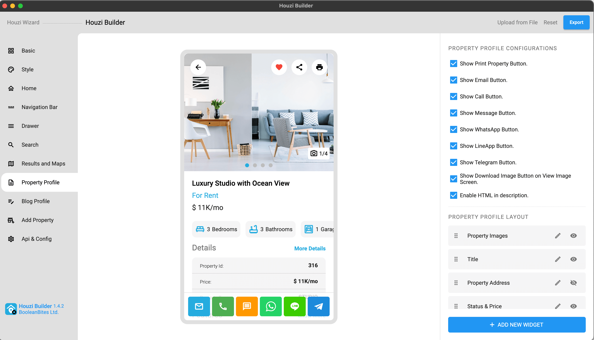

> **Important**: You are required to install the Houzi Rest Api Plugin on your Houzez wordpress. To install the Plug-in, click on [Houzi Rest Api Plugin Link](https://github.com/booleanbites/houzi-rest-api).

> A **Mobile App View** is provided in the center of screen, so you can see how the modifications will look on real device.  

This guide consists of following sections:  

[Property Profile Configurations](#property-profile-configurations)  
[Add New Section](#add-new-section)  
[Edit a Section](#edit-a-section)  
[Show-Hide a Section](#show-hide-a-section)  
[Re-arrange a Section](#re-arrange-a-section)  
[Delete a Section](#delete-a-section)  

Let's dive into the details of each section.

---

# Property Profile Configurations

- You can **show** or **hide** *Print Property Button*, on the top-right side of screen, just by *Check Marking or Un-Marking* the **Show Print Property Button** checkbox field. 

- You can **show** or **hide** *Email Button*, on the bottom action bar of screen, just by *Check Marking or Un-Marking* the **Show Email Button** checkbox field.

- You can **show** or **hide** *Call Button*, on the bottom action bar of screen, just by *Check Marking or Un-Marking* the **Show Call Button** checkbox field. 

- You can **show** or **hide** *WhatsApp Button*, on the bottom action bar of screen, just by *Check Marking or Un-Marking* the **Show WhatsApp Button** checkbox field. 

- You can **show** or **hide** *Line App Button*, on the bottom action bar of screen, just by *Check Marking or Un-Marking* the **Show LineApp Button** checkbox field.  

- You can **show** or **hide** *Telegram Button*, on the bottom action bar of screen, just by *Check Marking or Un-Marking* the **Show Telegram Button** checkbox field. 

- You can **show** or **hide** *Download Image Button*, on the top-right side of view image screen, just by *Check Marking or Un-Marking* the **Show Download Image Button on View Image Screen** checkbox field.  

- You can **enable** or **disable** the *HTML*, in the description widget, just by *Check Marking or Un-Marking* the **Enable HTML in description** checkbox field. 

---

# Add New Section

You can **Add** a new **place_holder** widget in *Property Profile Screen* with ease. There is a **Add New Widget** button at the right-bottom of the screen. Press this *Add New Widge* button, a dialog box will open.
    
 

You will encounter following fields on the dialog box:

[Section Type](#section-type)  
[Section Name](#section-name)  
[Enable Widget](#enable-widget)  

### Section Type:

You are provided with the dropdown list of  **Section Types**. The details of section types are as follows: 

* **place_holder:** If you want to [Display your Custom widget via Hooks](https://houzi-docs.booleanbites.com/hooks-widgets/add_custom_widget_in_property_details).

    

### Section Name:

Define the name of **Custom Widget** in the **Section Name** text field.

### Enable Widget:

You can `show/hide` any section just by selecting **true/false** from the **Enable Widget** dropdown. 

---

# Edit a Section

There are two type of sections in property profile screen as follows:

- Default Sections.
- Custom Sections.  

**Default Sections:** Sections that are provided by Houzi team by default and can not be deleted but can be [hide](#show-hide-a-section).  

**Custom Sections:** Sections that are added by users and can be [deleted](#delete-a-section) as well as [hide](#show-hide-a-section).

### Editing a Default Section:

While editing a *default section*, you only get to **Rename** the section. Just click on **Edit Icon** of respective section. A dialog will open. **Rename** the section as you like. 

    

- Click `Done` if you want to *Rename* the section.  
- Click `Cancel` if you want to *discard* the action.

### Editing a Custom Section:

While editing a *custom section*, you can perform following actions:

- Modify section [Section Name](#section-name).
- Modify section [Enable Widget](#enable-widget).

---

# Show-Hide a Section

You can **show** or **hide** any section just by clicking on **Visibility / Invisibility Icon** of respective section.  
 

 

---

# Re-arrange a Section

You can `Re-arrange` the sections on **Property Profile Screen**. Hold the section that you want to re-arrange and move it vertically (*upwards* or *downwards*). Place it on desire position in sections list.

  

 

---

# Delete a Section

There are two type of sections in drawer screen as follows:

- Default Sections.
- Custom Sections.  

**Default Sections:** Sections that are provided by Houzi team by default and can not be deleted but can be [hide](#show-hide-a-section).  

**Custom Sections:** Sections that are added by users and can be deleted as well as [hide](#show-hide-a-section).

You can **Delete** any custom section just by clicking on **delete icon** of respective section. A *delete* confirmation dialog will open. 

    

  
    
- Click **Delete** if you want to *delete* the section.   
- Click **Cancel** if you want to *discard* the action.