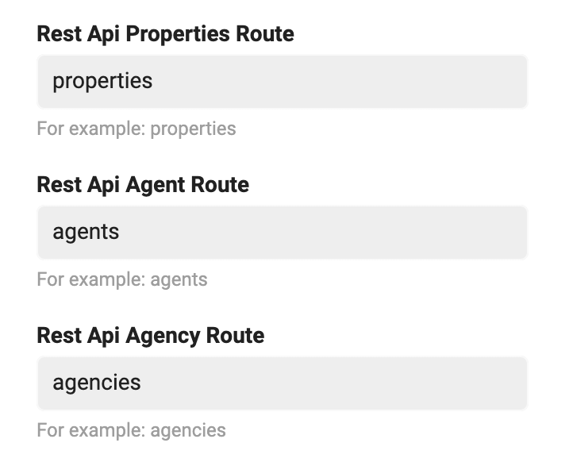
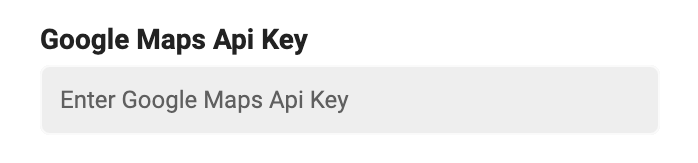
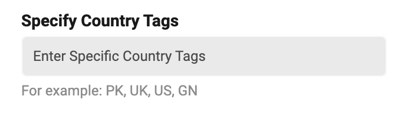
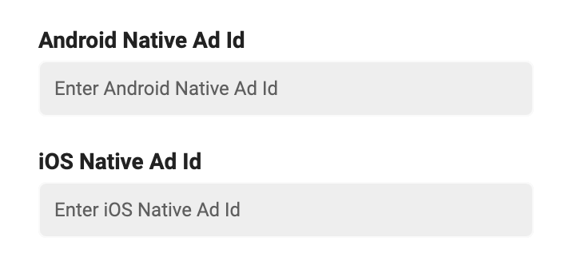
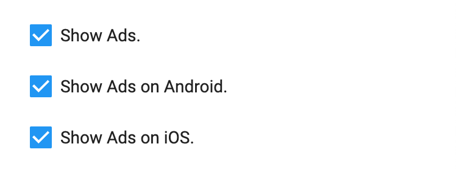
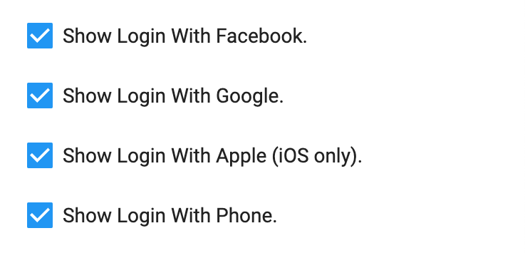

> **Important**: You are required to install the Houzi Rest API Plug-in on your Houzez wordpress. To install the Plug-in, click on [Houzi Rest Api Plugin Link](https://github.com/booleanbites/houzi-rest-api).

This guide consists of following configuration settings:  

[Routes Configurations](#routes-configurations)  
[Google Maps Api Key](#google-maps-api-key)  
[Places Api Configurations](#places-api-configurations)  
[Ads Configurations](#ads-configurations)  
[Social Sign-On Configurations](#social-sign-on-configurations)  
[Search Results Configurations](#search-results-configurations)  
[Segment Control Configuration](#segment-control-configuration)  

Let's dive into the details of each section.

---

# Routes Configurations:

#### Rest Api Properties Route:

  If your website use *wp/v2/property* or *wp/v2/translated_property_name* instead of **wp/v2/properties**, then define **property** or **translated_property_name** as *Rest Api Properties Route*.

#### Rest Api Agent Route: 

  If your website use `wp/v2/houzez_agent` or `wp/v2/translated_agent_name` instead of `wp/v2/agents`, then define *houzez_agent* or *translated_agent_name* as **Rest Api Agent Route**.

#### Rest Api Agency Route:

  If your website use `wp/v2/houzez_agency` or `wp/v2/translated_agency_name` instead of `wp/v2/agencies`, then define *houzez_agency* or *translated_agency_name* as **Rest Api Agency Route**.

  

---

# Google Maps Api Key:

  Please provide your **Google Maps Api Key** in the respective text field. 

    

  > **Google Maps Api Key** is prerequisite. If you do not have *Google Maps Api Key*, you can aquire key by following these steps:   
  >  1. [Setup Google Cloud Project Console](/tools/google_cloud_setup)
  >  2. Once you have setup the project on Google Cloud, you need to [Aquire the Maps Api Key](https://developers.google.com/maps/documentation/android-sdk/start#get-key) for Android and iOS separately.

---

# Places Api Configurations:

  If you want to **limit** the `Places Api` to specific *country* or *countries*, follow these steps:  

  1. *Check mark* the **Lock Places Api to Specific Country or Countries** checkbox field.
  

  2. Provide **Country/Countries Tags** (e.g. US, UK etc.) in respective text field.  
  

---

# Ads Configurations:

  #### Ads Key:

  Please provide **Android/IOS Native Ad Id** in the respective text fields.  

  

  > **AdMob App ID** is prerequisite. If you do not have *AdMob App ID*, you can aquire *AdMob App ID* by registering your app as an AdMob app. Simply follow these steps:   
  > 1. [Sign in](https://admob.google.com/home/) to or [Sign up](https://support.google.com/admob/answer/7356219) for an AdMob account.
  > 2. Register your app with AdMob. This step creates an AdMob app with a unique AdMob App ID for each platform.  

  #### Enable/ Disable Ads:

  - You can *enable* or *disable* **Ads** in *whole* app by check marking or check unmarking the **Show Ads** checkbox. 

  - You can *enable* or *disable* **Ads** in *android* apps only, just by check marking or check unmarking the **Show Ads on Android** checkbox. 

  - You can *enable* or *disable* **Ads** in *iOS* apps only, just by check marking or check unmarking the **Show Ads on IOS** checkbox. 

    

  > Prerequisite: **Android/IOS Native Ad Id**.  

---

# Social Sign-On Configurations:

  You can *enable* or *disable* **Social Sign-On** i.e. Sign-in with *Facebook*, *Google*, *Apple* and *Phone* with their respective checkbox fields.  

    

  > *Sign-in with Apple* is only available in **IOS**.  
> Prerequisite: [Social Sign-on Configuration](/tools/setup_google_signin).

---

# Search Results Configurations:

  - By default, when you open the **Search Results Screen**, you see property listings in **List view**. If you want that when you search something and Search Results Screen should show property listings in **Map view** instead of *List view*, check mark the **Show Map View instead List View on Search Results Page** checkbox field.

    

  - You can *enable* or *disable* **Grid View Button** on *Search Results Screen*, just by check marking or check unmarking the **Show Grid View Button on Search Results Page** checkbox field.

    

---

# Segment Control Configuration:

You can *enable* or *disable* **Cupertino Sliding Segment Control** in *whole App*, just by check marking or check unmarking the **Show Cupertino Segment Control** checkbox field.

> If you check unmark the **Show Cupertino Segment Control** checkbox field, the *Material Segment Control* widget will be used in the *whole app*.