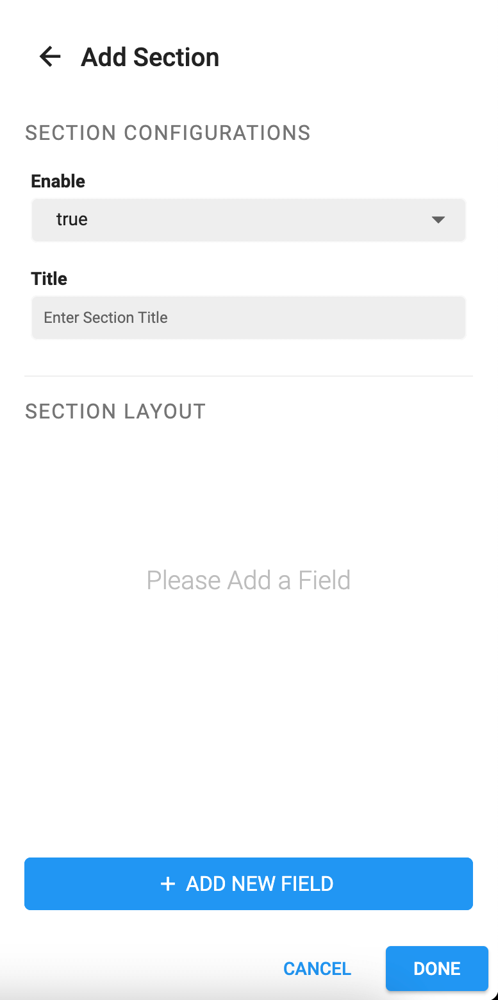
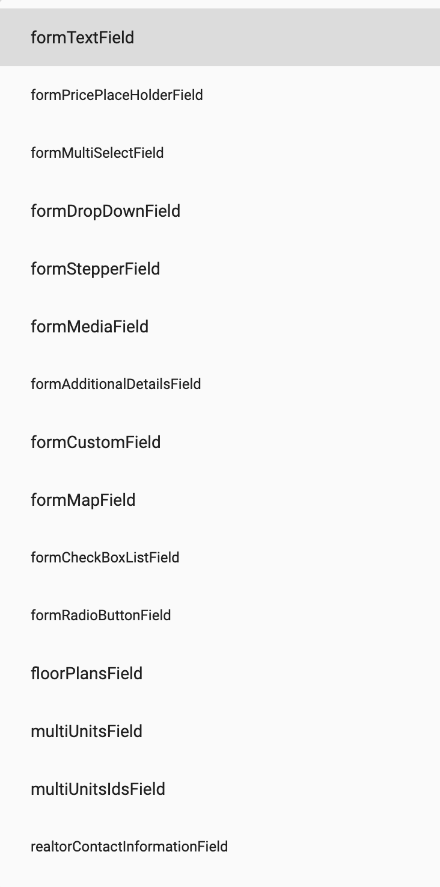
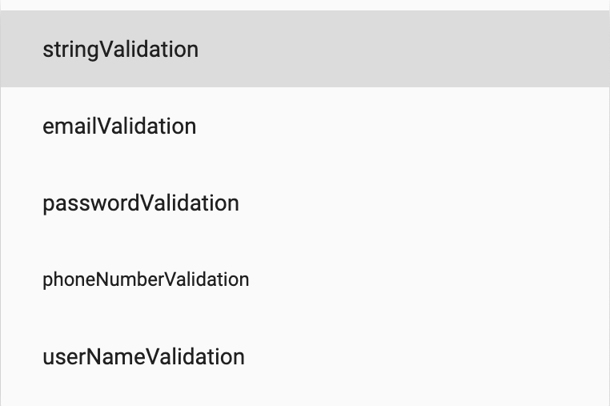
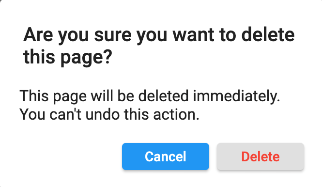
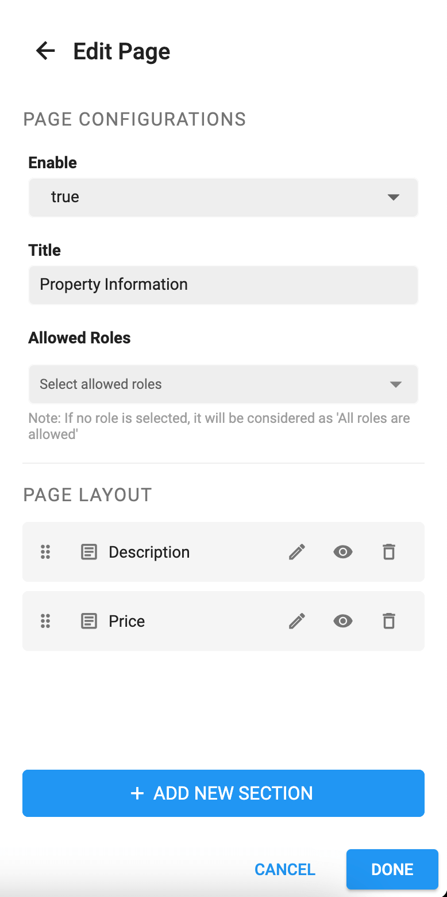
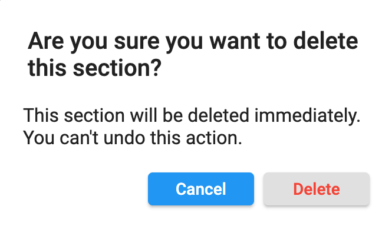

> **Important**: You are required to install the Houzi Rest Api Plugin on your Houzez wordpress. To install the Plug-in, click on [Houzi Rest Api Plugin Link](https://github.com/booleanbites/houzi-rest-api).

> A **Mobile App View** is provided in the center of screen, so you can see how the modifications will look on real device.

This guide consists of following sections.

[Add New Page](#add-new-page)  
This section guides through all the steps related to adding new Form Page. You can have *single* or *multiple* form pages (as per you desired) for **Add Property** purposes.

[Add New Section](#add-new-section)  
This section guides through all the steps related to adding new Form Section. In a Form Page, you can have *single* or *multiple* form sections (as per you desired).

[Add New Field](#add-new-field)  
This section guides through all the steps related to adding new Form Field. In a Form Page, you can have *single* or *multiple* form fields (as per you desired). 

[Edit Page](#edit-page)  
This section guides through all the steps related to editing Form Page. You can *Re-arrange, Hide or Delete* a form page. You can also *Add new sections or Remove existing sections* in the form page.

[Edit Section](#edit-section)  
This section guides through all the steps related to editing Form Section. You can *Re-arrange, Hide or Delete* a form section. You can also *Add new fields or Remove existing fields* in the form section.

[Edit Field](#edit-field)  
This section guides through all the steps related to editing Form Field.  You can *Re-arrange, Hide or Delete* a form field. You can also *customize* the existing form field.

[Re-arrange](#re-arrange)  
This section guides through all the steps related to *Re-arrange* a Form Page, Form Section and Form Field.

# Add New Page  
You can `Add` a new Page in **Add Property Form** by following these steps:  

- Press the **Add Page** button at the right bottom of the screen, a dialog box will open.   

      
      
- The value of **Enable** field determines wether to *show/hide* the page. If you and to *show* the page, set the value to **true**. If you and to *hide* the page, set the value to **false**.

- Enter the **Title** of page.

- If you want to **restrict** this page to some specific users e.g. *administrator, houzez_agnecy etc.*, select these specific roles from the **Allowed Roles** multiselect dropdown menu. If you want to make the page **public** (available to all users), unselect all the roles (if any role is selected).

- Now [Add New Section/Sections](#add-new-section) in this page.

- Click **Done** button and a new page will be added in the **Add Property Form**.

- By clicking **Cancel** button, all changes will be discarded and page will not be added in the **Add Property Form**.

- If you have *multiple* form pages and you want to re-arrnage the posotion of a particular form page, you can simply [Re-arrange the form page](#re-arrange) as per your desire.

# Add New Section
You can `Add` a new Section in Page by following these steps:

- Press the **Add Section** button at the right bottom of the screen, a dialog box will open.   

      
      
- The value of **Enable** field determines wether to *show/hide* the section on page. If you and to *show* the section, set the value to **true**. If you and to *hide* the section, set the value to **false**.

- Enter the **Title** of section.

- Now [Add New Field/Fields](#add-new-field) in this section.

- Click **Done** button and a new section will be added in the page.

- By clicking **Cancel** button, all changes will be discarded and section will not be added in the page.

- If you have *multiple* form sections and you want to re-arrnage the posotion of a particular form section, you can simply [Re-arrange the form section](#re-arrange) as per your desire.

# Add New Field
You can `Add` a new Field in Section by following these steps: 

- Press the **Add Field** button at the right bottom of the screen, a dialog box will open.   

      
      
- The value of **Enable** field determines wether to *show/hide* the field on section. If you and to *show* the field, set the value to **true**. If you and to *hide* the field, set the value to **false**.

- If you want to make the input of any field **required**, set the value of **Make Field Required** as *true*. Similarly if you want to make the input of any field **optional**, set the value of **Make Field Required** as *false*.

- If you want to **restrict** this field to some specific users e.g. *administrator, houzez_agnecy etc.*, select these specific roles from the **Allowed Roles** multiselect dropdown menu. If you want to make the field **public** (available to all users), unselect all the roles (if any role is selected).

- #### Field Type 
    It is the type of *Form Widget* that you want to display on screen. e.g. Input Text Field, Dropdown etc. Select the desired *Form Widget Type* from **Field Type** dropdown.

     

    The description of **Field Type** is as follows: 

    * **formTextField** should be used, if you want to take *text* input from user. e.g. Property Title, Property Price etc. You can define some assisting attributes like:

           
        
        * **Hint** is used as place holder for your field. e.g. *Enter property title* etc.

        * **Additional Hint** is used to provide extra assisting information about the field. e.g. additional hint of property price field: *Only digits* etc.

        * **Validation Types** are defined as follows:

             

            * **String Validation** is used to check if the input is **non-empty**. Otherwise it will return error.

            * **Email Validation** is used to check if the entered input is properly **email-formatted**. Otherwise it will return error.

            * **Password Validation** is used to check if the entered input is properly **password-formatted**. Otherwise it will return error.

            * **Phone Number Validation** is used to check if the entered input is properly **phone-number-formatted**. Otherwise it will return error.

            * **User Name Validation** is used to check if the entered input is properly **user-name-formatted**. Otherwise it will return error.

        * **Max Lines** is used to define the max lines of field. If you want to show a *Text Area* for any property attribute e.g. Property Description, simply set the max lines to *5* or *7* as you desire.
        * **Keyboard Type** are defined as follows:

             

            * **Text** is used to if you want to show normal keyboard for **text** input.

            * **Number** is used to if you want to show **Numeric** keyboard for text input.

            * **URL** is used to if you want to show **URL** assistive  keyboard for URL input.

            * **Email** is used to if you want to show **Email** assistive  keyboard for email input.

            * **MultiLine** is used to if you want to show text keyboard for **multi-line** input.

    * **formMultiSelectField** should be used, if you want to take *single/multiple* inputs of any *Houzez Term Type*, from the user. e.g. *Property Features (e.g. Garage, Pool etc.), Property Type (Commercail, Office etc.)* etc. You have to choose the **Term type** e.g. *property_type, property_status, property_feature* etc. from the *Term Type* dropdown. You can define some assisting attributes like:

        * **Hint** is used as place holder for your field. e.g. *Select Property Type* etc.

        * **Additional Hint** is used to provide extra assisting information about the field. e.g. additional hint of property price field: *Only digits* etc.

    * **formDropDownField** should be used, if you want to take **single** input of any *Houzez Term Type*, from the user. e.g. *Property Features (e.g. Garage, Pool etc.), Property Type (Commercail, Office etc.)* etc. You have to choose the **Term type** e.g. *property_type, property_status, property_feature* etc. from the *Term Type* dropdown. You can define some assisting attributes like:

        * **Hint** is used as place holder for your field. e.g. *Select Property Type* etc.

        * **Additional Hint** is used to provide extra assisting information about the field. e.g. additional hint of property price field: *Only digits* etc.

    * **formStepperField** should be used, if you want to take such user input in which user can *increase* or *decrease* some value with the help of steppers. e.g. Number of bedrooms, Number of bathrooms etc.

    * **formMediaField** should be used, if you want to take media from user e.g. photos etc.
        > **Note**: *formMediaField* is non-editable field (attributes like **Api Key** and **Title** are *fixed*.)

    * **formAdditionalDetailsField** should be used, if you want to take some *additional details/features* about property from user e.g. Equipment: Grill - Gas, Deposit: 20% etc.
        > **Note**: *formAdditionalDetailsField* is non-editable field (attributes like **Api Key** and **Title** are *fixed*.)

    * **formCustomField** should be used, if you want to take user input in your custom defined Houzez fields.
        > **Note**: *formCustomField* is non-editable field (attributes like **Api Key** and **Title** are *fixed*.)
    
    * **formMapField** should be used, if you want to take user location from *Google Maps* and display location as *latitude* and *longitude*.
        > **Note**: *formMapField* is non-editable field (attributes like **Api Key** and **Title** are *fixed*.)

    * **formCheckBoxListField** should be used, if you want to show a list of any *Houzez Term Type* and take *single/multiple* input from the user. e.g. Property Features (e.g. Garage, Pool etc.) etc. You have to choose the **Term type** e.g. *property_feature* etc. from the *Term Type* dropdown.

    * **formRadioButtonField** should be used, if you want to take user input from *Radio Group*. You can define the **Radio Option** through **Field Values** as follows:
        * Click on Field Values text area, a dialog will open.

             
        
        * Click on *Add Field Values* button, two field will be display. You can add *options* in 'key value' pair. *Key* will be the option to diplay on screen and its *Value* will be sent against the *Api key*. e.g. Key: **No**, Value: **0**, Key: **Yes**, Value: **1**, etc.

             

        * By clicking **(x)** button, the key-value pair option will be discarded.

        * Click **Done** button and a *Field Value* will be added.

        * By clicking **Cancel** button, all changes will be discarded and *Field Value* will not be added.

    * **floorPlansField** should be used, if you want to take user input about *Floor Plans*.
        > **Note**: *floorPlansField* is non-editable field (attributes like **Api Key** and **Title** are *fixed*.)

    * **multiUnitsField** should be used, if you want to take user input about *MultiUnits/Sub-Listings*.
        > **Note**: *multiUnitsField* is non-editable field (attributes like **Api Key** and **Title** are *fixed*.)

    * **multiUnitsIdsField** should be used, if you want to add other properties as multiunits or sub-listings of some particular property.
        > **Note**: 
        > - *multiUnitsIdsField* is restricted to **Administrator** use only.
        > - *multiUnitsIdsField* is non-editable field (attributes like **Api Key** and **Title** are *fixed*.)

    * **realtorContactInformationField** should be used, if you want to display any particular realtor (e.g. *admin, agency, agent or other user* etc.) contact information in the property details.
        > **Note**: 
        > - *realtorContactInformationField* is restricted to **administrator & houzez_agnecy** use only.
        > - *realtorContactInformationField* is non-editable field (attributes like **Api Key** and **Title** are *fixed*.)

     * **formGDPRAgreementField** should be used, if you want to display any particular realtor (e.g. *admin, agency, agent or other user* etc.) contact information in the property details.
        > **Note** *formGDPRAgreementField* is non-editable field (attributes like **Api Key** and **Title** are *fixed*.)

- #### Api Key [ Required ]
    Select the *Api key* from the dropdown menu. The corresponding data of field will be sent to this key when **Add Property API** will be called. e.g. the data related to Property Title field will be sent against *prop_title* key etc.

     

    The description of **Api Keys** is as follows: 

    * **prop_title** must be selected if you are taking user input related to *Property Title*.

    * **prop_des** must be selected if you are taking user input related to *Property Description*.

    * **prop_type[]** must be selected if you are taking user input related to *Property Type*. e.g. Commercial, Residential, Office, Appartment etc.

    * **prop_status[]** must be selected if you are taking user input related to *Property Status*. e.g. For-Rent, For-Sale etc.

    * **prop_label[]** must be selected if you are taking user input related to *Property Label*. e.g. Hot Offer, Open House etc.

    * **prop_price** must be selected if you are taking user input related to *Property Price*.

    * **prop_label** must be selected if you are taking user input related to *Property After Price*. e.g. Monthly etc.

    * **prop_price_prefix** must be selected if you are taking user input related to *Property Price Prefix*. e.g. Starts from etc.

    * **prop_sec_price** must be selected if you are taking user input related to *Property Second Price*.

    * **prop_video_url** must be selected if you are taking user input related to *Property Video URL*. (Video could be uploaded on Youtube, Vimeo or as SWF File, MOV Files etc.)

    * **prop_beds** must be selected if you are taking user input related to *Property Bedrooms*.

    * **prop_baths** must be selected if you are taking user input related to *Property Bathrooms*.

    * **prop_size** must be selected if you are taking user input related to *Property Size*.

    * **prop_size_prefix** must be selected if you are taking user input related to *Property Size Prefix*. e.g. sq ft etc.

    * **prop_land_area** must be selected if you are taking user input related to *Property Land Area Size*.

    * **prop_land_area_prefix** must be selected if you are taking user input related to *Property Land Area Size Prefix*. e.g. sq ft etc.

    * **prop_garage** must be selected if you are taking user input related to *Property Garage*.

    * **prop_garage_size** must be selected if you are taking user input related to *Property Garage Size*.

    * **prop_year_built** must be selected if you are taking user input related to *Property Year Built*.

    * **prop_features[]** must be selected if you are taking user input related to *Property Features*. e.g. Air Conditioning, Lawn, Swimming Pool, Wifi etc.

    * **property_map_address** must be selected if you are taking user input related to *Property Address*.

    * **country** must be selected if you are taking user input related to *Property Country*.

    * **administrative_area_level_1** must be selected if you are taking user input related to *Property State*.

    * **locality** must be selected if you are taking user input related to *Property City*.

    * **neighborhood** must be selected if you are taking user input related to *Property Area*.
    
    * **postal_code** must be selected if you are taking user input related to *Property Zip Code*.

    * **virtual_tour** must be selected if you are taking user input related to *Property Virtual Tour*.

    * **prop_featured** must be selected if you are taking user input related to *Making Property Featured*.
        > **Note**: *prop_featured* is restricted to **Administrator** use only.

    * **login-required** must be selected if you are taking user input related to *Making sure that user is Logged-in to view the Property Details*.
        > **Note**: *login-required* is restricted to **Administrator** use only.

    * **fave_property_disclaimer** must be selected if you are taking user input related to *Property Disclaimer*.
        > **Note**: *fave_property_disclaimer* is restricted to **Administrator** use only.

    * **fave_private_note** must be selected if you are taking user input related to *Property Private Note*.

- **[Required]** Enter the **Title** of field.
    > **Note**: *Title* of some fields (e.g. *Additional Details, FLoor Plans* etc.) will be non-editable.

- Click **Done** button and a new field will be added in the section.

- By clicking **Cancel** button, all changes will be discarded and field will not be added in the section.

- If you have *multiple* form fields and you want to re-arrnage the posotion of a particular form field, you can simply [Re-arrange the form field](#re-arrange) as per your desire.

# Edit Page

### Form Page Item Screenshot

   

You can perform following opertions while **Editing** a page.  

* [Re-arrange](#re-arrange)
* [Show or Hide](#show-or-hide-a-page)
* [Delete](#delete-a-page)
* [Edit](#edit-a-page)

### Show or Hide a Page

You can **show/hide** a form page just by clicking on *show/hide* icon of [Form Page Item](#form-page-item-screenshot).

### Delete a Page

You can **delete** a form page just by clicking on *delete* icon of [Form Page Item](#form-page-item-screenshot). A delete confirmation dialog will open. On clicking **Cancel**, the action will be *discarded* and dialog will be closed. On clicking **Delete**, the page will be deleted (this action can not be *undone*).

  

### Edit a Page
You can `Edit` a Form Page by following these steps:  

- Press the **Edit** icon of [Form Page Item](#form-page-item-screenshot), a dialog box will open.   

      
      
- The value of **Enable** field determines wether to *show/hide* the page. If you and to *show* the page, set the value to **true**. If you and to *hide* the page, set the value to **false**.

- If you want to **rename** the page, simply provide the new **Title** of page.

- If you want to **restrict** this page to some specific users e.g. *administrator, houzez_agnecy etc.*, select these specific roles from the **Allowed Roles** multiselect dropdown menu. If you want to make the page **public** (available to all users), unselect all the roles (if any role is selected).

- If you have *single* or *multiple* sections in the page, you can [Edit Section/Sections](#edit-section).

- If you have *no* section in the page, you can [Add New Section/Sections](#add-new-section).

- Click **Done** button, all *modifications* will applied to the page.

- By clicking **Cancel** button, all *modifications* will be discarded.

# Edit Section

### Form Section Item Screenshot
   

You can perform following opertions while **Editing** a section.  

* [Re-arrange](#re-arrange)
* [Show or Hide](#show-or-hide-a-section)
* [Delete](#delete-a-section)
* [Edit](#edit-a-section)

### Show or Hide a Section
You can **show/hide** a form section just by clicking on *show/hide* icon of [Form Section Item](#form-section-item-screenshot).

### Delete a Section
You can **delete** a form section just by clicking on *delete* icon of [Form Section Item](#form-section-item-screenshot). A delete confirmation dialog will open. On clicking **Cancel**, the action will be *discarded* and dialog will be closed. On clicking **Delete**, the section will be deleted (this action can not be *undone*).

  

### Edit a Section
You can `Edit` a Form Section in the Page by following these steps:

- Press the **Edit** icon of [Form Section Item](#form-section-item-screenshot), a dialog box will open.   

      
      
- The value of **Enable** field determines wether to *show/hide* the section on page. If you and to *show* the section, set the value to **true**. If you and to *hide* the section, set the value to **false**.

- If you want to **rename** the section, simply provide the new **Title** of section.

- If you have *single* or *multiple* form fields in the page, you can [Edit Field/Fields](#edit-field).

- If you have *no* field in the section, you can [Add New Field/Fields](#add-new-field).

- Click **Done** button, all *modifications* will applied to the section.

- By clicking **Cancel** button, all *modifications* will be discarded.

# Edit Field

### Form Field Item Screenshot
   

You can perform following opertions while **Editing** a field.  

* [Re-arrange](#re-arrange)
* [Show or Hide](#show-or-hide-a-field)
* [Delete](#delete-a-field)
* [Edit](#edit-a-field)

### Show or Hide a Field
You can **show/hide** a form field just by clicking on *show/hide* icon of [Form Field Item](#form-field-item-screenshot).

### Delete a Field
You can **delete** a form field just by clicking on *delete* icon of [Form Field Item](#form-field-item-screenshot). A delete confirmation dialog will open. On clicking **Cancel**, the action will be *discarded* and dialog will be closed. On clicking **Delete**, the field will be deleted (this action can not be *undone*).

  

### Edit a Field
You can `Edit` a Form Field in the Form Section by following these steps:

- Press the **Edit** icon of [Form Field Item](#form-field-item-screenshot), a dialog box will open.   

      
       
- The value of **Enable** field determines wether to *show/hide* the field on section. If you and to *show* the field, set the value to **true**. If you and to *hide* the field, set the value to **false**.

- If you want to make the input of field **required**, set the value of **Make Field Required** as *true*. Similarly if you want to make the input of field **optional**, set the value of **Make Field Required** as *false*.

- If you want to **restrict** this field to some specific users e.g. *administrator, houzez_agnecy etc.*, select these specific roles from the **Allowed Roles** multiselect dropdown menu. If you want to make the field **public** (available to all users), unselect all the roles (if any role is selected).

- You change the [Field Type](#field-type) as per your desire.

- You change the [Api Key](#api-key-[-required-]) as per your desire.

- If you want to **rename** the field, simply provide the new **Title** of field.
    > **Note**: *Title* of some fields (e.g. *Additional Details, FLoor Plans* etc.) will be non-editable.

- Click **Done** button, all *modifications* will applied to the field.

- By clicking **Cancel** button, all *modifications* will be discarded.

# Re-Arrange
You can perform the `Re-arrange` action just by dragging the **page, section** or **field** item *upwards* or *downwards*.

 

 