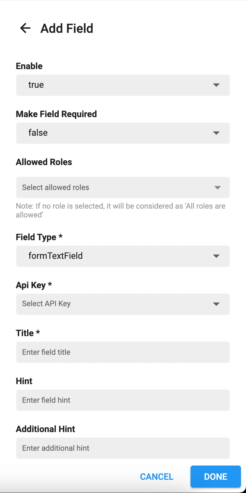

> **Important**: You are required to install the Houzi Rest Api Plugin on your Houzez wordpress. To install the Plug-in, click on [Houzi Rest Api Plugin Link](https://github.com/booleanbites/houzi-rest-api).

> A **Mobile App View** is provided in the center of screen, so you can see how the modifications will look on real device.

This guide consists of following sections.

[Add New Page](#add-new-page)  
This section guides through all the steps related to adding new Form Page.    

[Add New Section](#add-new-section)  
This section guides through all the steps related to adding new Form Section.    

[Add New Field](#add-new-field)  
This section guides through all the steps related to adding new Form Field.   

[Edit Page](#edit-page)  
This section guides through all the steps related to editing Form Page.    

[Edit Section](#edit-section)  
This section guides through all the steps related to editing Form Section.    

[Edit Field](#edit-field)  
This section guides through all the steps related to editing Form Field.  

# Add New Page  
You can `Add` a new Page in **Add Property Form** by following these steps:  

- Press the **Add Page** button at the right bottom of the screen, a dialog box will open.   

      
      
- The value of **Enable** field determines wether to *show/hide* the page. If you and to *show* the page, set the value to **true**. If you and to *hide* the page, set the value to **false**.

- Enter the **Title** of page.

- If you want to **restrict** this page to some specific users e.g. *administrator, houzez_agnecy etc.*, select these specific roles from the multiselect dropdown menu. 

- If you want to make the page **public** (available to all users), unselect all the roles (if any role is selected).

- Now [Add New Section/Sections](#add-new-section) in this page.

- Click **Done** button and a new page will be added in the **Add Property Form**.

- By clicking **Cancel** button, all changes will be discarded and page will not be added in the **Add Property Form**.

# Add New Section
You can `Add` a new Section in Page by following these steps:

- Press the **Add Section** button at the right bottom of the screen, a dialog box will open.   

      
      
- The value of **Enable** field determines wether to *show/hide* the section on page. If you and to *show* the section, set the value to **true**. If you and to *hide* the section, set the value to **false**.

- Enter the **Title** of section.

- Now [Add New Field/Fields](#add-new-field) in this section.

- Click **Done** button and a new section will be added in the page.

- By clicking **Cancel** button, all changes will be discarded and section will not be added in the page.

# Add New Field
You can `Add` a new Field in Section by following these steps: 

- Press the **Add Field** button at the right bottom of the screen, a dialog box will open.   

      
      
- The value of **Enable** field determines wether to *show/hide* the field on section. If you and to *show* the field, set the value to **true**. If you and to *hide* the field, set the value to **false**.

- Enter the **Api Key** of field.

- If you want to **restrict** this field to some specific users e.g. *administrator, houzez_agnecy etc.*, select these specific roles from the multiselect dropdown menu.

- If you want to make the field **public** (available to all users), unselect all the roles (if any role is selected).

- Enter the **Title** of field.

- Enter the **Hint** of field.

- Enter the **Additional Hint** of field.

- Click **Done** button and a new field will be added in the section.

- By clicking **Cancel** button, all changes will be discarded and field will not be added in the section.

# Edit Page  

# Edit Section

# Edit Field
