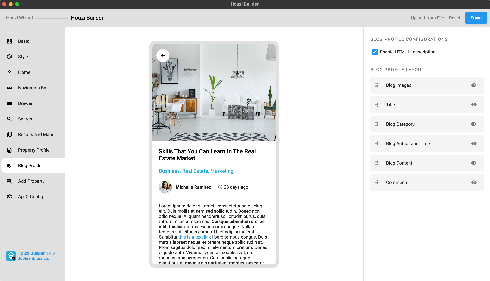
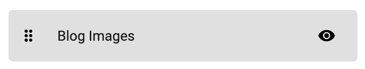
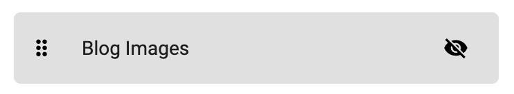
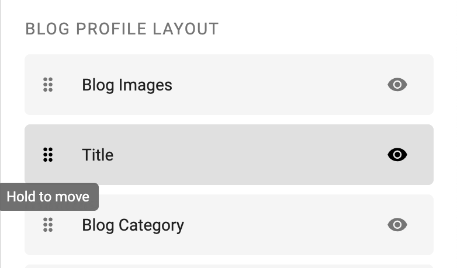
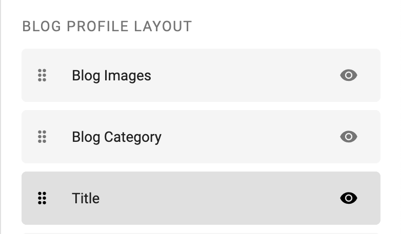

> **Important**: You are required to install the Houzi Rest Api Plugin on your Houzez wordpress. To install the Plug-in, click on [Houzi Rest Api Plugin Link](https://github.com/booleanbites/houzi-rest-api).

> A **Mobile App View** is provided in the center of screen, so you can see how the modifications will look on real device.  

This guide consists of following sections:  

[Blog Profile Configurations](#blog-profile-configurations)  
[Show-Hide a Section](#show-hide-a-section)  
[Re-arrange a Section](#re-arrange-a-section)  

Let's dive into the details of each section.

---

# Blog Profile Configurations

You can **enable** or **disable** the *HTML*, in the blog description widget, just by *Check Marking or Un-Marking* the **Enable HTML in description** checkbox field. 

---

# Show-Hide a Section

You can **show** or **hide** any section just by clicking on **Visibility / Invisibility Icon** of respective section.  
 

---

# Re-arrange a Section

You can `Re-arrange` the sections on **Blog Profile Screen**. Hold the section that you want to re-arrange and move it vertically (*upwards* or *downwards*). Place it on desire position in sections list.

  

 