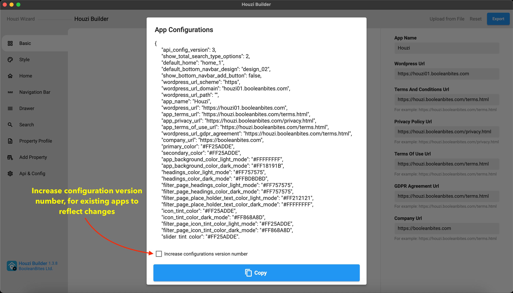
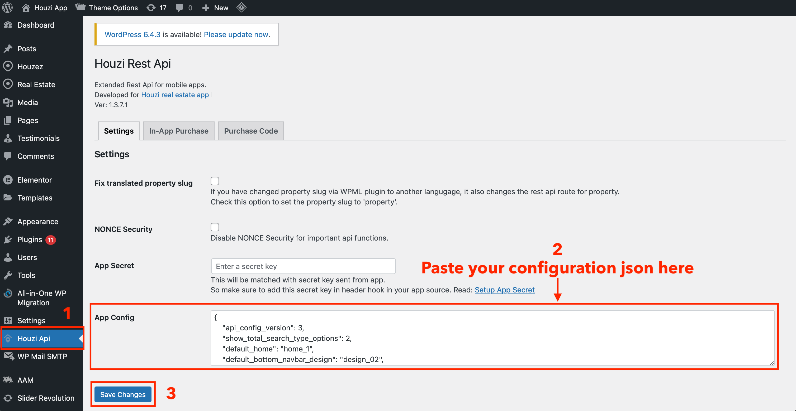

> **Important**: You are required to install the Houzi Rest Api Plugin on your Houzez wordpress. To install the Plug-in, click on [Houzi Rest Api Plugin Link](https://github.com/booleanbites/houzi-rest-api).

Once you have filled all the **required** fields, follow these steps: 

1. Press the **Export** button, at the top-right side of screen. A dialogbox will open with preview of the configurations of your app.

    

    
     

2. At the bottom of dialogbox, there is **Copy** button. Press the *Copy* button and the configurations of your app will be copied to clipboard.

3. **[Optional Task]** At the bottom of dialogbox, you will see a checkbox named as **Increase configurations version number**. If you are [**Editing/Updating**](/houzi-builder/edit_configuration) the configurations of your app, then *checkmark* it, else leave it unchecked.

### Now you need to save it to two places:

####  1. **configurations.json** in your app source code:
Open following file *configurations.json* file path:
 
    > Project_HOME > assets > configurations > configurations.json

and paste the *copied configurations* in it, replacing the old configurations. 

#### 2. **App Config field on Houzi Api on WPAdmin:**
Open your wordpress admin panel and navigate to the **Houzi Api Plugin**. Paste the copied json to the **App Config** text field and click on **Save Changes**.

### Benifits of saving configurations to Houzi Api
1. The configuration saved in App Config file are served over the air, which means, when app opens, it fetches latest configurations saved in Houzi Api Plugin. If it has the latest version, it will apply the latest configurations to the app. This is helpful if you want to hide/show sections of the app that is already installed on user devices. You can change search filter layout, home sections, hide/show property details sections, add remove menus in left drawer or change property item designs in listings and many more.
2. When Houzi Builder starts and you enter your website, the configuration saved in App Config file are also fetched and Houzi Builder shows all options and layouts according to your saved configurations in App Config field.
3. Although Houzi Builder fetches and applies the configurations from Houzi Api plugin, you can still load local configurations by loading the configuration.json file to Houzi Builder by opening file picker when clicking on top right "Upload from File" button.

> **Important**: If app receives the same version number in configurations, then it'll not honor the new configurations having the same config version. So if you don't increase the version number while exporting, then delete the existing app from device and reluanch to view the changes.
