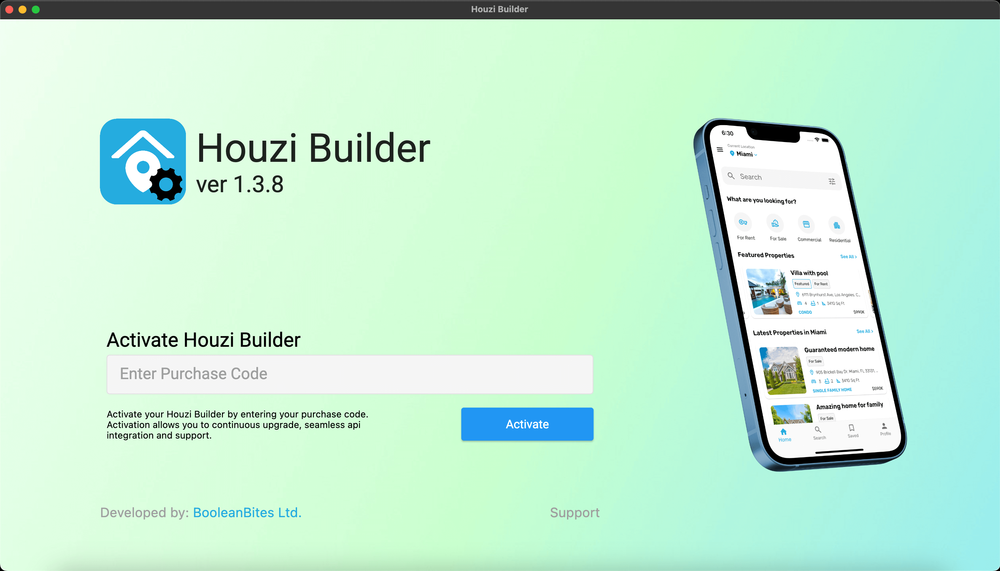

On opening the application, the first screen, that you will encounter, will be the **Houzi Builder Activation** screen. Enter your *Purchase Code* in the required text field and press *Activate* button. After verification, you will be taken to *Houzi Wizard Screen*.

If you require help of any kind regarding Houzi Builder, press the *Support* text button (at the bottom of screen). It will take you to the github page of the houzi-support. Open a new issue there and Houzi team will try to response as soon as possible.

> Once you have successfully activated your *Houzi Builder*, the app will auto varify your license on each launch.

