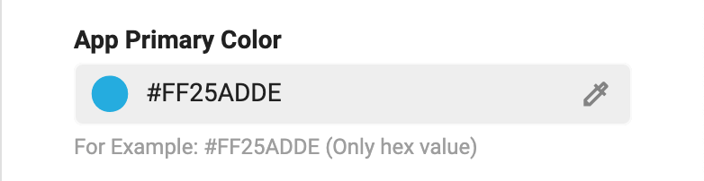
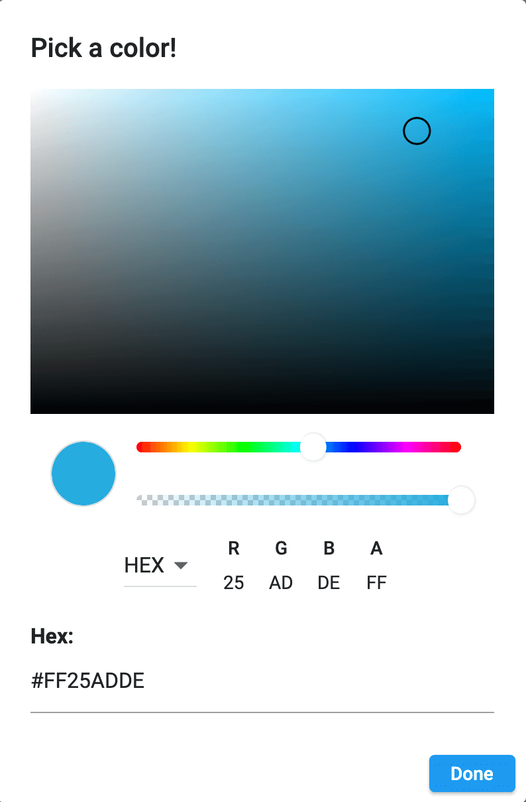

> **Important**: You are required to install the Houzi Rest Api Plugin on your Houzez wordpress. To install the Plug-in, click on [Houzi Rest Api Plugin Link](https://github.com/booleanbites/houzi-rest-api).

> A **Mobile App View** is provided in the center of screen, so you can see how the modifications will look on real device.

    

This guide consists of following sections:  

[Style Configurations](#style-configurations)   
[How to Customize Style Option](#how-to-customize-style-option)  

Let's dive into the details of each section.

---

# Style Configurations

The syle configurations are divided into following three catagories for the ease of customization:

### 1. General Configurations

General configurations include the style choices that stay the same no matter if you are using Light Mode or Dark Mode. For example, App Primary Color etc.

### 2. Light Mode Configurations

Light Mode configurations include the style choices that are for the Light Mode of app. For example, App Background Color etc.  

 

### 3. Dark Mode Configurations

Dark Mode configurations include the style choices that are for the Dark Mode of app. For example, App Background Color etc.

 

---

# How to Customize Style Option

If you want to change the **Primary Color** of the app, follow these steps: 

1. Click on the *Colored circle* or *Droper icon* of **App Primary Color **field.    
 
    

2. A color picker dialog will open. Choose you desired color, its opacity (optional) and press **Done**.  
 
    

3. If you have a **Hex value** of the desired color, you can simply put it in **App Primary Color** field or color picker dialog **Hex** field and press **Done** button.

**App Primary Color** will change accordingly.