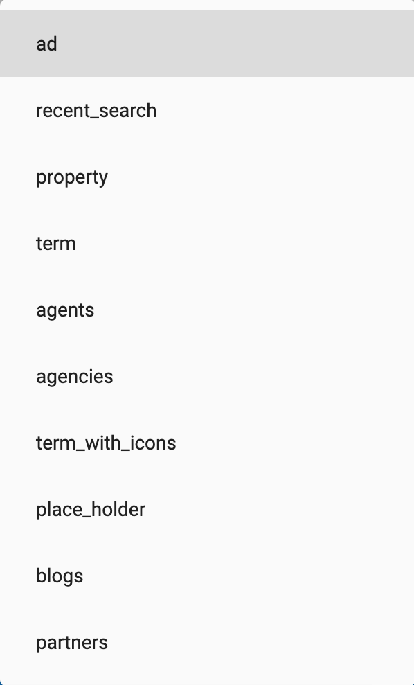
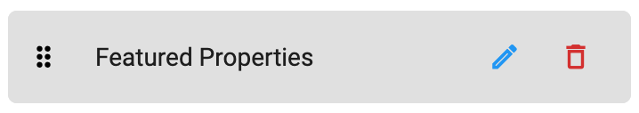

> **Important**: You are required to install the Houzi Rest Api Plugin on your Houzez wordpress. To install the Plug-in, click on [Houzi Rest Api Plugin Link](https://github.com/booleanbites/houzi-rest-api).

> A **Mobile App View** is provided in the center of screen, so you can see how the modifications will look on real device.

This guide consists of following sections:  

[Home Designs](#home-designs)  
[Add New Section](#add-new-section)  
[Edit a Section](#edit-a-section)  
[Delete a Section](#delete-a-section)  
[Re-arrange a Section](#re-arrange-a-section)  

Let's dive into the details of each section.

---

# Home Designs

Houzi provides you wide range of home designs. On the top right side of Home section, Home designs are provided. Click on any *Home design*, and you will be able to see, how it will look on real device in the *Mobile App View*. (By default, selected design is *Home Elegant*, one of most popular designs.)

   

There are some *additional customizations* related to Home designs as follows:

- If you select **Home Carousel** or **Home Location**, you can increase or reduce the *Search Type* options e.g. For Rent, For Sale etc. with the help of stepper. 

    

  > Above displayed **Search Types** are *generic houzez List-Type: property_status options*. You may encounter these options, according to the data of your website.

- If you select **Home Tabbed**, you can replace the quote 'What are you looking for?' with your custom quote, in the *Quote* text field. 

    

---

# Add New Section

For adding new section in Home Screen, follow these steps:

- There is a **Add** button at the bottom of the column, press this button and a dialog box will open.  
   
    

- First of all, you have to define the **Widget Type** of the section. There are many widget types as: 
  - **ad:** If you want to show *ads*.
  - **recent_searches:** If you want to show *Recent Searches*.
  - **property:** If you want to show *Specific Properties* e.g. *Properties by Rent* etc.
  - **term:** If you want to show *Particular Properties* e.g. *Properties by property_Type or property_city* etc.
  - **agents:** If you want to show *Agents*.
  - **agencies:** If you want to show *Agencies*.
  - **terms_with_icon:** If you want to show *Terms* on a circular view e.g. For Sale, For Rent etc.
  - **place_holder:** If you want to show your *Custom Widget*.
  - **partners:** If you want to show *Partners*.

       
  
- Second, you have to define the **Title** of the section.

- Third, you can define **Design** of any Property related section. Property related sections are as follows:
  - property.
  - term.   

  > You can choose from *Design # 01* to *Design # 08* for the *property* sections. *term* section has only two designs i.e. *Design # 01* and *Design # 02*.  
    **Design** for *non-proprety* related sections can not be defined.    
    
        
    
- Forth, you can define **List-Type** of any *Property* related section. List-Types are as follows:   

  - **all:** If you want to show latest listings. (It is by default selected option).
  - **property_type:** If you want to show listings by their *Types* e.g. Apartments, Offices, Shops etc.
  - **property_status:** If you want to show listings by their *Status* e.g. for-rent, for-sale etc.
  - **property_feature:** If you want to show listings by their *Features* e.g. Air-Conditioning, Swimming-pool etc.
  - **property_label:** If you want to show listings by their *Labels* e.g. hot-offer, open-house etc.
  - **property_state:** If you want to show listings by their *States*.
  - **property_city:** If you want to show listings by their *Cities*.
  - **property_area:** If you want to show listings by their *Areas*.
  - **property_country:** If you want to show listings by their *Countries*.

    

  > Above mentioed **List-Types** are *generic houzez List-Type options*. You may encounter all or some of these options, according to the data of your website.

- Fifth, you can define **List-Type Value** of any *Property* related section. List-Types Values are as follows:
  - **all:** If you want to show all the listings of specific List-Type.
  - If selected List-Type is **property_type** and you want to show listings according to some particular *property_type* e.g. Apartments, Offices, Shops etc.
  - If selected List-Type is **property_status** and you want to show listings according to some particular *property_status* e.g. for-rent, for-sale etc.
  - If selected List-Type is **property_feature** and you want to show listings according to some particular *property_feature* e.g. Air-Conditioning, Swimming-pool etc.
  - If selected List-Type is **property_label** and you want to show listings according to some particular property_label e.g. hot-offer, open-house etc.
  - If selected List-Type is **property_state** and you want to show listings according to some particular *state*.
  - If selected List-Type is **property_city** and you want to show listings according to some particular *city*.
  - If selected List-Type is **property_area** and you want to show listings according to some particular area.
  - If selected List-Type is **property_country** and you want to show listings according to some particular *country*.

- Check **Show Featured** to show *Featured* Properties in property section type only.

- Check **Show Nearby Properties** to show *Nearby Properties* in property section type only. 
  > Please consider the fact that you won't have properties available for all user locations. Also consider *location permission* and other *gps* related issues as well.

- Click **Done** to *add* the new section.

- Click **Cancel** to *discard* the action.

---

# Edit a Section

You can **Edit** any sections just by clicking on *edit icon* of respective section.   

 

 

You can perform following opertions while *editing* a section:
- You can change the **Widget Type** of any section.
- You can **Rename** any section.
- You can change the **Design** of any Property related section.
-  You can change the **Listing Type** of any Property related section (e.g. you can show *all properties* or just the properties based on their *property_type* or *property_status* etc.).
-  You can change the **Listing Type Value** of any Property related section (e.g. you can show *all properties* of particular selected Listing Type or just the properties based on that selected Listing Type Value (i.e. if selected Listing Type is *Property_type*, you can choose the selected Listing Type Value to be *all* or one of the selected Listing Type values (e.g. apartment, office etc.))).

---

# Delete a Section

You can **Delete** any section just by clicking on *delete icon* of respective section. A delete confirmation dialog will open. 

    

  
    
> Click **Delete** if you want to *delete* the section.  
  Click **Cancel** if you want to *discard* the action.

---

# Re-arrange a Section

You can **Re-arrange** the sections on **Home Screen**. Hold the section that you want to re-arrange and move it vertically (*upwards* or *downwards*). Place it on desire position in sections list.

  

  