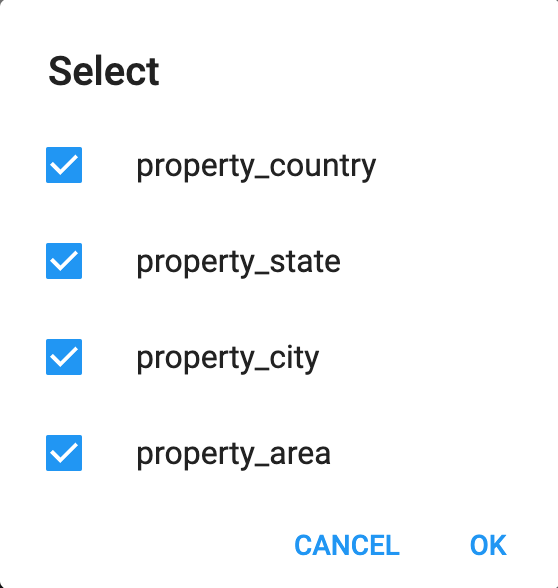
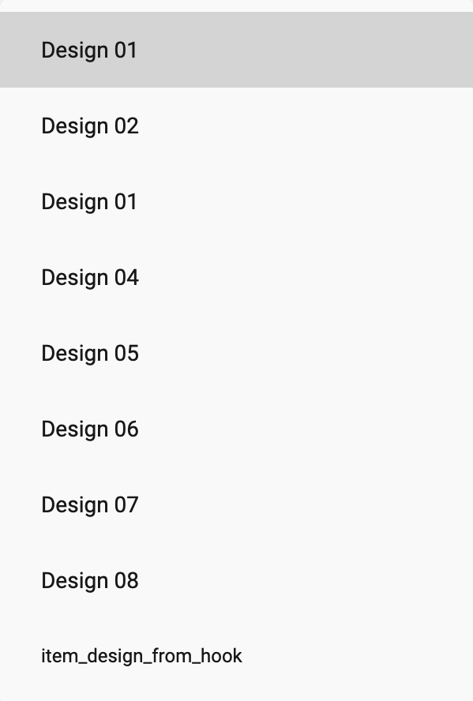
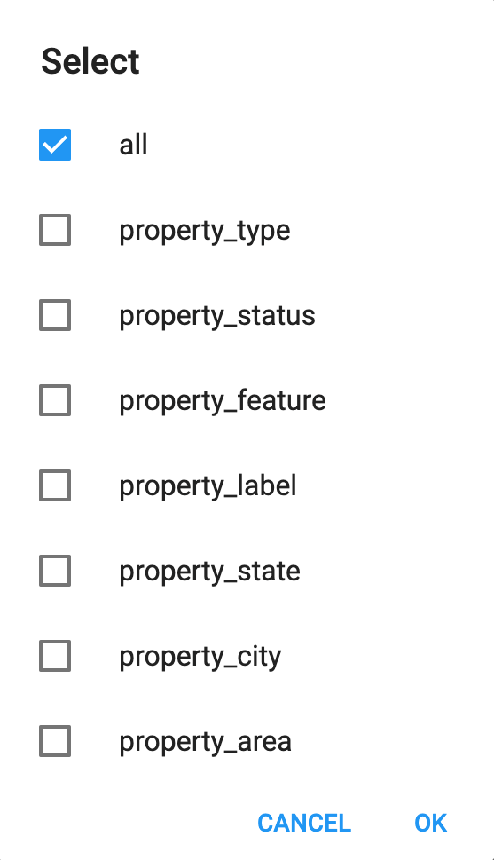

> **Important**: You are required to install the Houzi Rest Api Plugin on your Houzez wordpress. To install the Plug-in, click on [Houzi Rest Api Plugin Link](https://github.com/booleanbites/houzi-rest-api).

> A **Mobile App View** is provided in the center of screen, so you can see how the modifications will look on real device.

This guide consists of following sections:  

[Home Designs](#home-designs)  
[Add New Section](#add-new-section)  
[Edit a Section](#edit-a-section)  
[Delete a Section](#delete-a-section)  
[Re-arrange a Section](#re-arrange-a-section)  

Let's dive into the details of each section.

---

# Home Designs

Houzi provides you wide range of home designs. On the top right side of Home section, Home designs are provided. Click on any *Home design*, and you will be able to see, how it will look on real device in the *Mobile App View*. (By default, selected design is *Home Elegant*, one of most popular designs.)

   

There are some *additional customizations* related to Home designs as follows:

- If you select **Home Carousel** or **Home Location**, you can increase or reduce the *Search Type* options e.g. For Rent, For Sale etc. with the help of stepper. 

    

  > Above displayed **Search Types** are *generic houzez List-Type: property_status options*. You may encounter these options, according to the data of your website.

- If you select **Home Tabbed**, you can replace the quote 'What are you looking for?' with your custom quote, in the *Quote* text field. 

    

- If you select **Home Carousel** or **Home Elegant**, you can change the **Location Picker Hierarchy**. 

    

    

  > Above displayed **taxonomies** are *generic houzez taxonomies*. You may encounter these options, according to the data of your website.

---

# Add New Section

Click the **ADD NEW WIDGET** button at the right bottom of the screen, a dialog box will open. You will encounter following fields while adding a new section. 

[Widget Type](#widget-type)  
[Title](#title)  
[Design](#design)  
[List Type](#list-type)  
[List Type Value](#list-type-value)  
[View Type](#view-type)  
[Additional Fields](#additional-fields)  

   

Let's dive into the details of each section.

### Widget Type

Houzi offers a diverse selection of widget types for your home screen, making it easy to personalize and enhance your user experience. Details of these widget types is as follows:

- **ad:** Select this widget type, if you want to shows "**Ads Listing**" on you home screen.

- **recent_searches:** Select this widget type, if you want to shows "**Recent Searches Listing**" on you home screen.

- **property:** Select this widget type, if you want to shows "**Properties Listing**" on you home screen.

- **term:** Select this widget type, if you want to shows specific "**Properties Listing**" which are catagoriezed w.r.t Houzez Taxonomies (e.g. Properties Listing w.r.t. property_type/property_status etc.) on you home screen.

- **agents:** Select this widget type, if you want to shows "**Agents Listing**" on you home screen.

- **agencies:** Select this widget type, if you want to shows "**Agencies Listing**" on you home screen.

- **terms_with_icon:** Select this widget type, if you want to shows some specific "**Houzez Terms**" (e.g. For Rent, For Sale, Commercial, Residential etc. ) for quick search purposes.

- **place_holder:** Select this widget type, if you want to shows "**Custom Widget**" on you home screen.

- **partners:** Select this widget type, if you want to shows "**Partners  Listing**" on you home screen.

     
  

  ### Title

Define the **"Title"** of the section.

> Title field is not available for the **ads** section.

### Design

> Design field is only available for the Properties Listing related sections (i.e. section with the types **property** or **term**).

Select the **Design** as follows:

- You can choose from *Design # 01* and *Design # 02* for the **term** widget type sections. 

- You can choose from *Design # 01* to *Design # 08* for the **property** widget type sections. 

- You can choose *item_design_from_hook*, if you want to [provide your custom design for the Properites Listing section](https://houzi-docs.booleanbites.com/hooks-widgets/property_item_design_custom) for the **property** widget type sections.  
    
      

### List Type

> List Type field is only available for the Properties Listing related sections (i.e. section with the widget types **property** or **term**).

List types are the Houzez taxonomies. You can customize the **Properties Listing** on home screen by selecting the *one* or *multiple* *List Type*.

The details of the List Types are as follows:

- **all:** If you want to show latest listings. (It is by default selected option).

- **property_type:** If you want to show listings by their *Types* e.g. Apartments, Offices, Shops etc.

- **property_status:** If you want to show listings by their *Status* e.g. for-rent, for-sale etc.

- **property_feature:** If you want to show listings by their *Features* e.g. Air-Conditioning, Swimming-pool etc.

- **property_label:** If you want to show listings by their *Labels* e.g. hot-offer, open-house etc.

- **property_state:** If you want to show listings by their *States*.

- **property_city:** If you want to show listings by their *Cities*.

- **property_area:** If you want to show listings by their *Areas*.

- **property_country:** If you want to show listings by their *Countries*.

  

> Above mentioed **List-Types** are *generic Houzez Taxonomies/List-Type options*. You may encounter all or some of these options, according to the data of your website.

### List Type Value

> List Type Value field is only available for the Properties Listing related sections (i.e. section with the widget types **property** or **term**).

List type values are the Houzez taxonomies related data. You can customize the **Properties Listing** on home screen by selecting the *one* or *multiple* *List Type value*.

The details of the List Types are as follows:

- **all:** If you want to show all the listings of specific List-Type.

- If selected List-Type is **property_type** and you want to show listings according to some particular *property_type* e.g. Apartments, Offices, Shops etc.

- If selected List-Type is **property_status** and you want to show listings according to some particular *property_status* e.g. for-rent, for-sale etc.

- If selected List-Type is **property_feature** and you want to show listings according to some particular *property_feature* e.g. Air-Conditioning, Swimming-pool etc.

- If selected List-Type is **property_label** and you want to show listings according to some particular property_label e.g. hot-offer, open-house etc.

- If selected List-Type is **property_state** and you want to show listings according to some particular *state*.

- If selected List-Type is **property_city** and you want to show listings according to some particular *city*.

- If selected List-Type is **property_area** and you want to show listings according to some particular area.

- If selected List-Type is **property_country** and you want to show listings according to some particular *country*.

### View Type

> View Type field is not available for the **ads**, **term_with_icon** and **place_holder** widget type sections.

You can define the view of a section (e.g. vertical or horizontal) from the **View Type** dropdown menu. Views are of following types:

- **Carousel** (horizontal listing view).

- **List** (vertical listing view).

- **Slider** (sliding listing view).

> *Slider View Type* field is only available for the **property** widget type sections.

### Additional Fields

There are following additonal fields related to the **property** widget type sections:

- **Show Featured:** Check-mark this field to show *Featured* Properties listing on home screen.

- **Show Nearby Properties:** Check-mark this field to show *Nearby* Properties listing on home screen.

> Please consider the fact that you won't have properties available for all user locations. Also consider *location permission* and other *gps* related issues as well.

#### Terms With Icons Customization

Houzi provides you some by default Houzez Taxonomies Terms (e.g. For Rent, For Sale, Commercial, Residential etc.). These terms have by default icons assosiated with them. You can simply select the *term_with_icons* widget type and provide the section name and Terms with icons widget with by default attributes will be added to your home screen. You can [change the icons](https://houzi-docs.booleanbites.com/hooks-widgets/term_icon_item_design_custom) of these by default terms.

If you want to customize the Terms also, Houzi Builder provides you a convinent way to do so.  You just have to **Add** a new *terms_with_icon* type widget or you can **Edit** a existing one. If you are adding a new *terms_with_icon* type widget or editing the existing one, you will see **Widget Configurations** field. Click on this field and a **Terms with icon configurations** dialog will open. Follow these steps and you can add you customized Terms along your custom Icons.

1. Click on *ADD NEW WIDGET* button, a dialog will open.

2. Select **Term** (e.g. *property_type* etc.) from the dropdown menu. 

3. Select **Sub-Term** (e.g. *Commercial* etc.) from the dropdown menu. 

4. Select the **Icon** by clicking on the icon button field.

5. Click on the *Done* Text Button and your added Term will be displayed in the *Terms with icon configurations* dialog.

6. Repeat these steps if you want to add more Terms.

7. You can **re-arrange** the added term widget just by clicking and holding a widget and dragging it upwards or downward.

8. You can **edit** any term widget just by clicking on the edit icon. 

9. You can **delete** any un-necessary term widget just by clicking on the delete icon. After clicking *delete* from the confirmation dialog box, your widget will be deleted.

10. Click on *Done* Text button and your customized Terms with custom icons will be added on Home Screen.

- Click **Done** to *add* the new section.

- Click **Cancel** to *discard* the action.

---

# Edit a Section

You can **Edit** any section just by clicking on its **Edit Icon**. While editing a section, you can perform following actions: 

 

 

- Modify section [Widget Type](#widget-type)  
- Modify section [Title](#title)  
- Modify section [Design](#design)  
- Modify section [List Type](#list-type)  
- Modify section [List Type Value](#list-type-value)  
- Modify section [View Type](#view-type)  
- Modify section [Additional Fields](#additional-fields)  

---

# Delete a Section

You can **Delete** any section just by clicking on *delete icon* of respective section. A delete confirmation dialog will open. 

    

  
    
> Click **Delete** if you want to *delete* the section.  
  Click **Cancel** if you want to *discard* the action.

---

# Re-arrange a Section

You can **Re-arrange** the sections on **Home Screen**. Hold the section that you want to re-arrange and move it vertically (*upwards* or *downwards*). Place it on desire position in sections list.

  

  