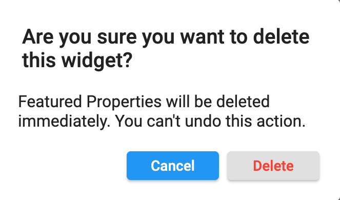
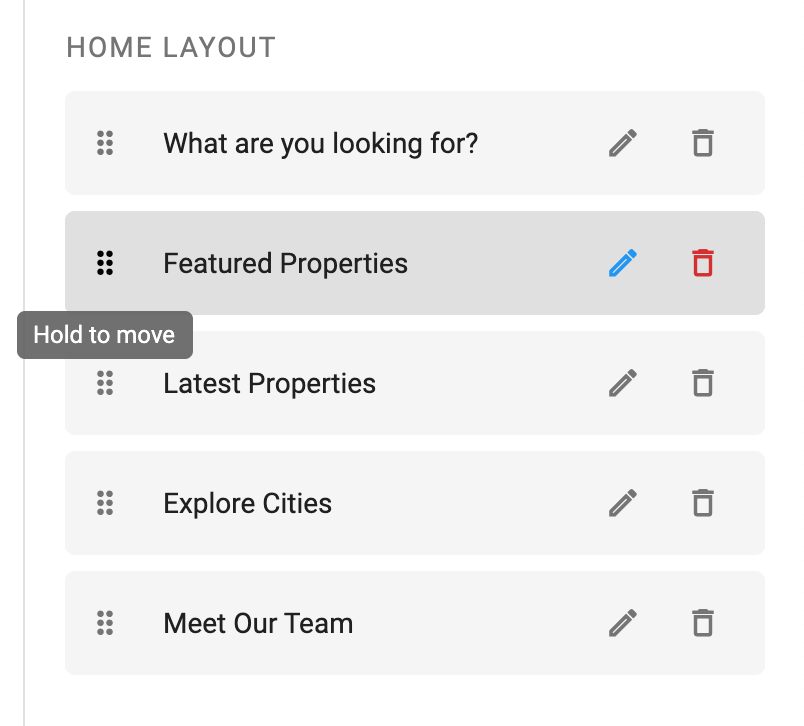

> **Important**: You are required to install the Houzi Rest Api Plugin on your Houzez wordpress. To install the Plug-in, click on [Houzi Rest Api Plugin Link](https://github.com/booleanbites/houzi-rest-api).

> A **Mobile App View** is provided in the center of screen, so you can see how the modifications will look on real device.

This guide consists of following sections:  

[Bottom Navigation Bar Designs](#bottom-navigation-bar-designs)  
[Add New Section](#add-new-section)  
[Edit a Section](#edit-a-section)  
[Delete a Section](#delete-a-section)  
[Re-arrange a Section](#re-arrange-a-section)  

Let's dive into the details of each section.

---

# Bottom Navigation Bar Designs

Houzi provides you wide range of bottom navigation bar designs. On the top right side of Navigation Bar section, Navigation Bar designs are provided. Click on any *Navigation Bar design*, and you will be able to see, how it will look on real device in the *Mobile App View*. (By default, selected design is *Design 02*, one of most popular designs.)

   

There are some *additional customizations* related to Home designs as follows:

If you select **Design 01** or **Design 03**, you can **show** or **hide** a **Add Floating Action Button** on the center of Navigation Bar, just by *Check Marking or Un-Marking* the **Show Add Floating Action Button** checkbox field.

    

You can add [Custom Action on Add Floating Action Button](https://houzi-docs.booleanbites.com/hooks-widgets/add_custom_action_on_add_floating_action_button).

---

# Add New Section

> The maximum limit is 05 for adding sections in Design 02.

For adding new section in Navigation Bar, follow these steps:

- There is a **Add** button at the right-bottom side of the screen, press this button and a dialog box will open.  
   
    

You will encounter following fields on the dialog box:

[Widget Type](#widget-type)  
[Title](#title)  
[Check Login](#check-login)  
[Icon](#icon) 

---

# Edit a Section

---

# Delete a Section

You can **Delete** any section just by clicking on *delete icon* of respective section. A delete confirmation dialog will open. 

    

  
    
> Click **Delete** if you want to *delete* the section.  
  Click **Cancel** if you want to *discard* the action.

---

# Re-arrange a Section

You can **Re-arrange** the sections on **Home Screen**. Hold the section that you want to re-arrange and move it vertically (*upwards* or *downwards*). Place it on desire position in sections list.

  

  