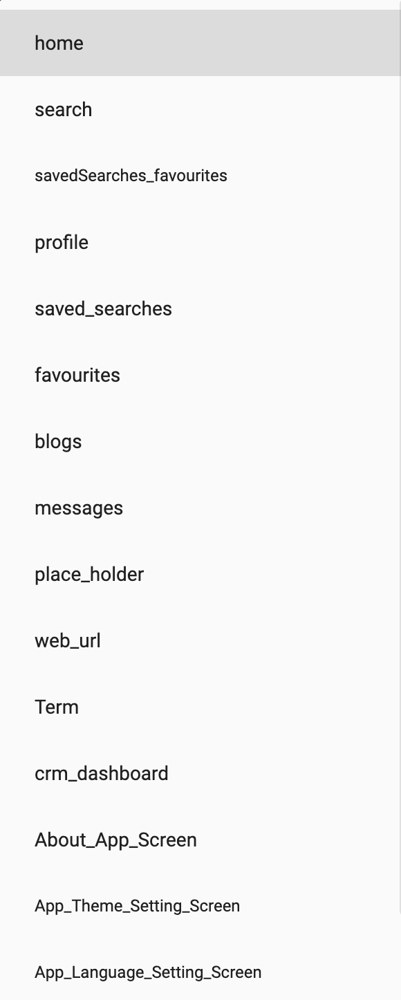

> **Important**: You are required to install the Houzi Rest Api Plugin on your Houzez wordpress. To install the Plug-in, click on [Houzi Rest Api Plugin Link](https://github.com/booleanbites/houzi-rest-api).

> A **Mobile App View** is provided in the center of screen, so you can see how the modifications will look on real device.

This guide consists of following sections:  

[Bottom Navigation Bar Designs](#bottom-navigation-bar-designs)  
[Add New Section](#add-new-section)  
[Edit a Section](#edit-a-section)  
[Delete a Section](#delete-a-section)  
[Re-arrange a Section](#re-arrange-a-section)  

Let's dive into the details of each section.

---

# Bottom Navigation Bar Designs

Houzi provides you wide range of bottom navigation bar designs. On the top right side of Navigation Bar section, Navigation Bar designs are provided. Click on any *Navigation Bar design*, and you will be able to see, how it will look on real device in the *Mobile App View*. (By default, selected design is *Design 02*, one of most popular designs.)

   

There are some *additional customizations* related to Home designs as follows:

If you select **Design 01** or **Design 03**, you can **show** or **hide** a **Floating Action Button** on the center of Navigation Bar, just by *Check Marking or Un-Marking* the **Show Add Floating Action Button** checkbox field.

    

By default, Floating Action Button will be a circular FAB Button with plus sign, and it'll open Quick Add Property. You can customize or add custom actions to [Floating Action Button](/hooks-widgets/add_floating_action_button).

---

# Add New Section

> The maximum limit is 05 for adding sections in Design 02.

For adding new section in Navigation Bar, follow these steps:

- There is a **Add** button at the right-bottom side of the screen, press this button and a dialog box will open.  
   
    

You will encounter following fields on the dialog box:

[Widget Type](#widget-type)  
[Title](#title)  
[Check Login](#check-login)  
[Icon](#icon)  
[Term Type](#term-type)  
[Term Type Value](#term-type-value)  

### Widget Type:

You are provided with the dropdown list of  **Widget Types**. The details of widget types are as follows: 

* **home:** If you want to show the *Home Page* option.

* **search:** If you want to show the *Search* option.

* **savedSearches_favourites:** If you want to show the *Saved Searches* and *Favourites* options in **Tab View**.

* **saved_searches:** If you want to show the *Saved Searches* option.

* **favourites:** If you want to show the *Favourites* option.

* **place_holder:** If you want to [Display your Custom Widget via Hooks](https://houzi-docs.booleanbites.com/hooks-widgets/add_custom_page_in_navigation_bar).

* **web_url:** If you want to show an option which will open a *Webpage*.

* **Term:** If you want to show *Particular Term* e.g. *Apartmets, Offices* etc.

* **About_App_Screen:** If you want to show *About App* screen menu option.

* **App_Theme_Setting_Screen:** If you want to show *App Theme Setting* App screen menu option.

* **App_Language_Setting_Screen:** If you want to show *App Language Setting* screen menu option.

* **App_Privacy_Policy_Screen:** If you want to show *App Privacy Policy* screen menu option.

* **App_Terms_and_Conditions_Screen:** If you want to show *App Terms and Conditions* screen menu option.

    

### Title:

*Title* is label that will be displayed on the *Navigation Bar*. Define the **Title** of the section.

### Check Login:

If you want that only *logged-in* user will be able to see the content of this particular navigation bar item, select *true* from the dropdown menu of **Check Login**, else leave it as *false*.

### Icon:

You can define the icon of your navigation bar item. Click on the icon button, an icon picker dialog will open. You can either choose from **Material Icons** or **Cupertino Icons**. Just search and click the required icon, it will be displayed and previous icon will be replaced.

### Term Type:

> Term Type is only section type "Term" related field.

If you have selected the **Term** widget type, an additional field will be visible to you named as *Term Type*. 
    

Select the *Term Type* from the **Term Type** dropdown menu.

  

### Term Type Value:

> Term Type Value is only section type "Term" related field.

If you have selected the **Term** widget type, an additional field will be visible to you named as *Term Type Value*. 
    

Select the *Term Type Value* from the **Term Type Value** dropdown menu.

  

  > Above displayed **Term Type** and **Term Type Value** are *generic houzez options*. You may encounter all or some of these options, according to the data of your website.

---

# Edit a Section

You can **Edit** the sections just by clicking on **Edit Icon** of respective section. While editing a section, you can perform following actions:

- Modify section [Widget Type](#widget-type).
- Modify section [Title](#title).
- Modify section [Check Login](#check-login).
- Modify section [Icon](#icon).
- Modify section [Term Type](#term-type).
- Modify section [Term Type Value](#term-type-value).

> Term Type and Term Type Value are only section type "Term" related fields.

---

# Delete a Section

> The minimum limit is 02 sections. If there are only 2 sections left, you can not delete further sections.

You can **Delete** any section just by clicking on *delete icon* of respective section. A delete confirmation dialog will open. 

    

  
    
> Click **Delete** if you want to *delete* the section.  
  Click **Cancel** if you want to *discard* the action.

---

# Re-arrange a Section

You can **Re-arrange** the sections on **Navigation Bar**. Hold the section that you want to re-arrange and move it vertically (*upwards* or *downwards*). Place it on desire position in sections list.

  

  
