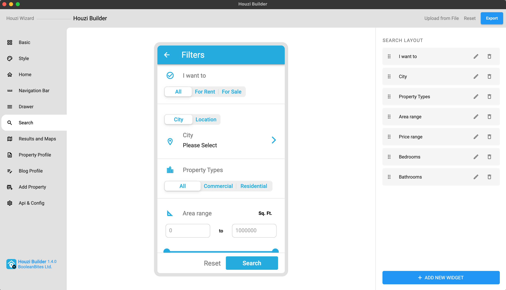
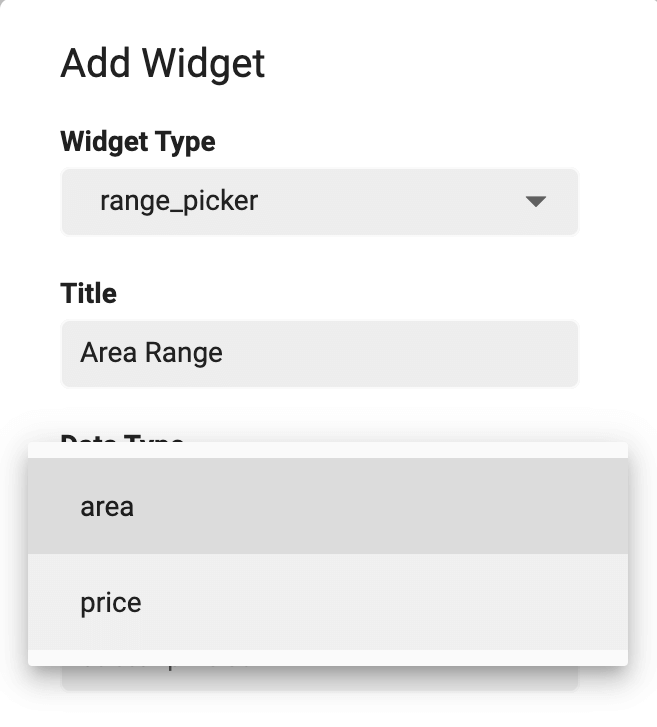
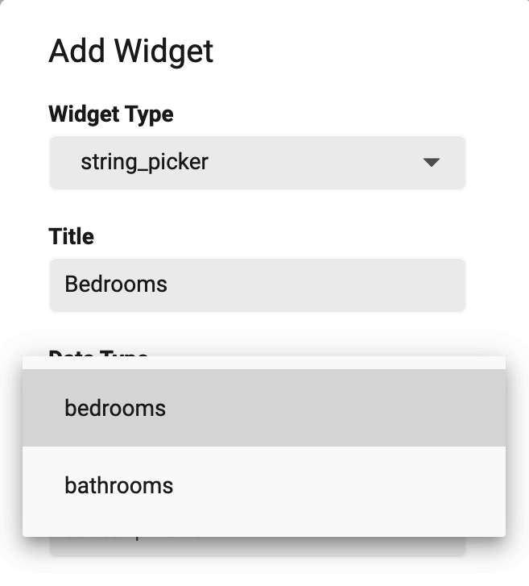
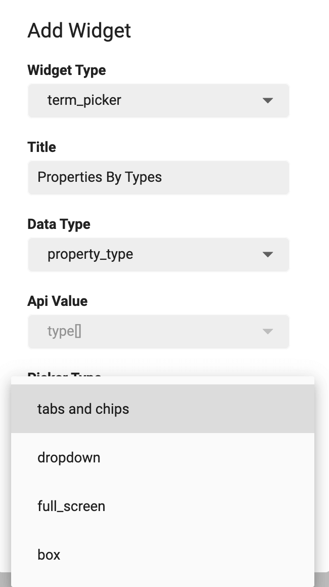
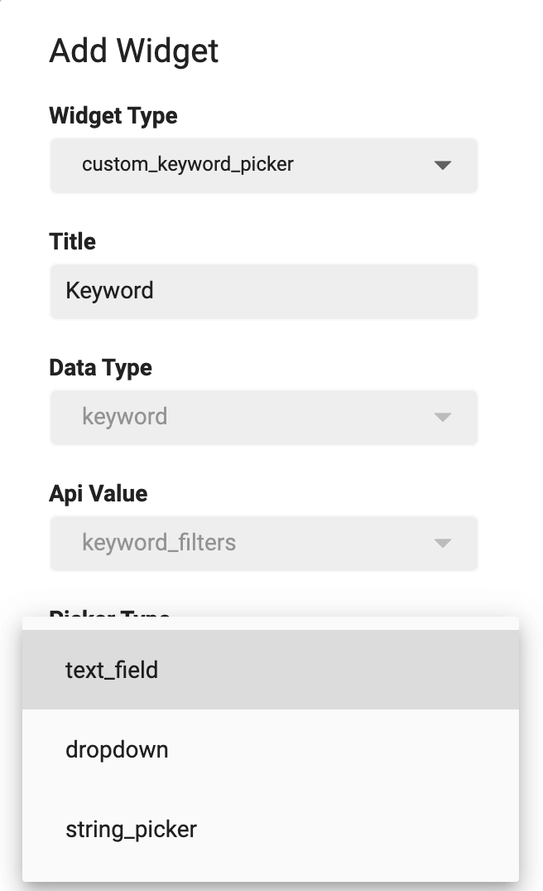
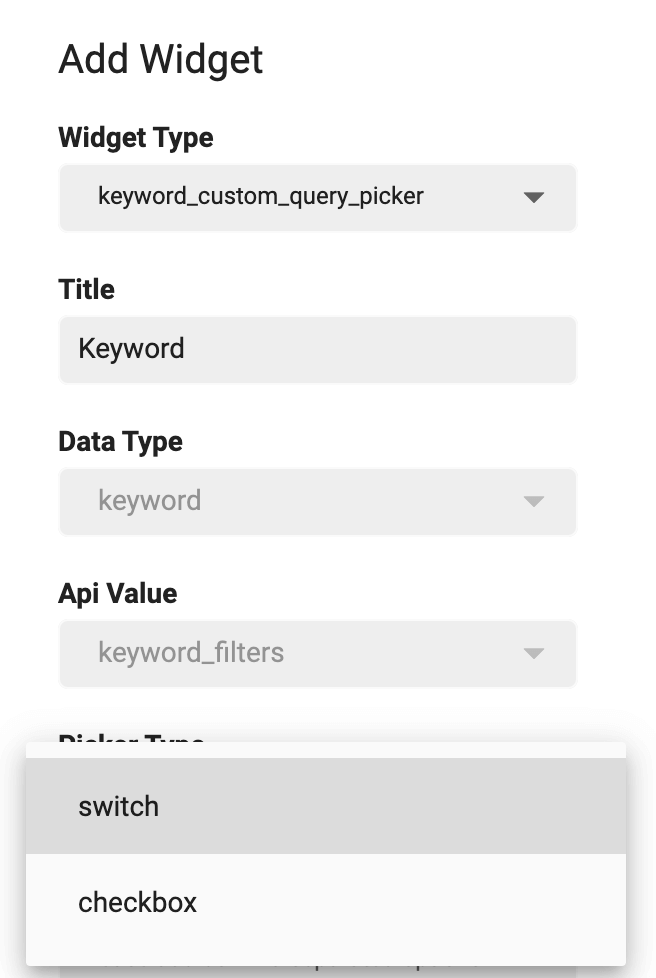
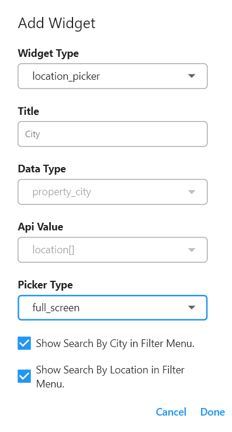
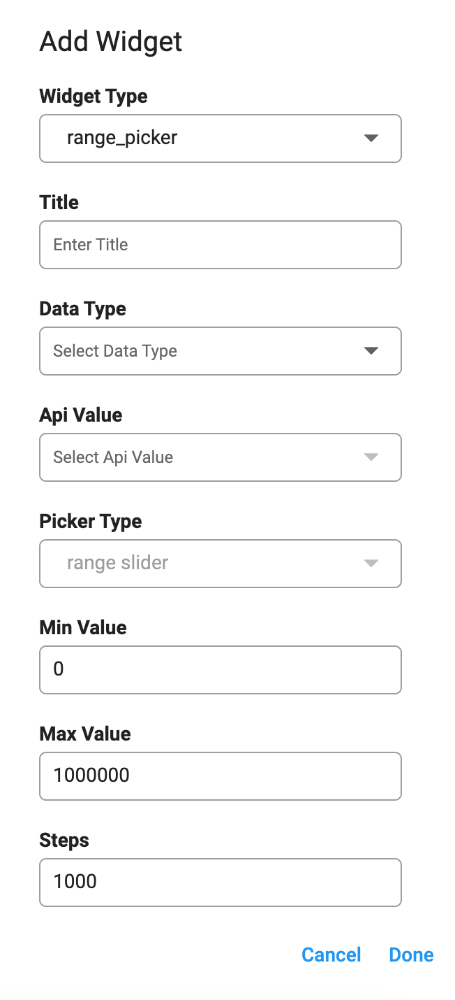
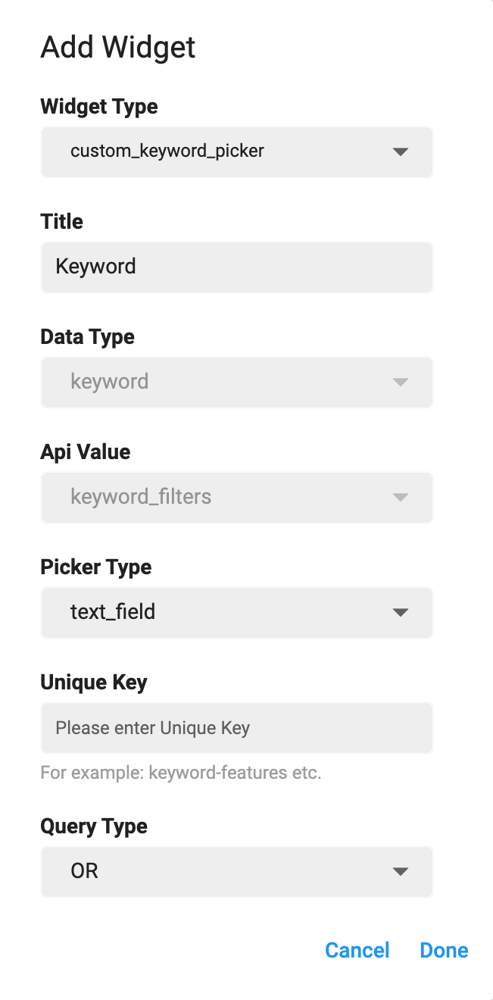

> **Important**: You are required to install the Houzi Rest Api Plugin on your Houzez wordpress. To install the Plug-in, click on [Houzi Rest Api Plugin Link](https://github.com/booleanbites/houzi-rest-api).

You can fully customize the **Search Screen** of your app. You can **add** new sections to your search screen and you can also **re-arrange** them according to your likings. You can also **remove** undesired sections from the Search screen. You can easily **Edit** an existing section and modify it as you like.

> A **Mobile App View** is provided in the center of screen, so you can see how the modifications will look on real device.  

Go to the `Search` section.

On the Right side, there is a cloumn with options to customize the **Search Screen**. You can do customization as follows:
* You can `Add` a new section to **Search Screen** by following these steps:
  - There is a **Add** button at the bottom of the column. Press this button and a dialog box will open.  
  
  - **First of all**, you have to define the **Widget Type** of the section that you want to add to *Search Screen*. There are many widget types as:  
  
      1. `term_picker:` If you want to search properties w.r.t. their
         - **Types** (e.g. apartment, office etc.)
         - **Status** (e.g. for-rent, for-sale etc.)
         - **Label** (e.g. hot-offer, open-house etc.)
         - **Features** (e.g. Air-Conditioning, Swimming-pool etc.)
      2. `location_picker:` If you want to search properties w.r.t. their
         - **City**
         - **Location**
      3. `range_picker:` If you want to search properties w.r.t. their
         - **Area**
         - **Price**
      4. `string_picker:` If you want to search properties w.r.t. specific attributes like
         - **Bedrooms**
         - **Bathrooms**
      5. `keyword_picker:` If you want to search properties w.r.t. some keywords e.g. Modern appartment with 2 bedrooms and 2 bathrooms etc.
      6. `custom_keyword_picker:` If you want to search properties w.r.t. some specified keywords.
      7. `keyword_custom_query_picker:` If you want to search properties w.r.t. some customized keyword query. You can define the *keyword* and send your custom query on its behalf.
      8. `custom_field_picker:` If you want to search properties w.r.t. some custom field attributes.
    > **Custom Field Picker** depends upon the data of you website. If you have not defined any custom field, this picker would not available.
  - **Second**, you have to define the **Title** of the section.
  - **Third**, you have to define the **Data Type** of the section as follows:
    - If selected *Widget Type* is `term_picker`, you can select from following data types:  
    
      - **property_type** (To search properties w.r.t. their type e.g. apartment, office etc.)
      - **property_status** (To search properties w.r.t. their status e.g. for-rent, for-sale etc.)
      - **property_label** (To search properties w.r.t. their Label e.g. hot-offer, open-house etc.)
      - **property_feature** (To search properties w.r.t. their features e.g. Air-Conditioning, Swimming-pool etc.)
    - If selected *Widget Type* is `range_picker`, you can select from following data types:  
    
      - **area** (To search properties within specific range of *area*)
      - **price** (To search properties within specific range of *price*)
    - If selected *Widget Type* is `string_picker`, you can select from following data types:  
    
      - **bedrooms** (To search properties w.r.t. specific number of *bedrooms*)
      - **bathrooms** (To search properties w.r.t. specific number of *bathrooms*)
        > All the other *Widget Types* have *Default* Data Types. 
  - **Forth**, each section has by default **Api Value**.
  - **Fifth**, you have to define the **Picker Type** of the section as follows:
    - If selected *Widget Type* is `term_picker`, you can select from following picker types:  
    
      - **tabs and chips** (To view properties related categories and sub-categories data in the form of `Tabs and Chips`.)
      - **dropdown** (To view properties related categories and sub-categories data in the form of `Dropdown`.)
    - If selected *Widget Type* is `string_picker`, you can select from following picker types:  
    
      - **chips** (To view properties related arrtibutes in the form of `Chips`.)
      - **tabs** (To view properties related arrtibutes in the form of `Tabs`.)
    - If selected *Widget Type* is `custom_keyword_picker`, you can select from following picker types:  
    
      - **text_field** (To take *Keyword* input from the user.)
      - **dropdown** (To provide users, a list of specified keywords in the form of `Dropdown Menu`.)
      - **string_picker** (To provide users, specified keywords in the form of `Tabs` or `Chips`.)
    - If selected *Widget Type* is `keyword_custom_query_picker`, you can select from following picker types:  
    
      - **switch**
      - **checkbox** 
      > All the other *Widget Types* have *Default* Picker Type. 
  - **Sixth**, for the following *Widget Types* you can define some **Additional fields**.
    - If selected *Widget Type* is `location_picker`, you can choose either to show **Search By City** or **Search By Location**.  
    
        > If you want to show both sections (i.e. `Search By City` and `Search By Location`, simply select both.)
    - If selected *Widget Type* is `range_picker`, you can define the minimun and maximun range of section in **Min Value** and **Max Value** fields.  
    
    - If selected *Widget Type* is `custom_keyword_picker`, you can define the **Unique key** and **Query Type**.  
    
    - **Unique key** (Assign a unique key to this field e.g. *keyword-some-text*.)
    - **Query Type**: (Assign a query type to this field from the dropdown menu.) It has two following types:
      - **OR Query Type** If you want that search properties which may include this specific keyword, use *OR* query type.
      - **AND Query Type** If you want that search properties which must include this specific keyword, use *AND* query type.  
    - If selected *Widget Type* is `custom_keyword_picker` and *Picker Type* is **dropdown** or **string_picker**. There are some additional fields. If the selecetd field is
      - **dropdown** you can define your comma seperated specific keywords in **Options** field.
        
      - **string_picker** you can define your comma seperated specific keywords in **Options** field. You can also specify *Sub-Picker Type* of *string_picker* i.e. `Chips` or `Tabs`.
        
      - **Sub-Picker Types:**
        
    - If selected *Widget Type* is `keyword_custom_query_picker`, you can define the **Options**, **Unique key** and **Query Type**.  
    
    - **Options** (Define your comma seperated custom keyword query in this field.)
    - **Unique key** (Assign a unique key to this field e.g. *keyword-some-text*.)
    - **Query Type**: (Assign a query type to this field from the dropdown menu.) It has two following types:
      - **OR Query Type** If you want that search properties which may include this specific keyword, use *OR* query type.
      - **AND Query Type** If you want that search properties which must include this specific keyword, use *AND* query type.
    
> Click `Done` to *add* the new section.  
    Click `Cancel` to *discard* the action.
* You can `Re-arrange` the sections on **Search Screen** just by dragging them *upwards* or *downwards*.
* You can `Remove/Delete` any section just by clicking on **Delete Icon** of respective section. A delete confirmation dialog will open.  
  
  
    > Click `Yes` if you want to *delete* the section.  
    Click `Cancel` if you want to *discard* the action.
* You can `Edit` the sections just by clicking on **Edit Icon** of respective section. You can perform following opertions in editing a section:
  - You can change the **Type** of any section.
  - You can **Rename** any section.
  - You can change the **Data Type** of following sections:
    - **term_picker**
    - **range_picker**
    - **string_picker** 
    > All the other *Widget Types* have *Default* Data Types. 
  -  You can change the **Picker Type** of following sections:
     - **term_picker**
     - **string_picker**
     > All the other *Widget Types* have *Default* Picker Type.  
  -  You can change **Additional Fields** of some sections as follows:
     - If selected *Widget Type* is `location_picker`, you can choose either to show **Search By City** or **Search By Location** or you can choose to show both.
     - If selected *Widget Type* is `range_picker`, you can change the **minimun** and **maximun** range of section.