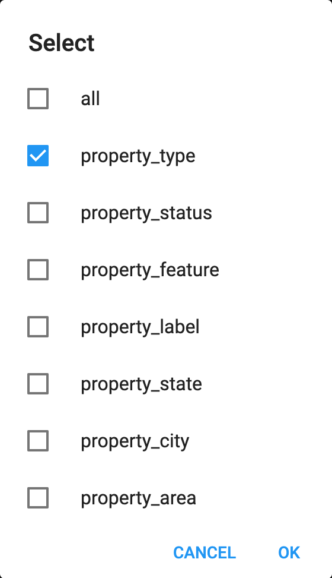
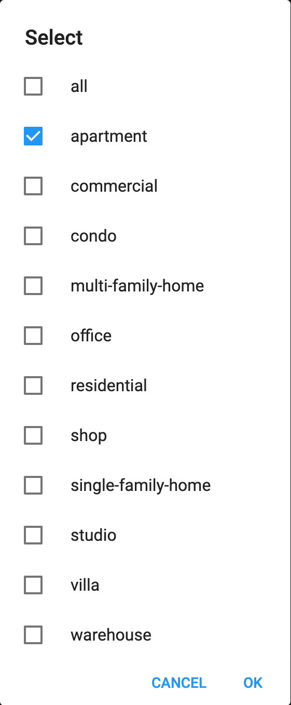
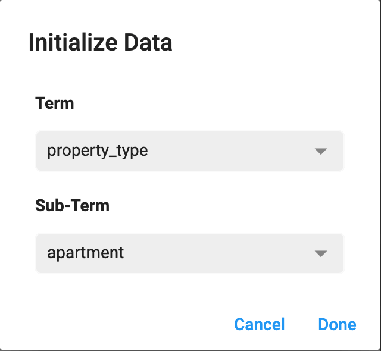
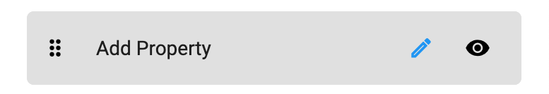

> **Important**: You are required to install the Houzi Rest Api Plugin on your Houzez wordpress. To install the Plug-in, click on [Houzi Rest Api Plugin Link](https://github.com/booleanbites/houzi-rest-api).

> A **Mobile App View** is provided in the center of screen, so you can see how the modifications will look on real device.

  

This guide consists of following sections:  

[Add New Section](#add-new-section)  
[Edit a Section](#edit-a-section)  
[Show-Hide a Section](#show-hide-a-section)  
[Re-arrange a Section](#re-arrange-a-section)  
[Delete a Section](#delete-a-section)  

Let's dive into the details of each section.

---

# Add New Section

You can **Add** a new section in *Drawer Menu* with ease. There is a **Add** button at the right-bottom of the screen. Press this *Add* button, a dialog box will open.
     
  

You will encounter following fields on the dialog box:

[Widget Type](#widget-type)  
[Title](#title)  
[Check Login](#check-login)  
[Initialize Data](#initialize-data)  

### Widget Type:

You are provided with the dropdown list of  **Widget Types**. The details of widget types are as follows: 

* **place_holder:** If you want to [Display your Custom widget via Hooks](https://houzi-docs.booleanbites.com/hooks-widgets/add_custom_widget_in_drawer).

* **web_url:** If you want to show an option which will open a *Webpage*.

* **Term:** If you want to show *Particular Term* e.g. *Apartmets, Offices* etc.

* **About_App_Screen:** If you want to show *About App* screen menu option.

* **App_Theme_Setting_Screen:** If you want to show *App Theme Setting* App screen menu option.

* **App_Language_Setting_Screen:** If you want to show *App Language Setting* screen menu option.

* **App_Privacy_Policy_Screen:** If you want to show *App Privacy Policy* screen menu option.

* **App_Terms_and_Conditions_Screen:** If you want to show *App Terms and Conditions* screen menu option.

    

### Title:

Title is label that will be displayed on the drawer menu. Define the **Title** of the section.

### Check Login:

If you want that only *logged-in* user will be able to see the content of this particular menu item, select *true* from the dropdown menu of **Check Login**, else leave it as *false*.

### Initialize Data:

If you have selected the **Term** widget type, an additional field will be visible to you named as *Initialize Data*. 
    

You can initialize the data of your term by following these steps:

- Click on the empty text field, an *Initialize Data* dialog will be opened.

    

- Select the *Term/Terms* from the **Term** dropdown menu.

    

- Select the *Sub-Term/Sub-Terms* from the **Sub-Term** dropdown menu.

     

    > Above displayed **Terms** and **Sub-Terms** are *generic houzez options*. You may encounter all or some of these options, according to the data of your website.

- Click `Done` to *perfrom* the action. 
- Click `Cancel` to *discard* the action.

     

- Click `Done` to *add* the new section.  
- Click `Cancel` to *discard* the action.

> **Initialize Data** field is only available to *Term* type widgets.  
*New widget* will be added to the **last** of menu items. You can [Re-arrange](#re-arrange-a-section) its position.

---

# Edit a Section

There are two type of sections in drawer screen as follows:

- Default Sections.
- Custom Sections.  

**Default Sections:** Sections that are provided by Houzi team by default and can not be deleted but can be [hide](#show-hide-a-section).  

**Custom Sections:** Sections that are added by users and can be [deleted](#delete-a-section) as well as [hide](#show-hide-a-section).

### Editing a Default Section:

While editing a *default section*, you only get to **Rename** the section. Just click on **Edit Icon** of respective section. A dialog will open. **Rename** the section as you like. 

    

- Click `Done` if you want to *Rename* the section.  
- Click `Cancel` if you want to *discard* the action.

### Editing a Custom Section:

While editing a *custom section*, you can perform following actions:

- Modify section [Widget Type](#widget-type).
- Modify section [Title](#title).
- Modify section [Check Login](#check-login).
- Modify section [Initialize Data](#initialize-data).

---

# Show-Hide a Section

You can **show** or **hide** any section just by clicking on **Visibility / Invisibility Icon** of respective section.  
 

 

---

# Re-arrange a Section

You can `Re-arrange` the sections on **Drawer Menu**. Hold the section that you want to re-arrange and move it vertically (*upwards* or *downwards*). Place it on desire position in sections list.

  

 

---

# Delete a Section

There are two type of sections in drawer screen as follows:

- Default Sections.
- Custom Sections.  

**Default Sections:** Sections that are provided by Houzi team by default and can not be deleted but can be [hide](#show-hide-a-section).  

**Custom Sections:** Sections that are added by users and can be deleted as well as [hide](#show-hide-a-section).

You can **Delete** any custom section just by clicking on **delete icon** of respective section. A *delete* confirmation dialog will open. 

    

  
    
- Click **Delete** if you want to *delete* the section.   
- Click **Cancel** if you want to *discard* the action.