> **Important**: You are required to install the Houzi Rest Api Plugin on your Houzez wordpress. To install the Plug-in, click on [Houzi Rest Api Plugin Link](https://github.com/booleanbites/houzi-rest-api).

> A **Mobile App View** is provided in the center of screen, so you can see how the modifications will look on real device.  

  

> You can **Enable** *Cupertino Sliding Segment Control* instead of using Material Segment Control from [Api and Config](../houzi-builder/api_config_setup) section. 

This guide consists of following sections:

[Add New Section](#add-new-section)  
[Edit a Section](#edit-a-section)  
[Delete a Section](#delete-a-section)  
[Re-arrange a Section](#re-arrange-a-section)  

Let's dive into the details of each section.  

---  

# Add New Section 

There is a **Add** button at the bottom of the column. Press this button and a dialog box will open.  

  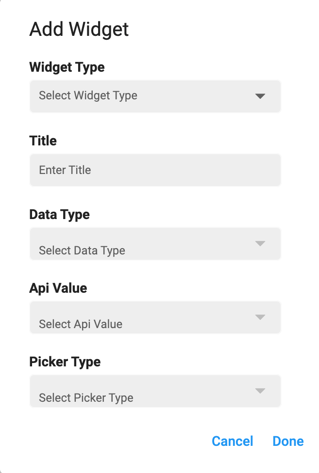  

You will encounter following fields on the dialog box:

[Widget Type](#widget-type)  
[Title](#title)  
[Data Type](#data-type)  
[Api Value](#api-value)  
[Picker Type](#picker-type)  
[Additional Fields](#additional-fields)  

### Widget Type:

You are provided with the dropdown list of  **Widget Types**. The details of widget types are as follows: 

* **term_picker:** If you want to search properties w.r.t. their
    - *Types* (e.g. apartment, office etc.)
    - *Status* (e.g. for-rent, for-sale etc.)
    - *Label* (e.g. hot-offer, open-house etc.)
    - *Features* (e.g. Air-Conditioning, Swimming-pool etc.)

* **location_picker:** If you want to search properties w.r.t. their
    - *City*
    - *Location*

* **range_picker:** If you want to search properties w.r.t. their
    - *Area*
    - *Price*

* **string_picker:** If you want to search properties w.r.t. specific attributes like
    - *Bedrooms*
    - *Bathrooms*
 
* **keyword_picker:** If you want to search properties w.r.t. some keywords e.g. Modern appartment with 2 bedrooms and 2 bathrooms etc.

* **custom_keyword_picker:** If you want to search properties w.r.t. some specified keywords.

* **keyword_custom_query_picker:** If you want to search properties w.r.t. some customized keyword query. You can define the *keyword* and send your custom query on its behalf.  

* **custom_field_picker:** If you want to search properties w.r.t. some custom field attributes. 

  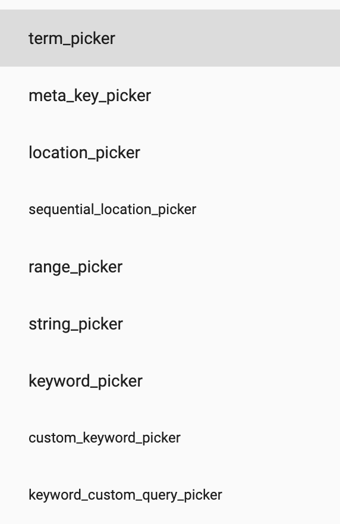   

  > **Custom Field Picker** depends upon the data of you website. If you have not defined any custom field, this picker would not available.  

### Title:

*Title* is label that will be displayed on the *Search Page. Define the **Title** of the section.

### Data Type:

You are provided with the dropdown list of **Data Types**. You can define the *Data Type* of the various sections as follows: 

* If selected *Widget Type* is **term_picker**, you can select from following data types:  

  - **property_type** (To search properties w.r.t. their type e.g. apartment, office etc.)

  - **property_status** (To search properties w.r.t. their status e.g. for-rent, for-sale etc.)

  - **property_feature** (To search properties w.r.t. their features e.g. Air-Conditioning, Swimming-pool etc.)

  - **property_label** (To search properties w.r.t. their Label e.g. hot-offer, open-house etc.)

  - **property_country** (To search properties w.r.t. Country)

  - **property_state** (To search properties w.r.t. States)

  - **property_city** (To search properties w.r.t. City)

  - **property_area** (To search properties w.r.t. Area)

    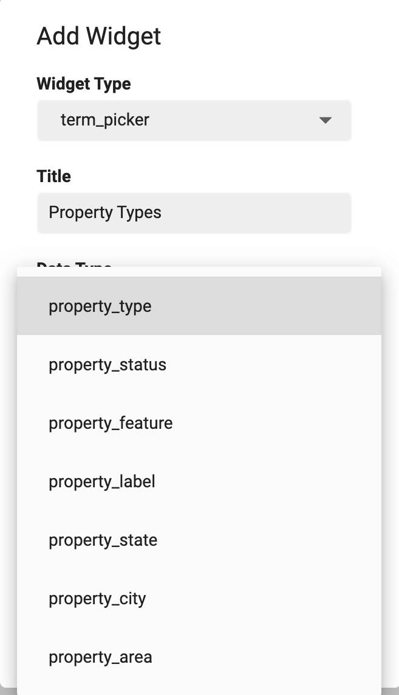

  > Above displayed **Data Types** are *generic houzez taxonomies*. You may encounter all or some of these options, according to the data of your website.

    
* If selected *Widget Type* is **range_picker**, you can select from following data types:  

  - **area** (To search properties within specific range of *area*)

  - **price** (To search properties within specific range of *price*)

      

* If selected *Widget Type* is **string_picker**, you can select from following data types:  

  - **bedrooms** (To search properties w.r.t. specific number of *bedrooms*)

  - **bathrooms** (To search properties w.r.t. specific number of *bathrooms*)

    

> All the other *Widget Types* have *Default* Data Types. 

### Api Value:

Each section has its by default **Api Value**.

### Picker Type:

You are provided with the dropdown list of  **Picker Types**. The details of picker types are as follows: 

- If selected *Widget Type* is **term_picker**, you can select from following picker types:  

  - **tabs and chips:** To view properties related categories and sub-categories data in the form of *Tabs and Chips*.

  - **dropdown:** To view properties related categories and sub-categories data in the form of *Dropdown*.

  - **full_screen:** To view properties related categories and sub-categories data in the form of *full_screen* menu. A new page will open, listing all the property related catagories with additional *Search Bar* to search required catagory with ease.

  - **box:** To view properties related categories and sub-categories data in the form of *Grid View* having 3 catagories per row with their icons and titles.

    

  - If selected *Widget Type* is **string_picker**, you can select from following picker types:  

  - **chips:** To view properties related arrtibutes in the form of *Chips*.

  - **tabs:** To view properties related arrtibutes in the form of *Tabs*.

    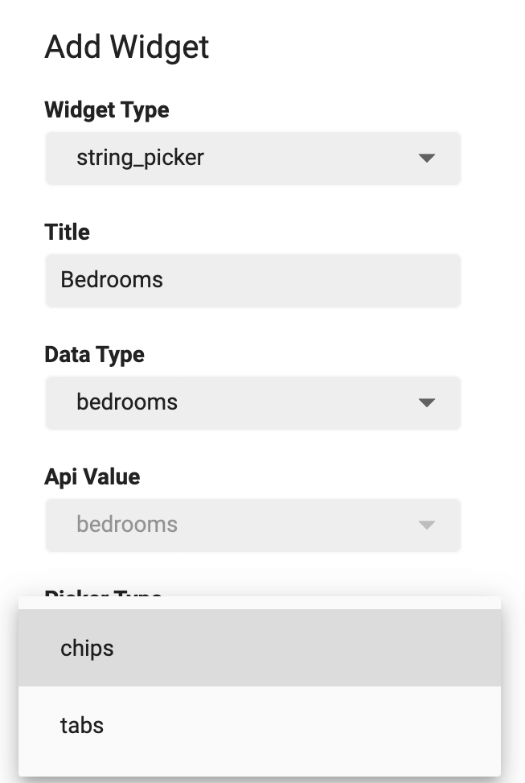

- If selected *Widget Type* is **custom_keyword_picker**, you can select from following picker types:  

  - **text_field:** To take *Keyword* input from the user.

  - **dropdown:** To provide users, a list of specified keywords in the form of *Dropdown Menu*.

  - **string_picker:** To provide users, specified keywords in the form of *Tabs* or *Chips*.

    

- If selected *Widget Type* is **keyword_custom_query_picker**, you can select from following picker types:

  - **switch**

  - **checkbox**

    

> All the other *Widget Types* have *Default* Picker Type. 

### Additional Fields

You can define some additional customizations for some sections. For this purpose you are provided with some **Additional fields**. Their details are as follows:

- If selected *Widget Type* is **location_picker**, you can set the value for the **Default Radius**. You can choose either to show **Search By City** or **Search By Location** or you can choose to show both.

   
  
  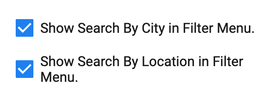 

- If selected *Widget Type* is **range_picker**, you can define the *minimun* and *maximun* range of section in **Min Value**, **Max Value** and **Steps** fields. 

    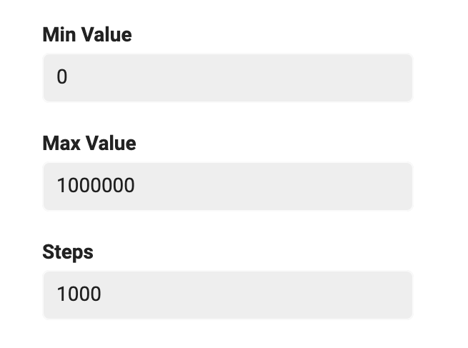  

- If selected *Widget Type* is **term_picker**, you can define the query type from dropdown menu in **Query Type** field. 

  - **OR Query Type:** If you want that search properties which may include this specific **term**, use *OR* query type.

  - **AND Query Type:** If you want that search properties which must include this specific **term**, use *AND* query type. 

      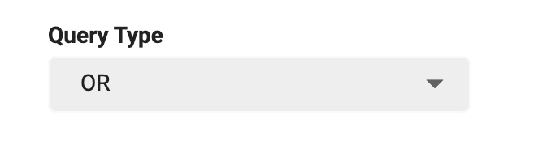 

      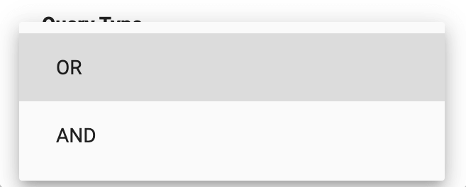 

- If selected *Widget Type* is **custom_keyword_picker**, you can define the **Unique key** and **Query Type**.  

    

  - **Unique key** (Assign a unique key to this field e.g. *keyword-some-text*.)

  - **Query Type**: (Assign a query type to this field from the dropdown menu.) It has two following types:

    - **OR Query Type:** If you want that search properties which may include this specific keyword, use *OR* query type.

    - **AND Query Type:** If you want that search properties which must include this specific keyword, use *AND* query type.  

       

       

- If selected *Widget Type* is **custom_keyword_picker** and *Picker Type* is **dropdown** or **string_picker**. There are some additional fields as:

    - If the selecetd field is **dropdown** you can define your comma seperated specific keywords in **Options** field.  

      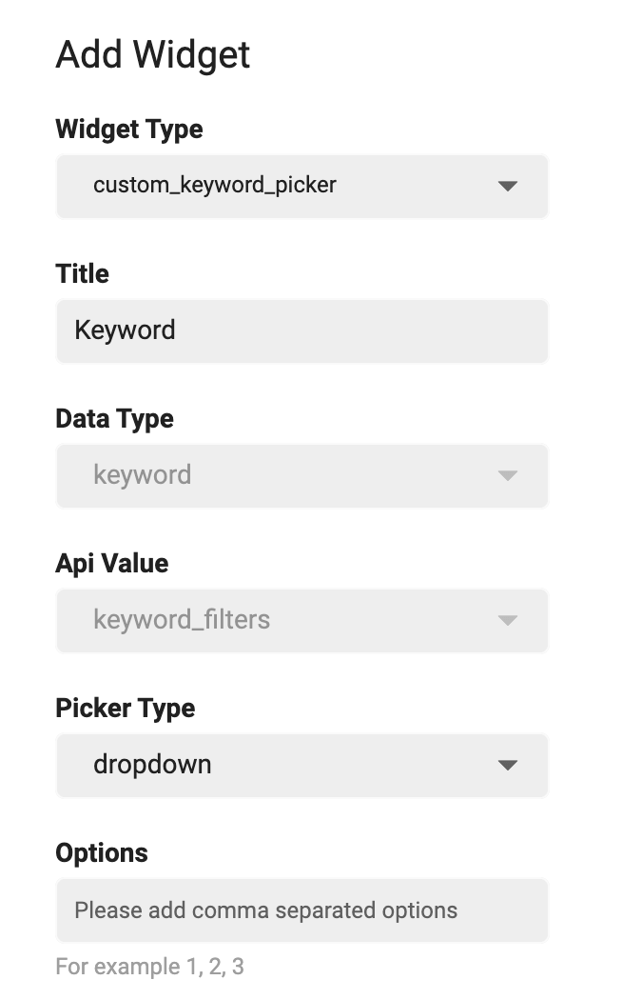  
      
    - If the selecetd field is **string_picker** you can define your comma seperated specific keywords in **Options** field. You can also specify *Sub-Picker Type* of *string_picker* i.e. *Chips* or *Tabs*.  

      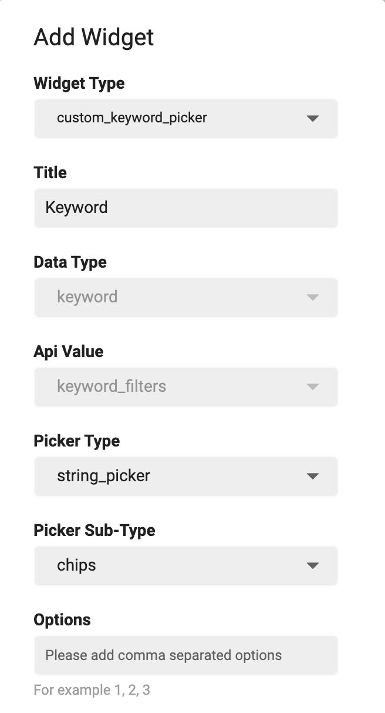  

    - **Sub-Picker Types:**  

      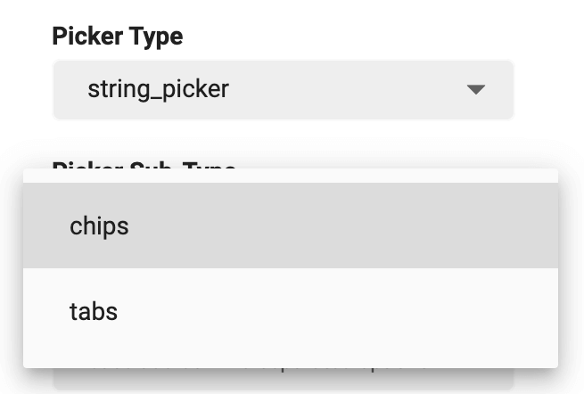  

  - If selected *Widget Type* is **keyword_custom_query_picker**, you can define the **Options**, **Unique key** and **Query Type**.  

    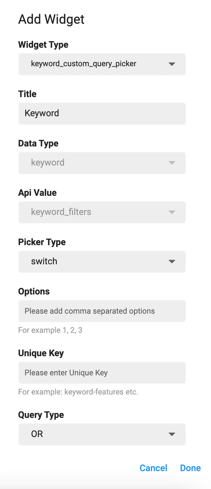  

  - **Options** (Define your comma seperated custom keyword query in this field.)

  - **Unique key** (Assign a unique key to this field e.g. *keyword-some-text*.)

  - **Query Type**: (Assign a query type to this field from the dropdown menu.) It has two following types:

    - **OR Query Type** If you want that search properties which may include this specific keyword, use *OR* query type.

    - **AND Query Type** If you want that search properties which must include this specific keyword, use *AND* query type.

       

       
    
> Click `Done` to *add* the new section.  
  Click `Cancel` to *discard* the action. 

---

## Edit a Section

You can **Edit** the sections just by clicking on **Edit Icon** of respective section. While editing a section, you can perform following actions:

- Modify section [Widget Type](#widget-type).
- Modify section [Title](#title).
- Modify section [Data Type](#data-type).
- Modify section [Api Value](#api-value).
- Modify section [Picker Type](#picker-type).
- Modify section [Additional Fields](#additional-fields).

---

## Delete a Section

You can **Delete** any section just by clicking on *delete icon* of respective section. A delete confirmation dialog will open.  

  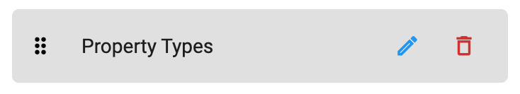  

  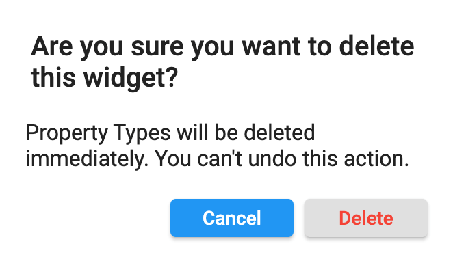  
  
> Click **Delete** if you want to *delete* the section.  
  Click **Cancel** if you want to *discard* the action. 

---

## Re-arrange a Section

You can **Re-arrange** the sections on **Search Page**. Hold the section that you want to re-arrange and move it vertically (*upwards* or *downwards*). Place it on desire position in sections list.

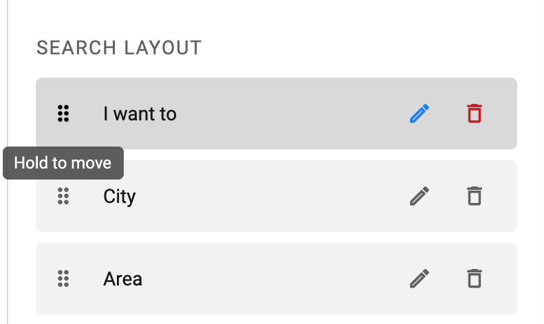 

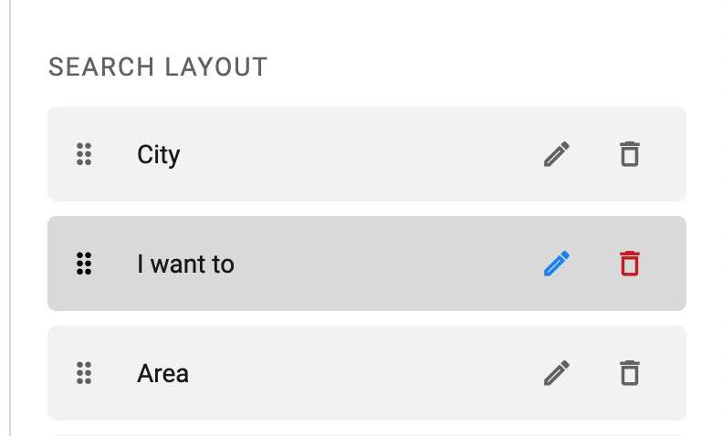 