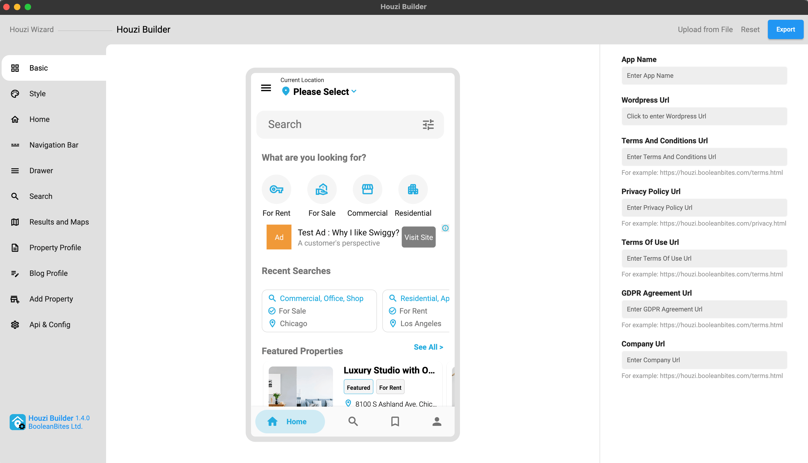

> **Important**: You are required to install the Houzi Rest Api Plugin on your Houzez wordpress. To install the Plug-in, click on [Houzi Rest Api Plugin Link](https://github.com/booleanbites/houzi-rest-api).

> A **Mobile App View** is provided in the center of screen, so you can see how the modifications will look on real device.

 

Please follow these steps for the `Basic Setup` of your Mobile app.

1. Open the `houziBuilder` application.
2. Click on `Houzi Builder` on the left side of the top bar. (Houzi Builder Screen will open)
3. Provide `App Name` in the required field.
4. Provide `Wordpress URL` in the required field.   

    > **Note**: To provide Wordpress URL, just click on `Wordpress URL Text Field`. A dialog will open. Provide the `Wordpress URL Scheme`, `Wordpress URL Domain` and `Wordpress URL Path` in their respective fields.  
    If your website URL does not contain a subpath then leave `Wordpress URL Path` field as it is.

     

    ```
    Example 1 (Website Url with path):
    Url: https://domain.com/path/
    Wordpress URL Scheme = https
    Wordpress URL Domain = domain.com
    Wordpress URL Path = path

    Example 2 (Website Url without path):
    Url: https://domain.com/
    Wordpress URL Scheme = https
    Wordpress URL Domain = domain.com
    Wordpress URL Path = 
    ```

> **Note**: If you have already defined `App Config` on `wordpress-admin-panel > Houzi Api` then the **HouziBuilder** feilds will be filled with the values of that **App Config**.

5. Provide `Terms and Conditions URL` in the required field.
6. Provide `Privacy Policy URL` in the required field.
7. Provide `Terms of Use URL` in the required field.
8. Provide `GDPR Agreement URL` in the required field.
9. Provide `Company URL` in the required field.

> **Note**: If you come to **Houzi Buider Screen** via **Houzi Wizard** (after passing all test), and if you have already defined `App Config` on `wordpress-admin-panel > Houzi Api` then the **HouziBuilder** feilds will be filled with the values of that **App Config**. Here you can modifiy those values with ease.