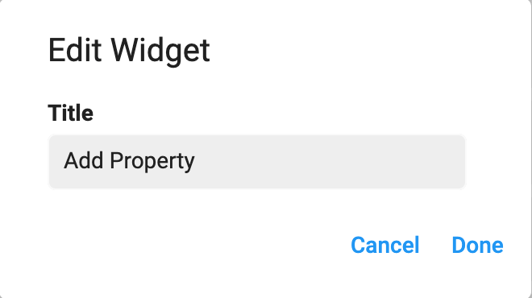
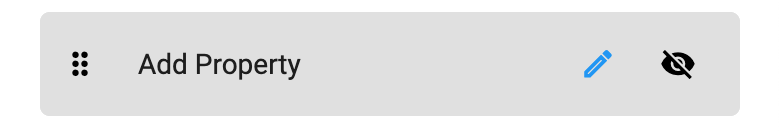
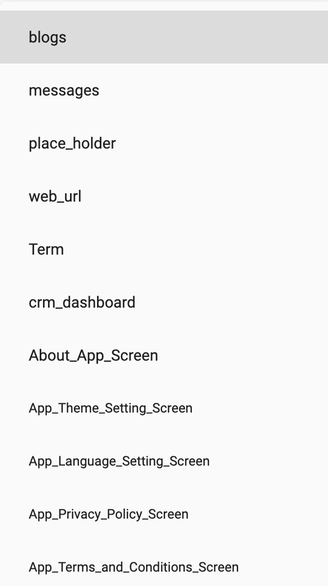
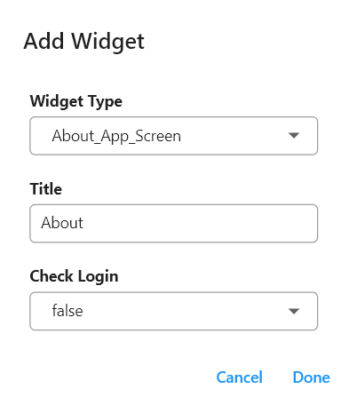
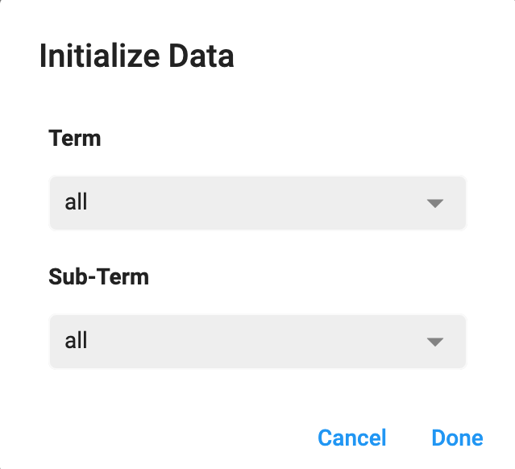

> **Important**: You are required to install the Houzi Plug-in on your Houzez wordpress. To install the Plug-in, click on [Houzi Plug-in Link](https://github.com/AdilSoomro/houzi-rest-api).

You can perform following operations to customize the **Drawer Menu** of your app. 
* You can **re-arrange** the drawer menu sections according to your likings.
* You can **rename** any section as you like.
* You can **show/hide** the desired/undesired sections on the Drawer Menu.
* You can **add/remove** the desired/undesired sections on the Drawer Menu.

> A **Mobile App View** is provided in the center of screen, so you can see how the modifications will look on real device.

Go to the `Drawer` section.

On the Right side, there is a cloumn with options to customize the **Drawer Menu**. You can perform the customization as follows:
* You can `Re-arrange` the sections on **Drawer Menu** just by dragging them *upwards* or *downwards*.
* You can `Rename` any section just by clicking on **Edit Icon** of respective section. A rename dialog will open. **Rename** the section as you like. 
    
    
    > Click `Done` if you want to *Rename* the section.  
    Click `Cancel` if you want to *discard* the action.
* You can `show/hide` any section just by clicking on **Visibility / Invisibility Icon** of respective section.  
 
    
      
    
* You can `Add` a new section on **Drawer Menu** by following these steps:
  - There is a **Add** button at the bottom of the column. Press this button and a dialog box will open. 
     
     

  - First of all, you have to define the **Widget Type** of the section that you want to add to *Drawer Menu*. There are many widget types as: 
     
     

     -  `Term` (If you want to show **Particular Term** on *Drawer Menu* e.g. *Apartmets, Offices* etc.).
     - `About_App_Screen` (If you want to show **About App** screen menu option on *Drawer Menu*).
     - `App_Theme_Setting_Screen` (If you want to show **App Theme Setting** App screen menu option on *Drawer Menu*).
     - `App_Language_Setting_Screen` (If you want to show **App Language Setting** screen menu option on *Drawer Menu*).
     - `App_Privacy_Policy_Screen` (If you want to show **App Privacy Policy** screen menu option on *Drawer Menu*).
     - `App_Terms_and_Conditions_Screen` (If you want to show **App Terms and Conditions** screen menu option on *Drawer Menu*).
  - Second, you have to define the **Title** of the section.
  - Third, if you want that only logged in user will be able to see the content of this particular menu item, select *true* from the dropdown menu of **Check Login**, else leave it as *false*.
  
    

  - Forth, I you have selected the *Term* widget type, an additional field will be visible to you named as **Initialize Data**. 
    
    
  
    You can define your term by following these steps:
    - Click on the empty text field, an *Initialize Data* dialog will be opened.
    
        
    
    - Select the *Term/Terms* from the **Term** dropdown menu.
    
        
    
    - Select the *Sub-Term/Sub-Terms* from the **Sub-Term** dropdown menu.
    
         
    
    > Click `Done` to *perfrom* the action.  
    Click `Cancel` to *discard* the action.

     

    > Click `Done` to *add* the new section.  
    Click `Cancel` to *discard* the action.
    
    

    > New widget will be added to the **last** of menu items. You can *re-arrange* its position (as already mentioned above).
    
    
  
   

> **Initialize Data** field is only available to *Term* type widgets.