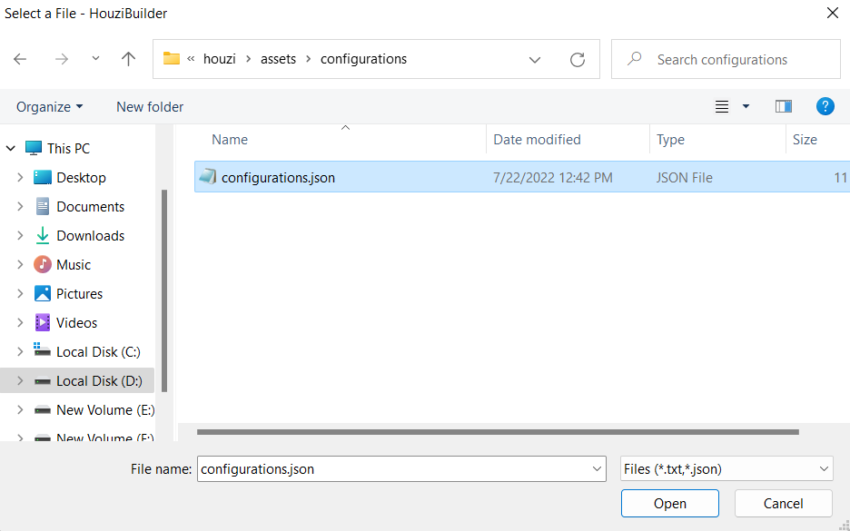
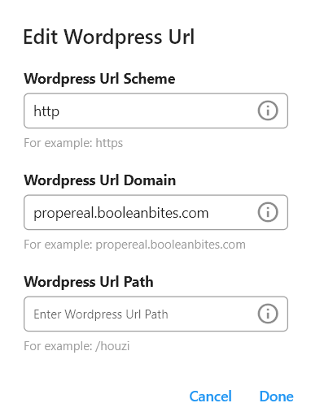

> **Important**: You are required to install the Houzi Rest Api Plugin on your Houzez wordpress. To install the Plug-in, click on [Houzi Rest Api Plugin Link](https://github.com/booleanbites/houzi-rest-api).

If you want to **Edit/Update** configurations of your app (e.g. the changing the Theme Color etc.), follow these steps:
1. Press the **Upload from File** button. A dialogbox will open, Select the `configurations.json` file of you project.  
   
    **configurations.json** file path:  
    `Project_HOME > assets > configurations > configurations.json`

    > `Upload from File` button is on the right side of top bar.  

    
    
    After selecting the file, all the data will be filled in the respective fields.
2. Click the **Wordpress Url** field. A dialogbox will open with all the respective filled fields.  
  
      
    
    Just click `Done` so that app verifies Houzi Rest Api Plugin is installation.
3. **Edit/Update** the required sections.
4. [**Export**](/houzi-config-builder/export-configurations) the configurations and update the `configurations.json` file of you project.