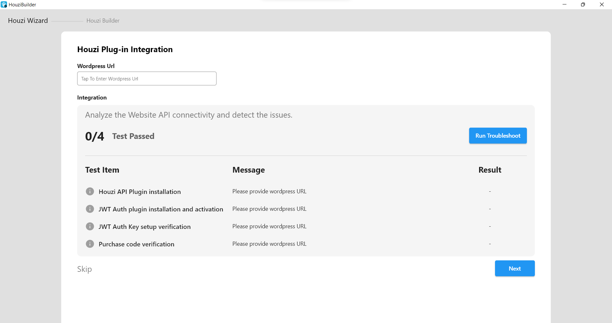
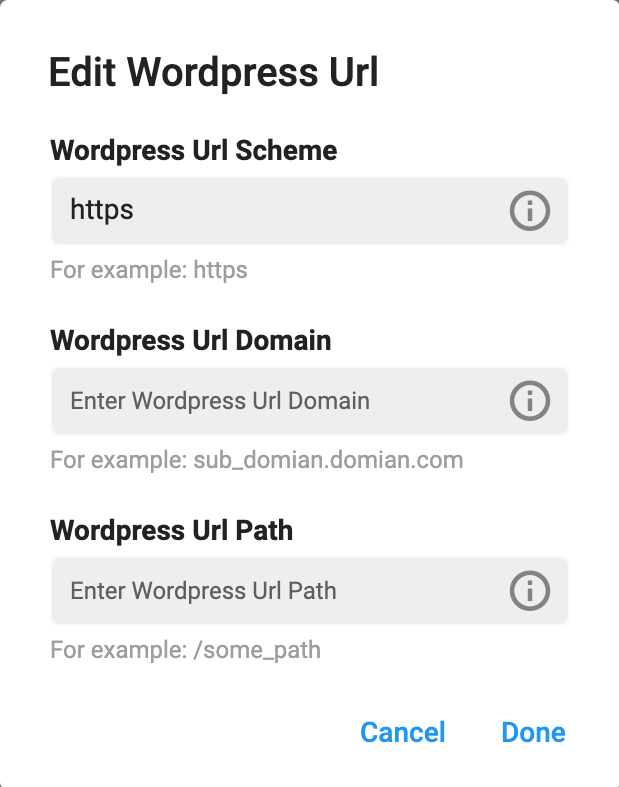

> **Important**: You are required to install the Houzi Plug-in on your Houzez wordpress. To install the Plug-in, click on [Houzi Plug-in Link](https://github.com/AdilSoomro/houzi-rest-api).

On opening the `HouziBuilder` application, The First screen, that you will encounter, will be the `Houzi Wizard` screen. **Houzi Wizard** analyzes your website for API connectivity and detects any possible issues.

 

Please follow these steps.

1. Open the `HouziBuilder` application. (You will encounter the `Houzi Wizard` screen)
2. Provide `Wordpress URL` in the required field.

    > **Note**: To provide Wordpress URL, just click on `Wordpress URL Text Field`. A dialog will open. Provide the `Wordpress URL Scheme`, `Wordpress URL Domain` and `Wordpress URL Path` in their respective fields.  
    If your website URL does not contain a subpath then leave `Wordpress URL Path` field as it is.

     

    ```
    Example 1 (Website Url with path):
    Url: https://domain.com/path/
    Wordpress URL Scheme = https
    Wordpress URL Domain = domain.com
    Wordpress URL Path = path

    Example 2 (Website Url without path):
    Url: https://domain.com/
    Wordpress URL Scheme = https
    Wordpress URL Domain = domain.com
    Wordpress URL Path = 
    ```
On pressing the `Done` button, **Houzi Wizard** will analyze your website for the following possible issues:

   1. Houzi API Plugin installation.
   2. JWT Auth Plugin installation and activation.
   3. JWT Auth Key setup verification.
   4. Purchase code verification.

   
   If none issue is detected then you will be taken to the `HouziBuilder` screen. 

    > **Note**: If you have already defined `App Config` on `wordpress-admin-panel > Houzi Api` then the **HouziBuilder** feilds will be filled with the values of this **App Config**.