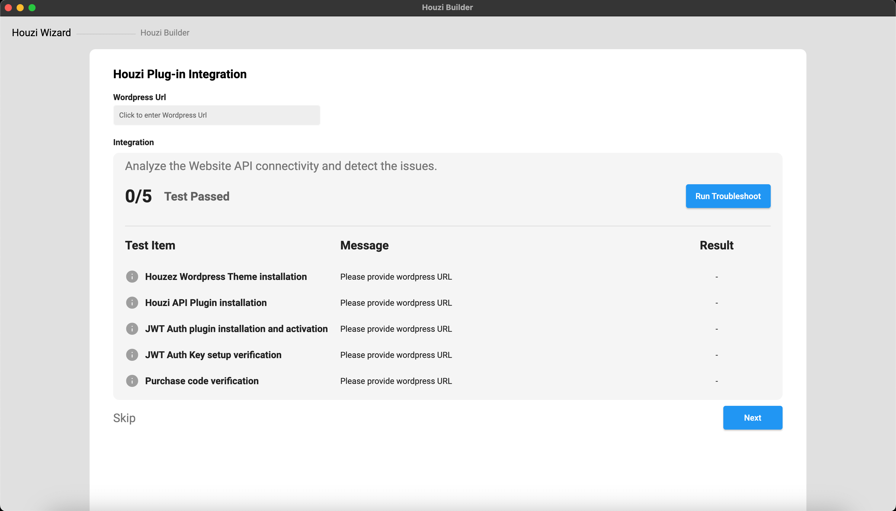
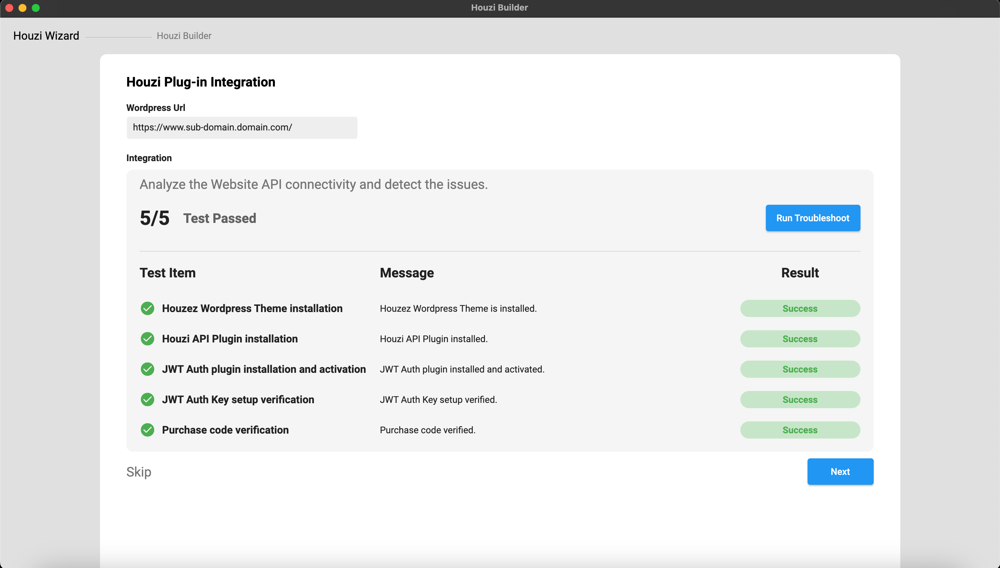
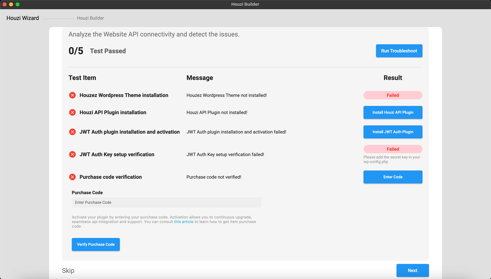

> **Important**: You are required to install the Houzi Rest Api Plugin on your Houzez wordpress. To install the Plug-in, click on [Houzi Rest Api Plugin Link](https://github.com/booleanbites/houzi-rest-api).

On opening the `HouziBuilder` application, The First screen, that you will encounter, will be the `Houzi Wizard` screen. **Houzi Wizard** analyzes your website for API connectivity and detects any possible issues.

 

Please follow these steps:

1. Open the `HouziBuilder` application. (You will encounter the `Houzi Wizard` screen)
2. Provide `Wordpress URL` in the required field.

    > **Note**: To provide Wordpress URL, just click on `Wordpress URL Text Field`. A dialog will open. Provide the `Wordpress URL Scheme`, `Wordpress URL Domain` and `Wordpress URL Path` in their respective fields.  
    If your website URL does not contain a subpath then leave `Wordpress URL Path` field as it is.

     

    ```
    Example 1 (Website Url with path):
    Url: https://domain.com/path/
    Wordpress URL Scheme = https
    Wordpress URL Domain = domain.com
    Wordpress URL Path = path

    Example 2 (Website Url without path):
    Url: https://domain.com/
    Wordpress URL Scheme = https
    Wordpress URL Domain = domain.com
    Wordpress URL Path = 
    ```
On pressing the `Done` button, **Houzi Wizard** will analyze your website for the following possible issues:

   1. Houzi API Plugin installation.
   2. JWT Auth Plugin installation and activation.
   3. JWT Auth Key setup verification.
   4. Purchase code verification.  


   If none issue is detected then you will be taken to the `HouziBuilder` screen. 

    

    > **Note**: If you have already defined `App Config` on `wordpress-admin-panel > Houzi Api` then the **HouziBuilder** feilds will be filled with the values of that **App Config**.

    If `Houzi API Plugin` is not installed on your Houzez wordpress or if there is any issue regarding `JWT` or if the `Purchase code` is not varified, you will remain on `Houzi Wizard` screen. You will be notified regarding the issue and also about its solution (if any).

    

   If `Houzi API Plugin` is not installed on your Houzez wordpress, click on `Install Houzi API Plugin` button, in-front of the issue. The link to **Houzi API Plugin** will open in browser. You can install **Houzi API Plugin** in you Wordpress website from there.

   If `JWT Auth Plugin` is not installed or activated on your Houzez wordpress, click on `Install JWT Auth Plugin` button, in-front of the issue. The link to **JWT Auth Plugin** will open in browser. You can install **JWT Auth Plugin** in you Wordpress website from there.

   If `JWT Auth Key` setup verification failed on your Houzez wordpress, please add the secert key in your **wp-config.php**.

    If `Purchase code` verification failed on your Houzez wordpress and you have the **Purchase code**, click on `Enter Code` button, in-front of the issue. An input field for the Purchase code will be displayed. Enter your **Purchase code** in the field and press **Verify Purchase Code** button.

     

    If all the issues are resloved, click on `Next` button. You will be navigated to the `HouziBuilder` screen.

     > **Note**: You can navigate directly to the `HouziBuilder` screen without analyzing your Houzez wordpress website either by clicking on the `HouziBuilder` text on the top or by clicking the `Skip` text below the screen.