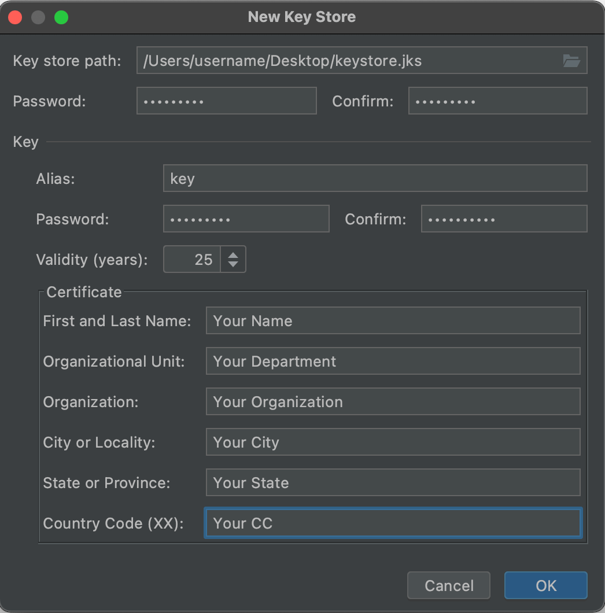

For uploading apps to PlayStore, you need to sign your builds with uniquely generated keys and keystores. Follow instructions here:

1. Creating a keystore from an Android Project is easier. So create new android dummy project. Name it Dummy.
2. Open this project in Android Studio.
3. In the menu bar, click Build > Generate Signed Bundle/APK.
4. In the Generate Signed Bundle or APK dialog, select Android App Bundle or APK and click Next.
5. Below the field for Key store path, click Create new.
6. On the New Key Store window, provide the following information for your keystore and key, as shown in figure 2.
7. Keystore
    - **Key store path:** Select the location where your keystore should be created. Also, a file name should be added to the end of the location path with the .jks extension.
    - **Password:** Create and confirm a secure password for your keystore.
8. Key
    - **Alias:** Enter an identifying name for your key.
    - **Password:** Create and confirm a secure password for your key. This should be the same as your keystore password. (Please refer to the known issue for more information)
    - **Validity (years):** Set the length of time in years that your key will be valid. Your key should be valid for at least 25 years, so you can sign app updates with the same key through the lifespan of your app.
    - **Certificate:** Enter some information about yourself for your certificate. This information is not displayed in your app, but is included in your certificate as part of the APK.

Follow Android Docs for any further help: [Generate an upload key and keystore](https://developer.android.com/studio/publish/app-signing#generate-key)

Once you have generated a keystore.jks, you need to replace the existing keystore here:

`Project_HOME > android > houzi_public_keystore.jks`

If you have different name, you need to update its reference in this file:

`Project_HOME > android > key.properties`

The `key.properties` file refers to path relevant to gradle location. So always consider adding a path with relation to the gradle file.