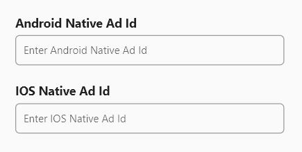

To setup ads on Houzi app, you need following things:

1. Android App ID on Admob
2. iOS App ID on Admob
3. Native Advanced Ad Id for Android App
4. Native Advanced Ad Id for iOS App

#### Create Apps in Admob

Register your app as an AdMob app by completing the following steps:
1. [Sign in](https://admob.google.com/home/) to or [Sign up](https://support.google.com/admob/answer/7356219) for an AdMob account.
2. Register your app with AdMob. This step creates an AdMob app with a unique AdMob App ID for each platform. You can also choose your already released app on both stores.
3. Copy App ID of both apps.

#### Create Native Advanced Ad Unit
Once apps for each platform are created, it is time to create a native ad unit. follow this link to create these ads: [Create a native ad unit](https://support.google.com/admob/answer/7187428#step1).

When you've acquired Native Ad Unit IDs, configure it in the app in the steps below.

#### Setup Admob App ID

After getting your app AdMob App ID go to:

**- Android** `houzi > android > app > src > main > res > values > strings.xml` file, and look for `google_ads_app_id`. Replace its value with your own AdMob App ID.

**- iOS** `Project_HOME > ios > Runner > Info.plist` file, and look for `GADApplicationIdentifier`. Replace its value with your own AdMob App ID. 

#### Enable iOS App Tracking Transparency 
You need to enable App Tracking Transparency in iOS Project. Follow here: [Setup iOS ads tracking](tools/setup_ads_tracking)

> **Good to remember:** After creating AdMob app, update your `GoogleServices-Info.plist` for iOS and `google-services.json` for android by downloading fresh copy from firebase.

#### Add/Change AdMob Native Advanced Ad ids by Houzi Config
Open houzi config and go to the section `Api & Config`. Enter your Android and iOS native ads id here

#### Add/Change AdMob Native Advanced Ad by editing config.json
Copy that native ad unit and go to the `Project_HOME > assests > configuration > configuration.json` file, and look for `android_native_ad_id` for android and `ios_native_ad_id` for IOS. Replace its value with your own native ad unit.
Make sure set the value of `show_ads: true` to turn on the ads

#### Add/Change AdMob Native Advanced Ad by editing constants.dart
Copy that native ad unit and go to the `Project_HOME > packages > houzi_package > lib > common > constants.dart` file, and look for `ANDROID_NATIVE_AD_ID` for android and `IOS_NATIVE_AD_ID` for IOS. Replace its value with your own native ad unit.
Make sure set the value of `SHOW_ADS=true` to turn on the ads

#### Enable Ad Validator to Debug your ads
AdMob sdk provides a way to validate your ads on screen. We've disabled the ad validator by default. However you can enable the ad validator to check if you've any issues with your configurations.

##### Enable Ad Validator Android

Open `houzi > android > app > src > main > AndroidManifest.xml` file, and look for `com.google.android.gms.ads.flag.NATIVE_AD_DEBUGGER_ENABLED`. Replace its value `android:value="false"` to `true`.

##### Enable Ad Validator iOS
Open file `Project_HOME > ios > Runner > Info.plist` file, and look for `GADNativeAdValidatorEnabled`. Replace its next tag `<false/>` with `<true/>`

This will enable ad validator for your app.

> **Good to remember:** After AdMob has been integrated, Google may ask you to verify your apps ownership via [app-ads.txt](https://support.google.com/admob/answer/9787936?hl=en&ref_topic=7384409&sjid=5964906072899827499-EU). It will ensure your app ad inventory is only sold through channels you’ve identified as authorized.

> **Good to remember:** After AdMob has been integrated, it is best to link your apps with your firebase. The Linked services page allows you to turn on user metrics and link your apps to Firebase from a single page in your AdMob account. Readmore about [Linked Services](https://support.google.com/admob/answer/11986609).