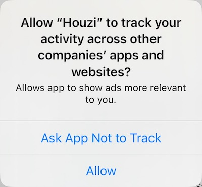

If you want to show ads, you need to have a key in your Info.plist named `NSUserTrackingUsageDescription` and its description string like below:

```
<key>NSUserTrackingUsageDescription</key>
<string>Allows app to show ads more relevant to you.</string>
```

If you’ve this key in your info.plist you’re required to

- Show app tracking permission dialog.
- Declare in app privacy section on AppStoreCoonect that you’re tracking user identifier for advertisement purpose.

> Failing to do any of the above item will result in **REJECTION** by Apple.

From Houzi Configurations, if you set true for showing ads, Houzi will show app tracking permission dialog automatically as shown below:



So make sure you've setup tracking correctly.

### If you want to SHOW ads:
You'll need to do following things:
- From Houzi Configurations, set true for showing ads. `"show_ads": true` and `"show_ios_ads": true`
- You’ll have to add a key `NSUserTrackingUsageDescription` and its value in app’s info.plist. (as shown above).
- 1.3.0 and above, you need to replace `REPLACE_WITH_TRACKING_KEY_IF_ADS_NEEDED` key with `NSUserTrackingUsageDescription`.
- Declare in app privacy section on AppStoreCoonect that you’re tracking user identifier for advertisement purpose.

> NOTE: if you have enabled ads in Houzi Config, but don't have `NSUserTrackingUsageDescription` key in your info.plist, app will crash at launch.

### If you DON'T plan on showing ads:
You'll need to do following things:
- From Houzi configurations, if you set false for showing ads (for iOS or all ads).
- You’ll have to remove key `NSUserTrackingUsageDescription` and its value from your app’s info.plist.

> If your app was rejected before for this reason, remove this key, set next build number and upload new binary resubmit for app review.

Read more about [App Tracking Transparency](https://developer.apple.com/documentation/apptrackingtransparency)

