## Documentation for Setting Up Houzi's In-App Purchase

This guide will walk you through the necessary steps to configure In-App Purchase in Google Play and Apple Store for Android and iOS devices, respectively. By following these instructions, you'll be able to offer various membership procedures to your users. Houzez offers three membership procedure i.e Free (Pay for featured), Pay Per Listing, and Membership options. You can choose one at a time.

### Table of Contents

1. [Setup Admin Panel](#setup-admin-panel)
   1. [Free (Pay for featured)](#free-pay-for-featured)
   2. [Pay Per Listing](#pay-per-listing)
   3. [Membership](#membership)
2. [Setup Apple Store](#setup-apple-store)
   1. [Paid Apps Agreements](#paid-apps-agreements)
   2. [Configuring In-App Purchases](#configuring-your-in-app-purchases)
      1. [Free (Pay for featured)](#free-pay-for-featured)
      2. [Pay Per Listing](#pay-per-listing)
      3. [Membership](#membership)
3. [Setup Google Play](#setup-google-play)
   1. [Setting Up Your Google Payments Merchant Account](#setting-up-your-google-payments-merchant-account)
   2. [Configuring In-App Purchases](#configuring-your-in-app-purchases)
      1. [Free (Pay for featured)](#free-pay-for-featured)
      2. [Pay Per Listing](#pay-per-listing)
      3. [Membership](#membership)
4. [Conclusion](#conclusion)

Let's dive into the details of each section.

---

## Setup Admin Panel

To begin setting up in-app purchases and membership procedures in your Houzi app, first go to your admin panel on your website. Navigate to `Theme Options > Membership` then follow the steps below:

 
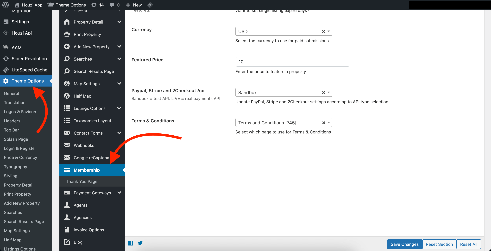  

 

1. **Free (Pay for featured)**

   In this procedure, your app is free to list properties, but users are charged if they want to upgrade their properties to featured. To enable this option:

   - Navigate to `Theme Options > Membership`.
   - In the "Enable Paid Submission" drop-down, select "Free (Pay for Featured)".
   - Configure other options, such as "Expire Days" and "Currency for Paid Submission" as per your requirements.
   - Enter the "Featured Price" to specify the price for featuring a listing.
   - Make a note of this price, as you'll need to enter it when setting up in-app purchases on Google Play and Apple Store.

    
   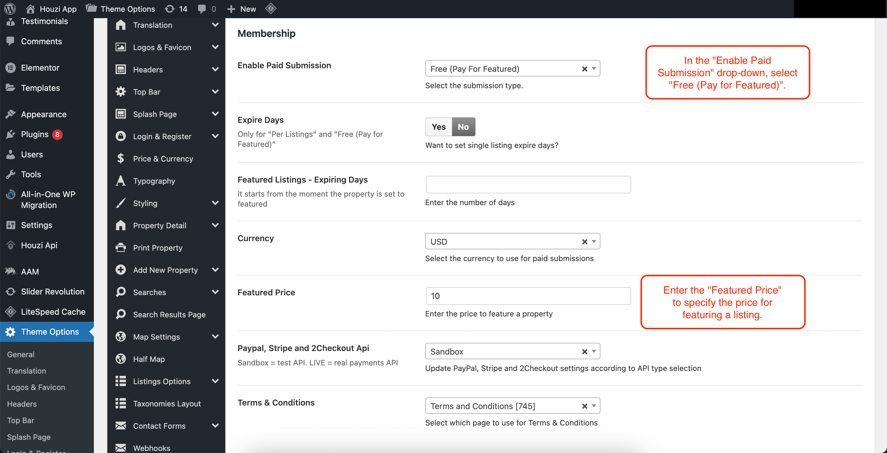  

    
   Additionally, within the Houzi API plugin, in the in-app purchase tab, add your "Make Featured product ID". Ensure that this product ID matches the configuration of your in-app product on Google Play and Apple Store.

    
   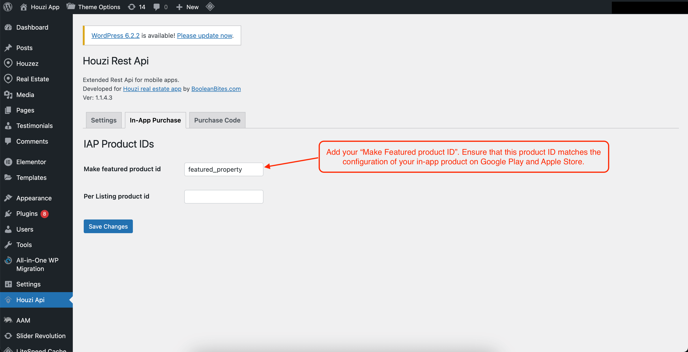  

    
2. **Pay Per Listing**

   In this procedure, users are charged for each property they publish. To set up this option:

   - Navigate to `Theme Options > Membership`.
   - In the "Enable Paid Submission" drop-down, select "Per Listing".
   - Configure other options, such as "Expire Days" and "Currency for Paid Submission" as per your requirements.
   - Enter the "Price Per Submission" to specify the price for each listing.
   - Enter the "Featured Price" to set the price for featuring a listing.
   - Make a note of both prices, as you'll need them when configuring in-app purchases on Google Play and Apple Store.

    
   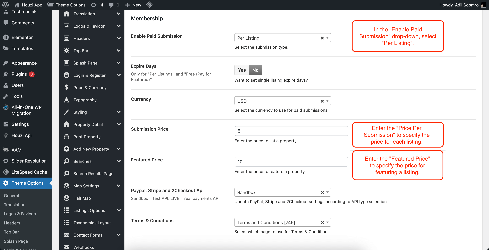  

   Within the Houzi API plugin, in the in-app purchase tab, add your "Make Featured" and "Per Listing" product IDs. Ensure that these product IDs match the configuration of your in-app products on Google Play and Apple Store.

    
   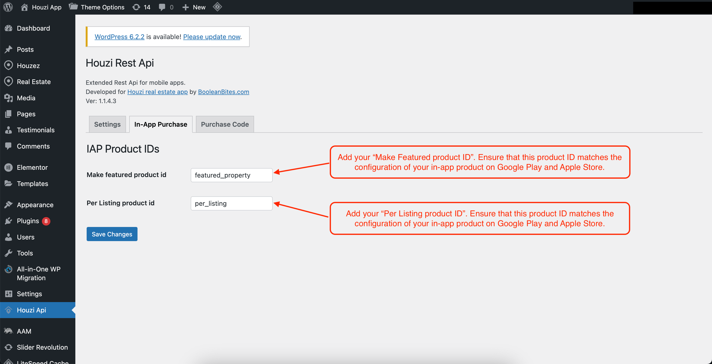  

    
3. **Membership**

   In this procedure, you can create membership packages that users can purchase. To configure this option:

   - Navigate to `Theme Options > Membership`.
   - In the "Enable Paid Submission" drop-down, select "Membership".
   - Configure other options, such as "Expire Days" and "Currency for Paid Submission" as per your requirements.
   - Enter the "Featured Price" to specify the price for featuring a property.

       
      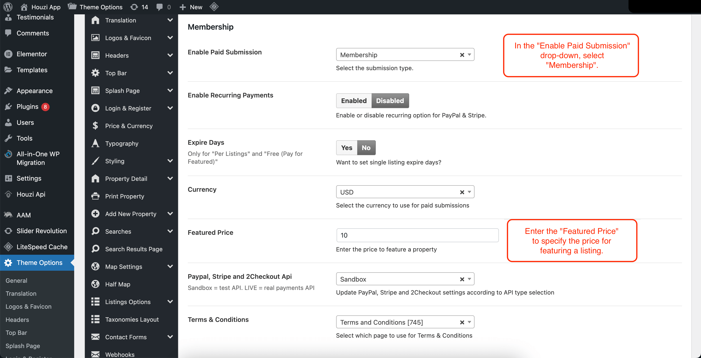  
   
    
   - Set up membership packages by following these steps:

     - You can either edit the existing package or add new package.
     - In your left sidebar, navigate to `Real Estate > Packages > Add New Package`.

          
         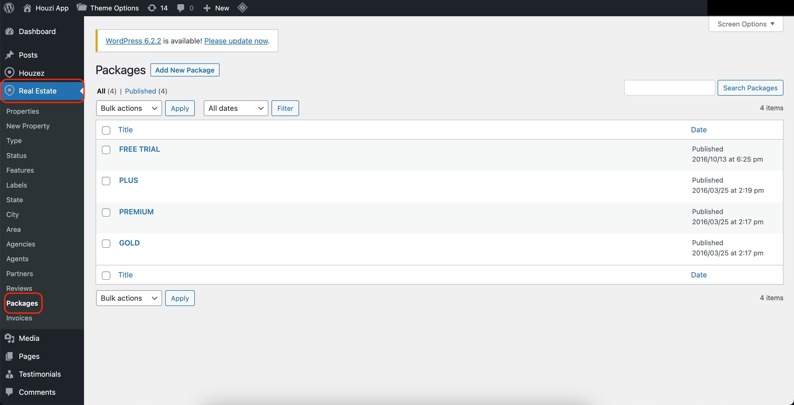  

     - Provide a name for your package in the "Title" field.
     - Select the desired "Billing Period" and "Billing Frequency" for the package.
     - Specify the number of included listings and featured listings, or choose to make them unlimited.
     - Set the package price and decide whether it should be visible or popular/featured.
     - Add the Google Play and Apple Store product IDs in the appropriate fields. Ensure that these product IDs match the    configuration of your in-app products on Google Play and Apple Store.
     - Save the package configuration.
      
          
         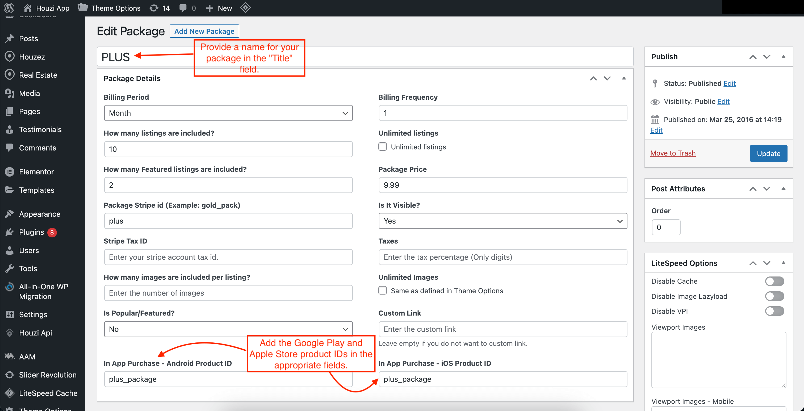  user-access.jpeg

   Repeat the package creation process for each membership package you want to offer.

Once you have completed the setup in the admin panel, you can proceed to configure in-app purchases on Apple Store and Google Play.

---

## Setup Apple Store

To configure in-app purchases for iOS devices on the Apple Store, follow these steps:

### Paid Apps Agreements

Before proceeding with in-app purchases, make sure you have an active agreement for paid apps in App Store Connect:

1. Visit [https://appstoreconnect.apple.com/](https://appstoreconnect.apple.com/) and log in.
2. Click on "Agreements, Tax, and Banking."
3. In the agreements section, ensure that the status for free apps is "Active" and for paid apps is "New."
4. Review the terms, accept them, and provide all the required information.
5. Once everything is set correctly, the status for paid apps will become "Active."

### Sandbox Testing
To ensure a smooth and error-free experience for your users, it's essential to conduct thorough testing of your in-app purchases before releasing them on the Apple Store. Apple provides a sandbox environment specifically for testing in-app purchases without making actual payments. Follow the steps below to set up sandbox testing:

1. To test the in-app purchases, you need a sandbox test user. This test user shouldn't be connected to iTunes—it's only used for testing in-app purchases. You can't use an email address that is already used for an Apple account. In Users and Access, go to Testers under Sandbox to create a new sandbox account or to manage the existing sandbox Apple IDs.

> **Note**: If you are using a Gmail account you can create a task-specific email address. For example, if you own foo@gmail.com you can create an account with the following e-mail foo+sandbox@gmail.com. The email for this account will still be received in foo@gmail.com inbox. [Google Workspace Learning Center.](https://support.google.com/a/users/answer/9282734?visit_id=638254442833679599-400723780&rd=1#email-address-variation)

    
   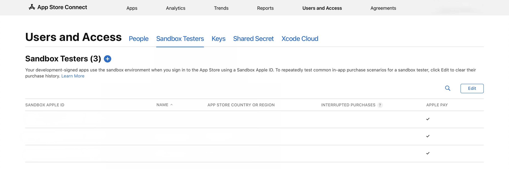  

2. Now you can set up your sandbox user on your iPhone by going to `Settings > App Store > Sandbox-account.`

    
   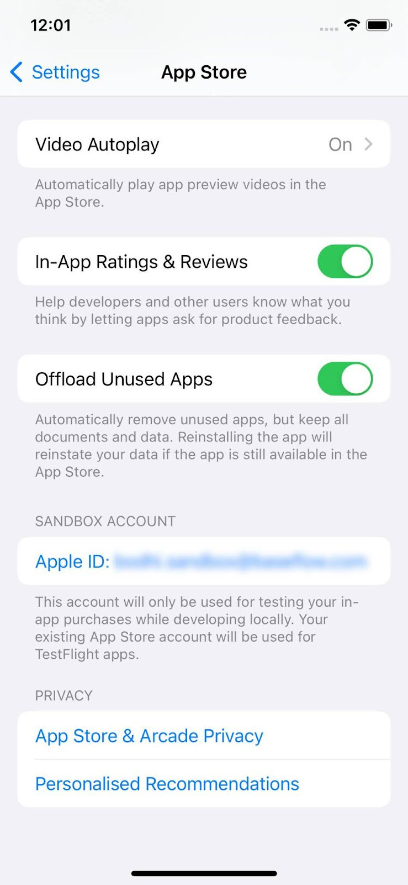

> **Important**: If you cannot find the sandbox account in Settings > App Store, simply log out from your App Store account. Next, launch the app and proceed with a purchase. During this process, you will be prompted to log in using the sandbox test user. Make sure to input the credentials that you previously added to the Sandbox Testers section.

### Configuring your in-app purchases

To configure in-app purchases on Apple Store:

1. Go to [https://appstoreconnect.apple.com/apps/](https://appstoreconnect.apple.com/apps/) and select your app.
2. Navigate to "In-App Purchases" and click on "Manage."

#### Free (Pay for featured)

1. Select the "Consumable" type and create your in-app purchase using the product ID mentioned in the Houzi API plugin's in-app purchase tab.
2. Set the price according to the value specified in `Theme Options > Membership`.
3. Fill out the remaining information.
4. In the screenshot section, add a screenshot of the app where the "Make featured" option is visible. You can find this in app `Properties > Action button on property card`

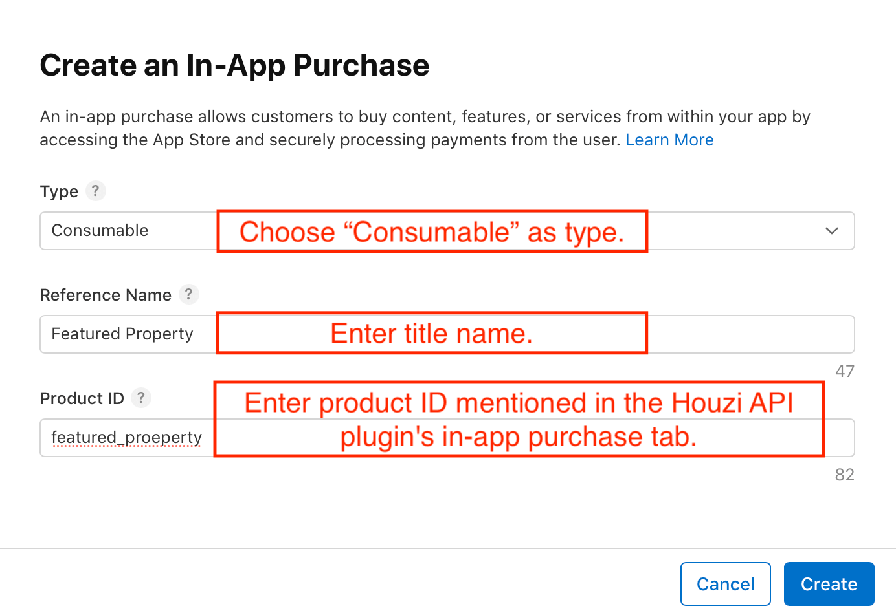
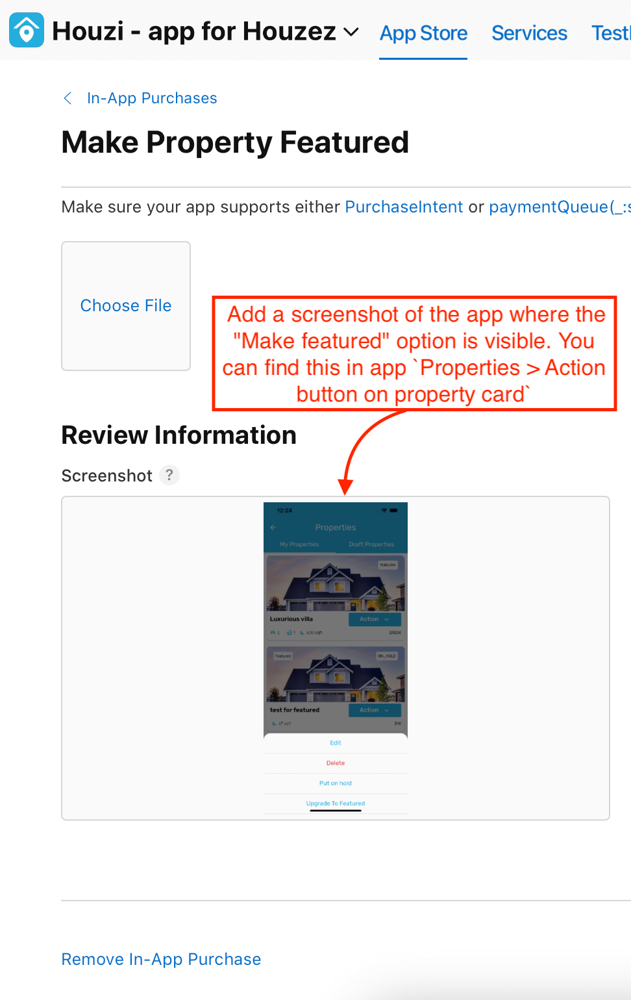

#### Pay Per Listing

1. Select the "Consumable" type and create two in-app purchases—one for the featured product ID and another for the per listing product ID mentioned in the Houzi API plugin's in-app purchase tab.
2. Set the prices according to the values specified in `Theme Options > Membership`.
3. Fill out the remaining information.
4. In the screenshot section, add a screenshot of the app where the "Make featured" and "Pay Now" options are visible. You can find this in app `Properties > Action button on property card`

#### Membership

1. For each package you created in the admin panel, add a product using the respective iOS product ID mentioned in the package details.
2. Select the "Consumable" type and fill out the remaining information.
3. In the screenshot section, take a screenshot of the package from the profile page. You can find this in app `Profile > Membership`
4. Repeat these steps for each package.

---

## Setup Google Play

You first need to release on the closed testing track as this results in a code review from Google. This is a requirement to be able to access any play store products.
Next, upload the app-release.aab app bundle that was generated by the build command. Click Save and then click Review release. Finally, click Start rollout to Internal testing to activate the internal testing release.

### Set up test users

To be able to test in-app purchases, Google accounts of your testers must be added in the Google Play console in two locations:
   - To the specific test track (Internal testing)
   - As a license tester

First, start with adding the tester to the internal testing track. Go back to `Release > Testing > Internal testing` and click the `Testers` tab.

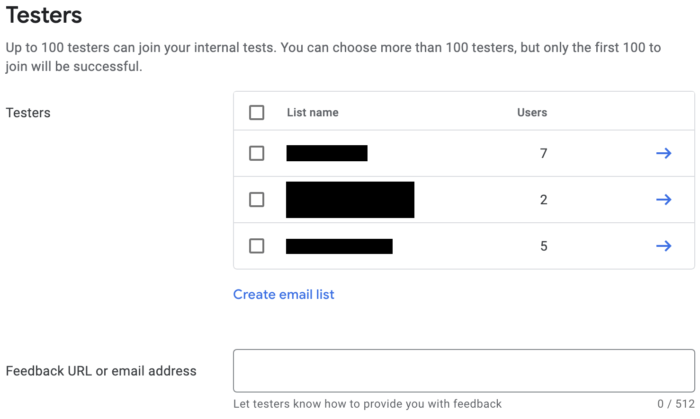

Create a new email list by clicking `Create email list`. Give the list a name, and add the email addresses of the Google accounts that need access to testing in-app purchases.

Next, select the checkbox for the list, and click `Save changes`.

Then, add the license testers:
   - Go back to the `All apps` view of the Google Play Console.
   - Go to `Setup > License testing`.
   - Add the same email addresses of the testers who need to be able to test in-app purchases.
   - Set License response to `RESPOND_NORMALLY`.
   - Click Save changes.
   
       
      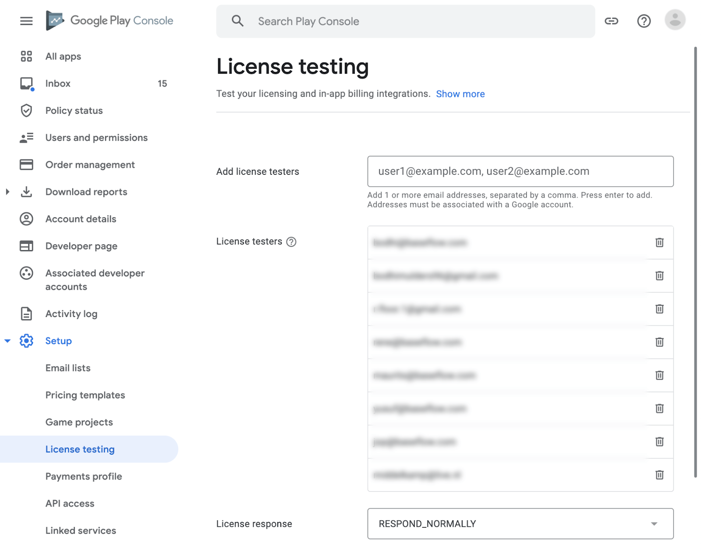

To configure in-app purchases for Android devices on Google Play, follow these steps:

### Setting Up Your Google Payments Merchant Account

To enable in-app purchases for your application on the Google Play Store, you'll need to set up a Google Payments merchant account. Follow the steps below to get started:

1. **Access Payments Settings:** In the Play Console, navigate to the "Setup" section and select "Payments profile."

2. **Create Payments Profile:** Click on the "Create payments profile" option. Make sure you have your business information ready as you'll need it to set up your payments profile.

3. **Provide Business Details:**
   - **Name and Address:** Enter the legal name of your business exactly as you want it to appear on your payments profile. This name will be visible to your customers and on receipts. Also, input your legal business address exactly as it appears on official documents. Keep in mind that a valid physical address is required, and PO box addresses are not allowed. Remember that your bank account needs to be registered in the same country as your payments profile. [Learn more](https://support.google.com/payments/merchant/answer/7164584) about bank account requirements.
   - **Primary Contact:** Enter the name of an authorized representative for your company. This person can be contacted by Google if there are questions regarding your payments profile. Provide an email address and an optional phone number.

4. **Public Business Information:**
   - Enter your business website.
   - Select the category of products you sell.
   - Provide a customer support email.
   - Specify the business or product name that will appear on your customers' credit card statements. Ensure it's recognizable and appropriate to minimize chargebacks.

5. **Submission:** Once you've filled in the required information, click the "Submit" button to finalize your payments profile setup.

### Configuring your in-app purchases

1. Go to the Google Play Console and select your application.
2. Navigate to `Monetize > Products > In-app products.`
3. Click on "Create product."

#### Free (Pay for featured)

1. Create your in-app product using the product ID mentioned in the Houzi API plugin's in-app purchase tab.
2. Set the price according to the value specified in `Theme Options > Membership`.
3. Fill out the remaining information.

#### Pay Per Listing

1. Create two in-app products—one for the featured product ID and another for the per listing product ID mentioned in the Houzi API plugin's in-app purchase tab.
2. Set the prices according to the values specified in `Theme Options > Membership`.
3. Fill out the remaining information.

#### Membership

1. For each package you created in the admin panel, add a product using the respective Android product ID mentioned in the package details.
2. Fill out the remaining information.

---

## Conclusion

Congratulations! You have successfully completed the setup of in-app purchases and membership procedures for your Houzi app. Users can now enjoy the powerful property management system, and you can monetize your real estate marketplace by offering different membership options.

Make sure to follow the instructions carefully and double-check all the configurations to ensure a smooth user experience. If you encounter any issues or need further assistance, please refer to the Houzi documentation or contact our support team.