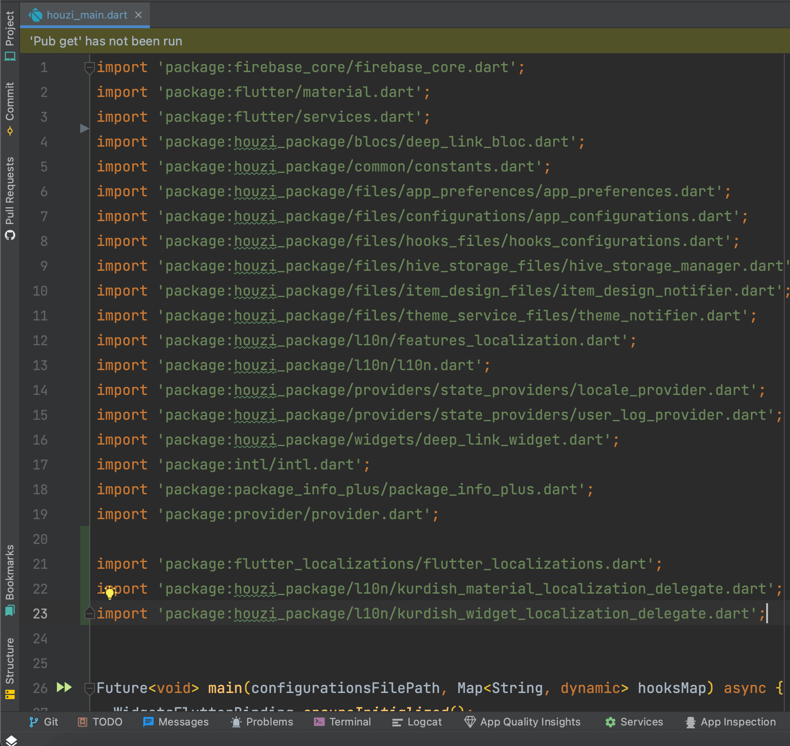
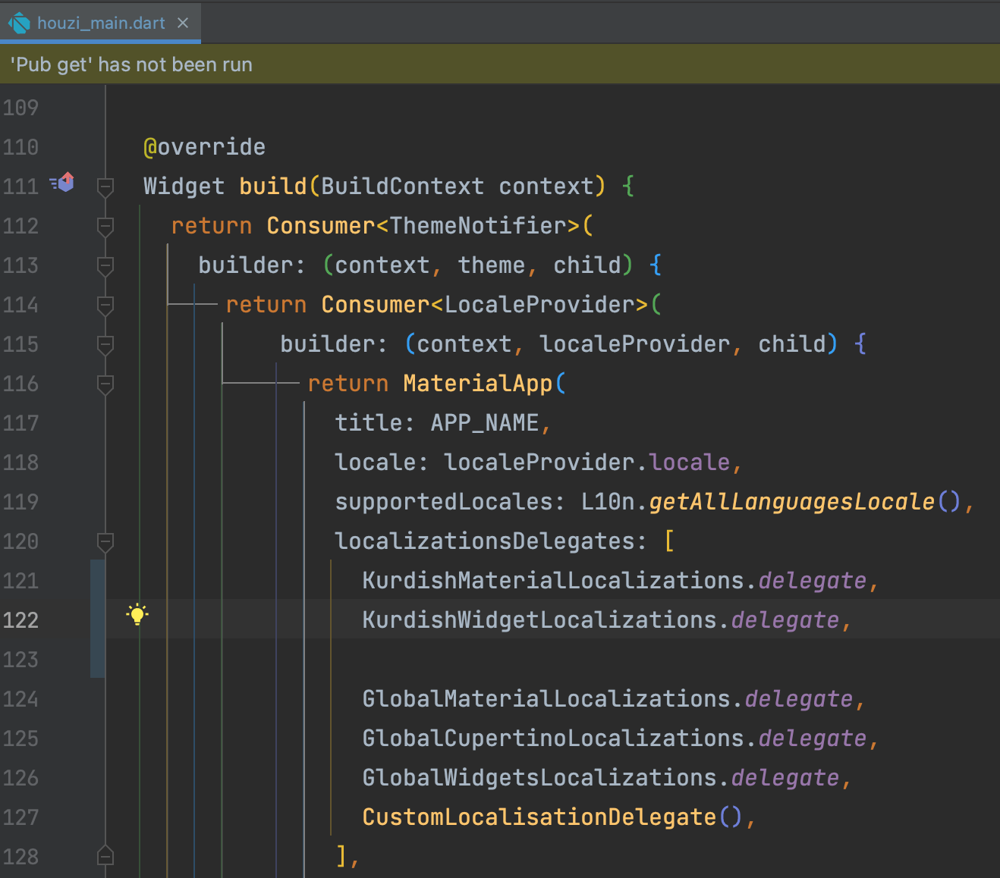
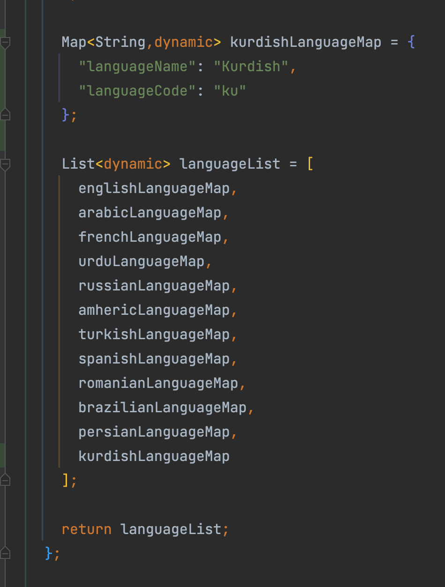

You can add Kurdish Language support in your app by following these simple steps:

1. Download the [kurdish_material_localization_delegate.dart](https://github.com/aminsamad/flutter_kurdish_localization/blob/master/lib/kurdish_material_localization_delegate.dart) file.

2. Download the [kurdish_widget_localization_delegate.dart](https://github.com/aminsamad/flutter_kurdish_localization/blob/master/lib/kurdish_widget_localization_delegate.dart) file.

3. Now head to the project and go to the **l10n** directory, path:

   `PROJECT_NAME/packages/houzi_package/lib/l10n`

4. Now place both the files in this directory.

5. Now go to the houzi_main.dart file, path:

   `PROJECT_NAME/packages/houzi_package/lib/houzi_main.dart`

6. Add following imports at the start of file, under all the imports.

   ```dart
   import 'package:flutter_localizations/flutter_localizations.dart';
   import 'package:houzi_package/l10n/kurdish_material_localization_delegate.dart';
   import 'package:houzi_package/l10n/kurdish_widget_localization_delegate.dart';
   ```

    

7. Now go to the **build()** function and add following lines in the *localizationsDelegates*.

   ```dart
   KurdishMaterialLocalizations.delegate,
   KurdishWidgetLocalizations.delegate,
   ```

    

8. Now head to the **hooks_v2.dart** file and look for the getLanguageCodeAndName() hook, path:

   `PROJECT_NAME/lib/hooks_v2.dart`

9. Define **kurdishLanguageMap** and add this map to the **languageList** in the hook.

   

10. Restart the app.

Now Kurdish language support is added to your app.
