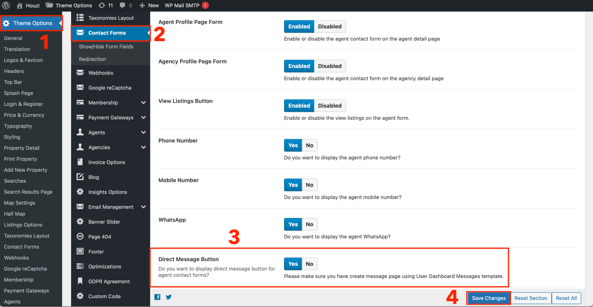
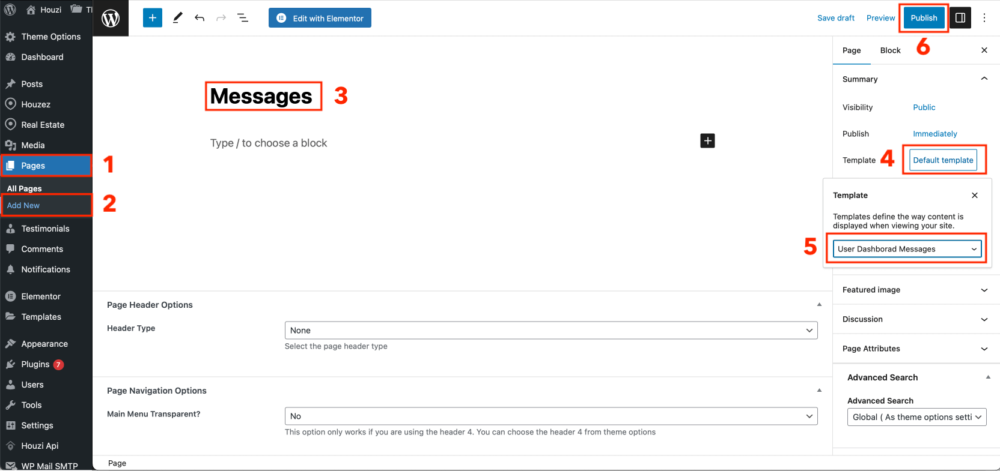
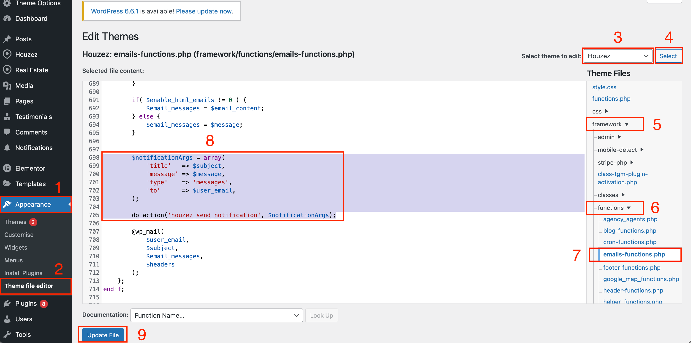

Direct Messaging is an excellent way to connect with realtors efficiently. We've developed this feature to significantly improve engagement and communication between clients and real estate professionals. By enabling seamless and direct interaction, it fosters a more personalized and responsive experience, allowing for timely updates and meaningful conversations. This feature is designed to bridge the gap between clients and realtors, enhancing overall satisfaction and streamlining the real estate process.

> Important: These messages are not real-time like WhatsApp; instead, they are HTTP-based, where the app periodically polls the server for new messages. You can adjust the polling interval through a hook as described below.

Direct Message are disabled by default on Houzez. To use the Direct Message feature, you will need to perform some configurations on your WordPress site. 

This guide includes the following sections:

- [Direct Messages Setup on WordPress](#direct-messages-setup-on-wordpress)
  - [1. Enable Direct Message Button:](#1-enable-direct-message-button)
  - [2. Create Message Page:](#2-create-message-page)
  - [3. Enable Push Notification:](#3-enable-push-notification)
- [Houzi Package via Houzi Builder](#houzi-package-via-houzi-builder)
- [Direct Messages Pooling Interval Configuration via Hooks](#direct-messages-pooling-interval-configuration-via-hooks)


## Direct Messages Setup on WordPress

You have to provide these following configurations:

### 1. Enable Direct Message Button:

Go to the `Theme Options > Contact Forms`.  Enable the *Direct Message Button* setting and Save Changes.

  

### 2. Create Message Page:

- Go to the `Pages` and click on `Add New`.  
- Set title as **Messages**. 
- Click on **Default template** and select *User Dashboard Messages* from the dropdown.
- Click the **Publish** button.

  

### 3. Enable Push Notification:

**Houzez v3.3.0** already sends the push notification for direct messages. 

To Enable Push Notifications for Messages in Houzez version 3.2.5 and below, you will need to do following changes manually:

- Go to the **Theme File Editor** (path: `Appearance > Theme File Editor`). (If it is not available for you, you will need to enable it via hosting panel. Please consult Wordpress Doc or Youtube to enable this.).
- Select the **Houzez** theme from the dropdown and click the *Select* button.
- Go to the **emails-function.php** (path: `framework > functions > emails-function.php`). 
- Find the function `houzez_send_messages_emails`.
- Add these lines just before **@wp_mail**.

```php
$notificationArgs = array(
            "title" => $subject,
            "message" => $message,
            "type" => "messages",
            "to" => $user_email,
        );

do_action('houzez_send_notification', $notificationArgs);
```

  
- Click the **Update File** button. Now the the app should receive message push notifications.

## Houzi Package via Houzi Builder

- Go to the **Property Profile** section of the Houzi Builder and enable/disable the *Direct Message* button. Checkout HouziBuilder [Listing Details Configurations](/houzi-builder/customize_property_profile#property-profile-configurations). 

- Go to the **Navigation Bar** section of the Houzi Builder and configure the *Direct Messages*. Checkout HouziBuilder [Navigation Bar Configurations](/houzi-builder/customize_navigation_bar#add-new-section). 

## Direct Messages Pooling Interval Configuration via Hooks

Checkout [Direct Messages Hooks](/hooks-widgets/direct_messages_hooks) for further direct messages configurations. 


>  **❗️❗️IMPORTANT❗️❗️**
>
>  [Direct Messages Setup on WordPress](#direct-messages-setup-on-wordpress) is required. Please ensure that you have configured Direct Messages on your Wordpress before configuring via **HouziBuilder** and **Hooks**.

>  **❗️❗️IMPORTANT❗️❗️**
>
>  Direct Messages are sent directly to the author of the listing. If the listing is assigned to an agency or an agent, they will not receive these messages. In contrast, when a contact email is sent regarding a listing, it is directed to the assigned agency or agent. This is how Houzez theme designed the messages.

 *Added in version 1.4.2*