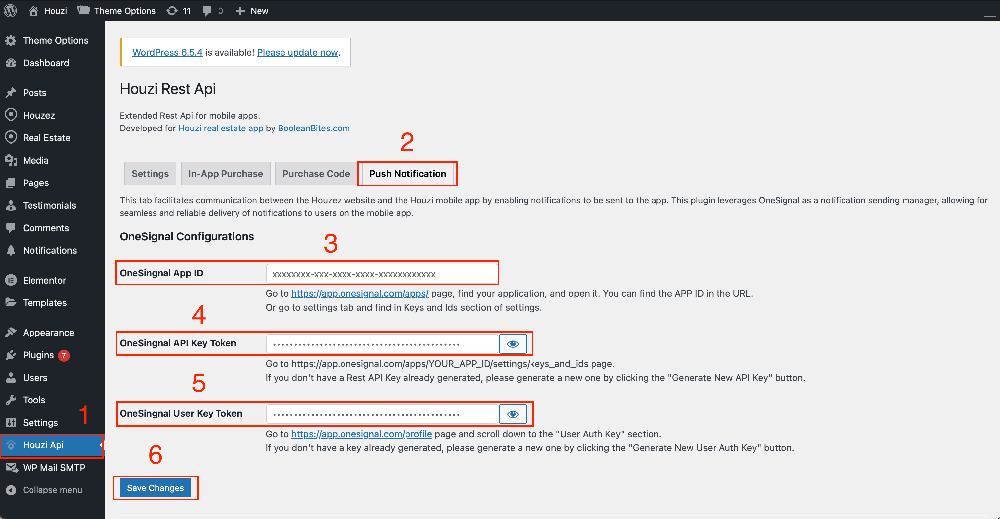

We’re using OneSignal for the push notification purpose. You can set up OneSignal on your wordpress and your app. This guide consists of following sections:

- [OneSignal setup](#onesignal-setup)
- [OneSignal setup on Wordpress](#onesignal-setup-on-wordpress)
  - [1. OneSignal App ID:](#1-onesignal-app-id)
  - [2. OneSingnal API Key Token:](#2-onesingnal-api-key-token)
  - [3. OneSingnal User Key Token:](#3-onesingnal-user-key-token)
- [OneSignal setup on App](#onesignal-setup-on-app)
  - [1. Android Directory:](#1-android-directory)
  - [2. iOS Directory:](#2-ios-directory)
  - [3. Houzi Package via Houzi Builder](#3-houzi-package-via-houzi-builder)

## OneSignal setup

Use the following link to sign-up/login in.

https://app.onesignal.com/login

A typical flow should like this:

0. You use social login or signup with email & password.
   - You will be asked to choose the plan. Choose Free plan and Click on Get Started Now.
1. Provide your info in About You section. Choose Drive Visits to Web/App and Choose Push Notification for channel options.
2. Provide info about your organization.
3. Provide info about your app.
4. In the following Welcome page, choose below options
   1. Messaging Channels -> Push Notifications.
   2. Android:
      1. Choose Android. and continue, you will be asked to upload your firebase configruation file. Follow the guide by OneSignal. [Android Guide](https://documentation.onesignal.com/docs/android-firebase-credentials)
      2. Once firebase-adminsdk-key is uploaded, You can choose Flutter in next step. Click save and Continue.
      3. Copy the app id and click done.
   3. iOS
      1. From the Inactive platforms, choose iOS. You need paid Apple Membership for this.
      2. You will be asked to provide APNs info. Follow the guide by OneSignal for acquiring the p8 file from AppleDeveloper portal. [iOS Guide](https://documentation.onesignal.com/docs/ios-p8-token-based-connection-to-apns)
      3. Once .p8 key file is uploaded, You can enter the other info and Save And Continue. You can choose Flutter in next step. Click save and Continue.
      4. Copy the app id and click done. Both app id should be same.

Keep in mind that we have installed the SDKs in the project, you just need app id so don’t follow steps to integrate sdks.

## OneSignal setup on Wordpress

Go to the `Houzi Api > Push Notification > OneSignal Configurations`.

  

You have to provide these following configurations:

### 1. OneSignal App ID:

Provide your *OneSignal App ID* in the respective text field. If you do not know how to get the *One Signal App ID*, Go to https://app.onesignal.com/apps/ page, find your application, and open it. You can find the APP ID in the URL.
Or go to **Settings** tab and find in **Keys and Ids** section of settings.

### 2. OneSingnal API Key Token:

Provide your *OneSingnal API Key Token* in the respective text field. If you do not know how to get the *OneSingnal API Key Token*, Go to https://app.onesignal.com/apps/YOUR_APP_ID/settings/keys_and_ids page.

> If you don't have a Rest API Key already generated, please generate a new one by clicking the **Generate New API Key** button.

### 3. OneSingnal User Key Token:

Provide your *OneSingnal User Key Token* in the respective text field. If you do not know how to get the *OneSingnal User Key Token*, Go to https://app.onesignal.com/profile page and scroll down to the **User Auth Key** section.

> If you don't have a key already generated, please generate a new one by clicking the **Generate New User Auth Key** button.

After providing the configurations, click on the **Save Changes** button.

## OneSignal setup on App

Copy your *OneSignal App ID*. If you do not know how to get the *One Signal App ID*, Go to https://app.onesignal.com/apps/ page, find your application, and open it. You can find the APP ID in the URL.
Or go to **Settings** tab and find in **Keys and Ids** section of settings.

You will have to provide this app id in the following destinations (Mandatory):

### 1. Android Directory:

Go to the `Project_HOME > android > app > src > main > res > values > strings.xml` file, and look for `onesignal_app_id`. Replace its value with your app id.

### 2. iOS Directory:

 and go to the `Project_HOME > ios > Runner > AppDelegate.swift` file, and look for `ONE_SIGNAL_APP_ID`. Replace its value with your app id.

### 3. Houzi Package via Houzi Builder

 Go to the **Api & Config** section of  the Houzi Builder and provide the *One Signal App ID* in the respective text field. 
 
For further assiatance [Push Notifications Configurations](/houzi-builder/api_config_setup#push-notification-configurations).   