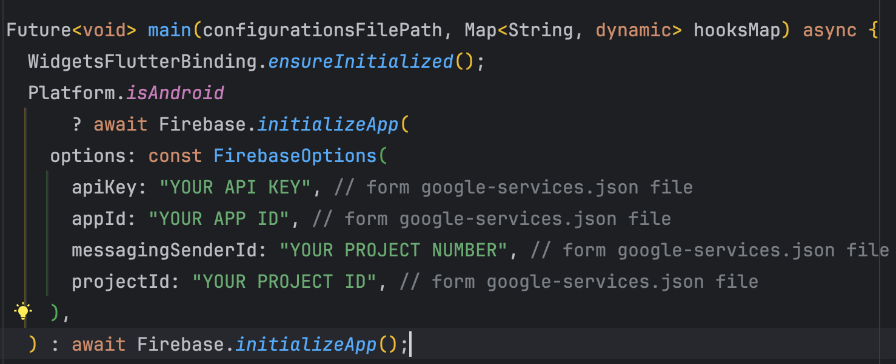
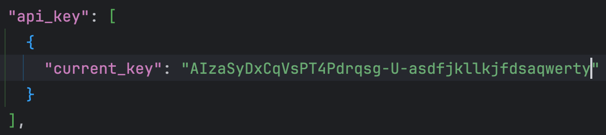
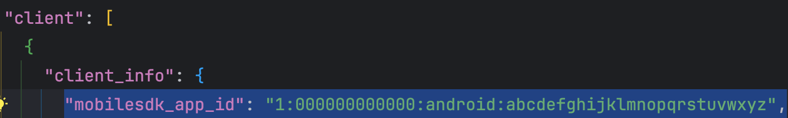
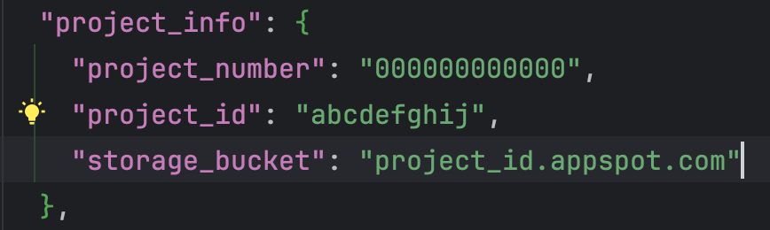

> Make sure your desired app bundle identifiers are set before setting up firebase.

Firebase is necessary to be set up if you want analytics, planning to support push notifications and other diagnostic related data.

### Android setup (mandatory)
https://firebase.google.com/docs/android/setup

### iOS setup (mandatory)
https://firebase.google.com/docs/ios/setup

### App setup (mandatory)

1. After acquiring the **json** and **plist** for both platforms. Place them at following places:

    - Android: `Project_HOME > android > app > google-services.json`

    - iOS: `Project_HOME > ios > Runner > GoogleServices-Info.plist`

2. Go to the **houzi_main.dart** file, (path: `PROJECT_HOME > packages > houzi_package > lib > houzi_main.dart`).

    - Go to the main() function.
        

    - In the main() function, you have to provide the following configurations from your *google-services.json* file:
        
        1. apiKey
        2. appId
        3. messagingSenderId
        4. projectId

    - Open the *google-services.json* file.

    - Look for the **"api_key"**, copy the value againt the **current_key** and paste it against the **appKey** in the main() function.
         
    
    - Look for the **"mobilesdk_app_id"**, copy its value and paste it against the **appId** in the main() function.
         

    - Look for the **"project_info"**.
        

    - Copy the value againt the **"project_number"** and paste it against the **messagingSenderId** in the main() function.
         
    - Copy the value againt the **"project_id"** and paste it against the **projectId** in the main() function.