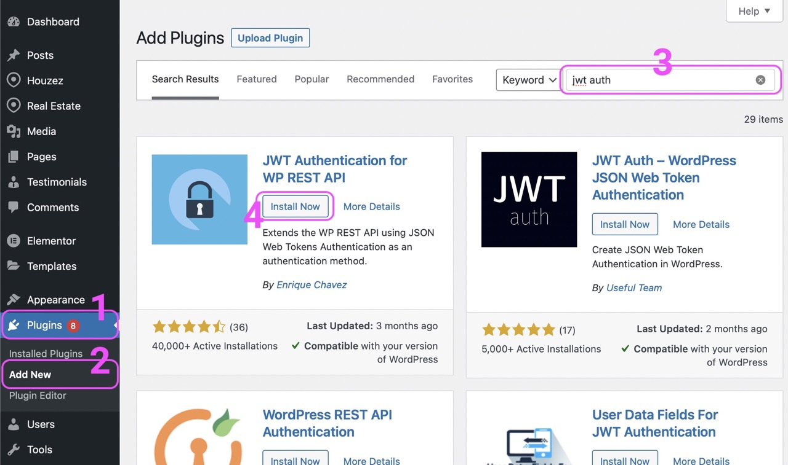
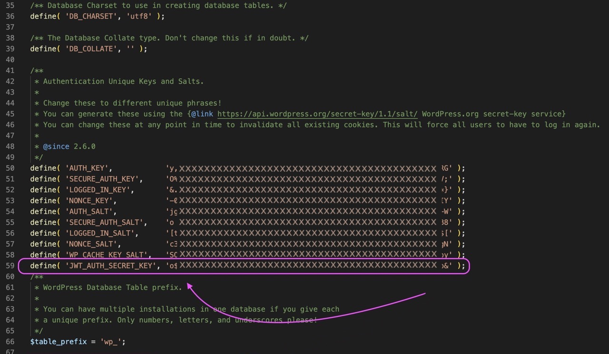

In order for the login and other user related tasks (add property, add review, CRM functionalities, admin activities), we’re using JWT (JSON Web Token) approach. For this we are using JWT Auth plugin.

You can download here: https://wordpress.org/plugins/jwt-authentication-for-wp-rest-api/

JWT Auth Plugin is required if you want to login from app.

## Install & Activate
To install this plugin, you go into your wordpress dashboard, from left menu select plugin and add new plugin

1. Wordpress > Left Menu > Plugin
2. From plugin choose Add New
3. Search 'JWT Auth'.
4. From the Results, Choose 'JWT Authentication for WP REST API' by 'Enrique Chavez' and Click Install
5. Activate the Plugin.

## Setup Plugin Secret Key
JWT Auth Plugin require a unique key to be setup in your wordpress installation. The key name is `JWT_AUTH_SECRET_KEY`. To setup this key, you'll need to access the wp-config.php file of your Wordpress installation. You might either require FileZilla (or other ftp clients) or you can access the wp-config.php file from FileManager (or similar option ie File Explorer, File Browser etc) of your hosting. Some hosting may not provide FileManager service. Use FileZilla or similar apps in that case. The steps are as follow:

1. Open wp-config.php file via your preferred editor.
2. Scroll down to Authentication Unique Keys and Salts section. (usually line # 40-60s)
3. You should see many keys already defined. You just need to add another key to bottom of the list.
4. How to generate key? You can use Wordpress service for this. Open this link in your browser: https://api.wordpress.org/secret-key/1.1/salt/, you should bunch of keys on every refresh.
5. Copy any key from there and paste to bottom of your already defined key.
6. Now replace the left variable or key name with  `JWT_AUTH_SECRET_KEY`
7. Your keys should look like below screenshot.

Conslut Description of JWT Auth Plugin for more guidance here: https://wordpress.org/plugins/jwt-authentication-for-wp-rest-api